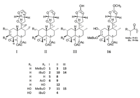

NATURALS

ARTICLE

pubs.acs.org/jn

# neo-Clerodane Diterpenoids from Ajuga bracteosa

${ }^{4}$ Amaya Castro, ${ }^{\dagger}$ Josep Coll, ${ }^{*, \dagger}$ and Mohammad Arfan ${ }^{3}$

Departament de Química Biològica i Modelitzación Molecular, Institut de Química Avançada de Catalunya, Consejo Superior de Investigaciones Científicas, Jordi Girona 18-26, 08034 Barcelona, Spain Institute of Chemical Sciences, University of Peshawar, Peshawar, Pakistan

3 Supporting Information

ABSTRACT: Different neo -clerodane diterpenoids were isolated from a dichloromethane extract of Ajuga bracteosa depending on the isolation procedure used, owing to the labile nature of these tetrahydrofuran derivatives. Under “hydroxyl-free” purification conditions, both clerodin- and dihydroclerodin-type diterpenes were obtained [four new compounds, ajubractins A − D (1 − 4), along with clerodin (5), 3- epi -caryoptin (6), ajugapitin (7), 14,15-dihydroclerodin (8), 3- epi 14,15-dihydroxyoptin (9), ivain II (10), and 14,15-dihydroajugap reversed-phase prepurification procedure and for semipreparative I and 8 − 11 , as previously, but 7 was the only tetrahydrofuran obtained instead of 14-hydro-15-hydroxyclerodin derivatives [15-hy and 14-hydro-15-hydroxyajugapitin (15)], along with 15- epi -lupuli by NMR and MS data analysis and by comparison with values prevlarvae was evaluated for the compounds obtained.

died via DUKE UNIV on June 25, 2025 at 09:40:07 (UTC). naringguidelines for options on how to legitimately share pu

Ajuga bracteosa Wall. ex Benth. (Lamiaceae) is a small prostrate annual herb. The ethnomedicinal applications of its leaves include use as a remedy for acne, constipation, ear infections, headache, hypertension, jaundice, measles, pimples, sore throats, and stomach hyperacidity, and as a blood purifier and a cooling agent. $^{1-3}$ Recently, a study on the content of trace elements of A. bracteosa suggested a possible correlation with the use of the herb as a remedy for diabetes and hypertension. 4 The isolation of neo-clerodane diterpenoids from A. bracteosa has been reported in about 10 different papers, as reviewed recently. 5 Different plant collection locations have yielded constituents with a variety of structures, including clerodin- and ajugarin-like side chains among the neo-clerodanes isolated. 5 Ajuga remota, reported by some authors, is a synonym of A. bracteosa according to The International Plant Names Index . 6 The isolation and structure elucidation of neo-clerodane diterpenes of a sample of A. bracteosa harvested in northwest Pakistan are described herein. Antifeedant activities for the isolated compounds have been determined against Spodoptera littoralis larvae.

## RESULTS AND DISCUSSION

Different neo -clerodane diterpenes were isolated from a dichloromethane extract of the dried and powdered aerial parts of A. bracteosa, depending on the isolation procedure, owing to the labile nature of the tetrahydrofurofuran derivatives present in the crude extract. Thus, under “ hydroxyl-free" purification conditions, clerodin- and dihydroclerodin-type diterpenes were

obtained, representative of four new and seven already reported compounds $\{$ the new ajubractins A $-$ D, or 3 $\beta$ -[(2-methyl)butyryloxy]clerodin (1), 3 $\beta$ - iso -butyryloxyclerodin (2), 3 $\beta$ -[(2methyl)butyryloxy)-14,15-dihydroclerodin (3), and 3 $\beta$ - iso -butyryloxy-2 $\alpha$ -hydroxy-14,15-dihydroclerodin (14,15-dihydroajugachin A) (4), and clerodin (5), 7,8 3- epi -caryoptin (6), 9 ajugapitin (7), 8,10 14,15-dihydroclerodin (8), 8,11 3- epi -14,15-dihydrocaryoptin (9), 9,12 ivain II (10), 13 and 14,15-dihydroajugapitin (11) 8,10,14 $\}$ . The extract was fractionated on a silica gel column eluting with CH 2 Cl 2 − tert -butyl methyl ether mixtures. Fractions containing clerodane-like compounds were selected on the basis of their TLC behavior and then separated on preparative TLC plates, using hexane $-$ tert -butyl methyl ether mixtures as developing solvents, in order to minimize any undesired addition reaction to the sensitive enol double bond in the tetrahydrofurofuran ring. 7,15

No match with any previously reported neo -clerodane diterpene was obtained for compounds 1 $-$ 4, and their structure elucidation based on 1D and 2D NMR experiments is described below. The 1 H NMR chemical shifts and multiplicities for compounds 5 $-$ 11 matched with those described in the literature. 7 $-$ 14 3 β -Acetoxy-14,15-dihydroclerodin, or 3- epi 14,15-dihydroxyoptin (9), is a new natural compound and was prepared by semisynthesis previously. 12 Compound 1 (ajubractin A) displayed 29 signals in the 13 C

NMR spectrum (Table 1), accounting for six methyls, sever

Received: December 20, 201

Published: May 03, 2011

ACS Publications Copyright 2011 American Chemical Society and American Society of Pharmacognosy

1036

dx.doi.org/10.1021/np100929u | / Not Prod. 2011, 74, 1036-104

---

ournal of Natural Products

AR

methylenes, 10 methines (two of them sp2), and six quaternary carbons with three carbonyl groups: δC 175.1, 171.1, and 170.1.

The high-resolution mass spectrum matched with the molecular formula C $_{29}$ H $_{42}$ O $_{9\text{r}}$ with m/z 557.2761 (C $_{29}$ H $_{42}$ O $_{9\text{Na}}$ +) being the most abundant ion in the positive mode. Characteristic chemical shifts and multiplicities for a clerodin-like diterpene were displayed in the $^{1}$ H NMR spectrum. Thus, two doublets of doublets ( $\delta_{\rm H}$ 4.82 and 6.47, H-14 and H-15, respectively) and a doublet ( $\delta_{\rm H}$ 6.03, H-16) indicated the presence of a tetrahydrofurofuran side chain, whereas two A/B spin systems ( $\delta_{\rm H}$ 2.60/ 2.82 and 4.39/4.80, H $_{2}$ -18 and H $_{2}$ -19, respectively) were consistent with the typical functionalities at C-18 and C-19. Furthermore, the following patterns for methyl groups were found: a doublet ( $\delta_{\rm H}$ 0.85) and three singlets ( $\delta_{\rm H}$ 2.13, 1.95, and 0.97) matched with H $_{3}$ -17, two acetoxy groups, and H $_{3}$ -20, respectively. In addition, another doublet ( $\delta_{\rm H}$ 1.10) and a triplet ( $\delta_{\rm H}$ 0.89) were consistent with the presence of a 2-methylbutyryloxy substituent. The two acetoxy groups could be assigned to C-6 and C-19 by their reciprocal correlation in the HMBC spectrum ( $\delta_{\rm H}$ 4.39/4.80 cross-peaks with $\delta_{\rm C}$ 71.3 and $\delta_{\rm H}$ 4.75 with $\delta_{\rm C}$ 61.4). The correlations of a doublet of doublets at $\delta_{\rm H}$ 5.31 with signals at $\delta_{\rm C}$ 175.1, 65.2 (C-4), and 42.5 (C-18) were supportive of the 2-methylbutyryloxy substituent location being at C-3 (the oxirane carbons were assigned by the HSQC/HMBC correlations with the H $_{2}$ -18 signals at $\delta_{\rm H}$ 2.60/2.82). The observed broad doublet for H $_{\rm B}$ -18 (instead of a clear dd displayed by 5) indicated a small residual H-3 $-$ H $_{\rm B}$ -18 coupling. Finally, crosspeaks from $\delta_{\rm H}$ 4.75 (H-6), 0.85 (H $_{3}$ -17), and 0.97 (H $_{3}$ -20) to $\delta_{\rm C}$ 36.1 indicated the last signal to be for C-8. Both substituents in the stereogenic centers C-3 and C-6 must be present in the equatorial position to account for the large trans diaxial coupling constant shown by their geminal protons (12.1 Hz for H-3 and 11.6 Hz for H-6). Thus, the structure proposed for ajubractin A (1) was 3 $\beta$ -[(2-methyl)butyryloxy]clerodin. Compound 2 (ajubractin B) showed in the $^{1}$ H NMR spectrum

a large number of similarities to 1 (Table 1). In fact, only the 2-methylbutyryloxy substituent pattern was absent, and this was replaced by one septuplet ( $\delta_{\textrm{H}}$ 2.48, $J=7.0$ Hz) and two methyl doublets ( $\delta_{\textrm{H}}$ 1.12 and 1.13), pointing out the presence of an isobutyryloxy group instead. The HRMS confirmed the expected molecular formula [ m/z 543.2571 (C 28 H 40 O 9 Na + )] . Thus, the structure assigned to ajubractin B ( 2 ) was 3 β -(isobutyryloxy)clerodin.

Compound 3 (ajubractin C) displayed an apparent 28 signals (Table 2 ) in the $^{13}$ C NMR spectrum (with one of double intensity), accounting for six methyls, nine methylenes, eight

methines, and six quaternary carbons (with again three as C=O ester groups). The HRESIMS matched with a molecular formula of C $_{29}$ H $_{44}$ O $_{9}$ [ m/z 559.2875 (C $_{29}$ H $_{44}$ O $_{9}$ Na)], and the $^{1}$ H and $^{13}$ C NMR spectra showed typical chemical shifts and multiplicities for a dihydroclerodin-like derivative, indicating a 14,15dihydroajubractin A structure, owing to the acyloxy groups present. The $^{1}$ H NMR spectrum of the bicyclic hexahydrofurofuran side chain displayed a doublet ( $\delta_{\rm H}$ 5.65, H-16), a doublet of doublets ( $\delta_{\rm H}$ 4.11, H-11), and two multiplets ( $\delta_{\rm H}$ 3.89 and 2.89, H $_2$ -15 and H-13, respectively). Cross-peaks in the $^{1}$ H $-$ $^{1}$ H COSY spectrum allowed assignments for H $_2$ -14 ( $\delta_{\rm H}$ 2.18 and 1.69) and H $_2$ -12 ( $\delta_{\rm H}$ 1.82 and 1.62) to be determined, starting from $\delta_{\rm H}$ 3.89 (H $_2$ -15), and from $\delta_{\rm H}$ 4.11 (H-11), respectively. The H-13 ( $\delta_{\rm H}$ 2.89) signal was confirmed by a cross-peak from $\delta_{\rm H}$ 5.65 (H-16). $^{13}$ C NMR chemical shifts for the side chain were obtained from the $^{1}$ H $-$ $^{13}$ C HSQC spectrum [ $\delta_{\rm C}$ 107:7, 85.1, 68.4, 42.0, 32.6, and 32.5 (C-16, C-11, C-15, C-13, C-14, and C-12, respectively)]. As in 1 , again the presence and location of the same acyloxy substituents were inferred from the NMR data, as well as the presence of a C-18 epoxide moiety. Other assignments for the proton spin system in ring-B of the decalin moiety were established from the $^{1}$ H $-$ $^{1}$ H COSY spectrum starting at both ends: from the methyl doublet signal ( $\delta_{\rm H}$ 0.88, H $_3$ -17) to $\delta_{\rm H}$ 1.46 (H-8) and from the H-6 doublet of doublets ( $\delta_{\rm H}$ 4.74) to $\delta_{\rm H}$ 1.64/1.46 (H $_2$ -7). The H-10 to H-3 spin system was accounted for starting from H-11 ( $\delta_{\rm H}$ 4.11) and H $_3$ -20 ( $\delta_{\rm H}$ 0.96) to locate the C-10 signal ( $\delta_{\rm C}$ 47.5, HMBC spectrum) and the corresponding H-10 resonance ( $\delta_{\rm H}$ 1.68, HSQC correlation), whereas the H-3 signal ( $\delta_{\rm H}$ 5.31) led to the assignments of $\delta_{\rm H}$ 2.07 and 1.43 for H $_2$ -2 and $\delta_{\rm C}$ 31.0 for C-2. The HSQC crosspeaks at $\delta_{\rm H}$ 1.77/2.26 with $\delta_{\rm C}$ 21.1 indicated that the H $_2$ -1 signals were partly overlapped in the $^{1}$ H NMR spectrum. Thus, the structure proposed for ajubractin C ( 3 ) was 3 β -(2-methyl)butyryloxy-14,15-dihydroclerodin. Similarly, compound 4 (ajubractin D) was identified as 3 β -

isobutyryloxy-2 $\alpha$ -hydroxy-14,15-dihydroclerodin (14,15-dihydroajugachin A). The acyloxy substituent was deduced from its proton signals [a septuplet ( $\delta_{\text{H}}$ 2.56, $J=7.0$ ) and a methyl doublet ( $\delta_{\text{H}}$ 1.17, $J=7.1$ , 6H)]. The presence of the same substituents in ring A as in dihydroajugapitin ( 11 ) was indicated by correlations of their geminal protons and the change of multiplicity for the axial H-3 signal to a doublet ( $\delta_{\text{H}}$ 5.24, $J=9.8$ Hz), due to the presence of a vicinal axial proton (H-2: $\delta_{\text{H}}$ 3.66, ddd, $J=10.3$ , 10.3, 4.9 Hz) (Table 2).

However, when a defatted (with hexane) CH 2 Cl 2 extract of A. bracteosa was fractionated on reversed-phase C 18 columns using 60 % and 90 % MeOH — water mixtures, 8 clerodane diterpenes were distributed in three fractions, based on analytical HPLC conditions and antifeedant bioassay results. Owing to the lack of any UV absorption, semipreparative HPLC purification conditions were established by ELS detection. Surprisingly, ajugapitin (7) was the only diterpene with a tetrahydrofurofuran side chain isolated, and it was obtained along with several hexahydrofurofurans (3 and 8 − 11 ) and C-15 epimeric mixtures of clerodin hemiacetal derivatives [mixtures of (15 R and 15 S ) 15-hydroxyajubractin C (13) , 14-hydro-15-hydroxyajugapitin (14) , 16 and 14-hydro-15-hydroxyajugachin A (15) 15 ] (considered as purification artifacts). 7,15

One further new derivative, ajubractin E (12) , $^17$ was also isolated as well as 15- epi -lupulin B (16) . 18,19 The large coupling of the H-3 doublet of doublets ( $\delta_{\rm H}$ 4.04, $J=11.7$ , 4.8 Hz) is consistent with an axial proton and an equatorial substituent in

1037

dx.doi.org/10.1021/np100929u |J. Nat. Prod. 2011, 74, 1036-104

---

ournal of Natural Products

AR

<table><tr><td rowspan="2">position</td><td colspan="2">1</td><td colspan="2">2</td></tr><tr><td>δ C, mult.</td><td>δ H, mult. ( J )</td><td>i H→13 C HMBC</td><td>δ H, mult. ( J )</td></tr><tr><td>1ax</td><td>21.2, CH 2</td><td>1.78, m</td><td></td><td></td></tr><tr><td>1eq</td><td></td><td>2.23, dda a (14.8, 4.8, 2.9)</td><td></td><td>2.23, dda a (15.0, 5.0, 3.2)</td></tr><tr><td>2ax</td><td>31.0, CH 2</td><td>1.45, m</td><td></td><td></td></tr><tr><td>2eq</td><td></td><td>2.07, brdt d (12.6, 4.4, 3.1)</td><td></td><td>2.08, brdt d (12.9, 4.0, 3.2)</td></tr><tr><td>3ax</td><td>66.6, CH</td><td>5.31, dd (12.1, 4.9)</td><td>2, 4, 18, t′</td><td>5.30, dd (12.0, 4.8)</td></tr><tr><td>4</td><td>65.2, C</td><td></td><td></td><td></td></tr><tr><td>5</td><td>46.3, C</td><td></td><td></td><td></td></tr><tr><td>6ax</td><td>71.3, CH</td><td>4.75, dd (11.6, 4.6)</td><td>4, 5, 7, 19, t′′′</td><td>4.76, dd (11.8, 4.9)</td></tr><tr><td>7ax</td><td>33.1, CH 2</td><td>1.64, m</td><td></td><td></td></tr><tr><td>7eq</td><td></td><td>1.48, m</td><td></td><td></td></tr><tr><td>8ax</td><td>36.1, CH</td><td>1.47, m</td><td></td><td></td></tr><tr><td>9</td><td>40.1, C</td><td></td><td></td><td></td></tr><tr><td>10ax</td><td>48.0, CH</td><td>1.69, m</td><td></td><td></td></tr><tr><td>11</td><td>84.5, CH</td><td>4.04, dd (11.7, 4.5)</td><td>8, 9, 10, 12, 13, 20</td><td>4.04, dd (11.7, 4.5)</td></tr><tr><td>12a</td><td>31.2, CH 2</td><td>1.67, m</td><td></td><td></td></tr><tr><td>12</td><td></td><td>1.73, m</td><td></td><td></td></tr><tr><td>13</td><td>46.0, CH</td><td>3.58, m</td><td></td><td>3.58, m</td></tr><tr><td>14</td><td>101.8, CH</td><td>4.82, dd (2.9, 2.4)</td><td>15, 16</td><td>4.83, dd (2.9, 2.4)</td></tr><tr><td>15</td><td>146.9, CH</td><td>6.47, dd (2.9, 2.2)</td><td>13, 14, 16</td><td>6.48, dd (2.9, 2.1)</td></tr><tr><td>16</td><td>107.6, CH</td><td>6.03, d (6.2)</td><td>11, 12, 13, 14, 15</td><td>6.03, d (6.2)</td></tr><tr><td>17</td><td>16.3, CH 3</td><td>0.85, d (6.5)</td><td>7, 8, 9</td><td>0.86, d (6.5)</td></tr><tr><td>18A</td><td>42.5, CH 2</td><td>2.60, d (4.3)</td><td>3, 4, 5</td><td>2.63, d (4.2)</td></tr><tr><td>18B</td><td></td><td>2.82, brd (4.3)</td><td>4, 5</td><td>2.84, brd (4.2)</td></tr><tr><td>19A</td><td>61.4, CH 2</td><td>4.39, d (12.3)</td><td>4, 5, 6, 10, t′′</td><td>4.41, d (12.4)</td></tr><tr><td>19B</td><td></td><td>4.80, d (12.3)</td><td>4, 5, 6, 10, t′′</td><td>4.80, d (12.4)</td></tr><tr><td>20</td><td>14.0, CH 3</td><td>0.97, s</td><td>8, 9, 10, 11</td><td>0.98, s</td></tr><tr><td>1′</td><td>175.1, C</td><td></td><td></td><td></td></tr><tr><td>2′</td><td>41.1, CH</td><td>2.30, sext a (6.9)</td><td>1′</td><td>2.48, sept a (7.0)</td></tr><tr><td>3′a</td><td>26.6, CH 2</td><td>1.47, m</td><td>1′, 2′, 5′</td><td>1.12, d (7.0)</td></tr><tr><td>3′</td><td></td><td>1.64, m</td><td>1′, 2′, 5′</td><td>1.13, d (7.0)</td></tr><tr><td>4′</td><td>11.3, CH 3</td><td>0.89, t (7.4)</td><td>2′, 3′</td><td></td></tr><tr><td>5′</td><td>16.4, CH 3</td><td>1.10, d (7.0)</td><td>1′, 2′, 3′</td><td></td></tr><tr><td>1′′</td><td>171.1, C</td><td></td><td></td><td></td></tr><tr><td>2′′</td><td>21.0, CH 3</td><td>2.13, s</td><td>1′′</td><td>2.15, s</td></tr><tr><td>1′′′</td><td>170.1, C</td><td></td><td></td><td></td></tr><tr><td>2′′′</td><td>21.2, CH 3</td><td>1.95, s</td><td>1′′′</td><td>1.96, s</td></tr></table>

Table 1. NMR Data of Ajubractins A (1) and B (2) $\left[499.81 \mathrm{MHz}\left({ }^{1} \mathrm{H}\right), 100.62 \mathrm{MHz}\left({ }^{13} \mathrm{C}\right), \mathrm{CDCl}_{3}, \delta(\mathrm{ppm})(J=\mathrm{Hz})\right.$

12 (3- epi -14,15-dihydroxaryoptinol or 3 β -hydroxy-14,15-dihydroclerodin) instead of the reversed stereochemistry reported for caryoptinol (3 α -epimer, δ H 3.31, brs). The 3 α -epimer of 12 has been reported. 17

Compound 16 (15- epi -lupulin B) matched with the molecular formula C 30 H 46 O 10 ( m/z 567.3113 [C 30 H 47 O 10 ] + ), and the presence of a three-proton singlet ( $\delta_{\rm H}$ 3.34) in the $^1$ H NMR spectrum was supportive of a methoxy substituent. The MeO signal displayed a cross-peak with $\delta_{\rm C}$ 104.8 (HMBC), one of two presumably hemiacetal carbon signals ( $\delta_{\rm C}$ 104.8 and 109.2). A second deshielded doublet ( $\delta_{\rm H}$ 4.99) displayed a cross-peak with the resonance at $\delta_{\rm C}$ 109.2 (HMBC, H-15 → C-16) and supported the assignment of 16 as a 14-hydro-15-methoxyclerodin derivative, related to clerodinins A and B. 7,19 The 3 $\beta$ -(2-

methyl)butyryloxy substitution observed in 16 has been previously reported for lupulin B. 18,19 However, the chemical shifts of H-11, H-13, H-15, H-16, and C-16 matched the epimeric 15S stereochemistry at the stereogenic center C-15. 18–21 Other cross-peaks were observed in the $^{1}$ H $-$ $^{13}$ C HMBC NMR spectrum from H-16 (at $\delta$ 5.81) to $\delta$ 104.8 (C-15), 83.2 (C-11), 40.5 (C-13), and 32.6 (C-12), as previously reported for 6 . Thus, this substance was assigned as the new 15- epi -lupulin B 16 . The $^{1}$ H NMR data of (15 R and 15 S )-15-hydroxyajubractin C

(13) and for (15 R and 15 S )-14-hydro-2,15-dihydroxy-3 β -isobutyryloxyclerodin (15) are reported in the Supporting Information.

Antifeedant activity against S. littoralis was measured as described in the Experimental Section. Low antifeedant activities

1038

dxdoi.org/10.1021/np100929u |J. Nat. Prod. 2011, 74, 1036-104

---

ournal of Natural Products

AR

<table><tr><td rowspan="2">position</td><td colspan="3">3</td><td rowspan="2">4  δ H, mult. ( J )</td><td rowspan="2">12  δ H, mult. ( J )</td><td colspan="3">16</td></tr><tr><td>δ C, mult.</td><td>δ H, mult. ( J )</td><td>1H→ 13 C HMBC</td><td>δ C, mult.</td><td>δ H, mult. ( J )</td><td>1H→ 13 C HMBC</td></tr><tr><td>1ax</td><td>21.1, CH 2</td><td>1.77, m</td><td></td><td></td><td></td><td>21.1, CH 2</td><td>1.64</td><td></td></tr><tr><td>1eq</td><td></td><td>2.26, m</td><td></td><td></td><td></td><td></td><td>2.35, m</td><td></td></tr><tr><td>2ax</td><td>31.0, CH 2</td><td>1.43, m</td><td></td><td>3.66, t a d (10.3, 4.9)</td><td></td><td>31.0, CH 2</td><td>1.43, m</td><td></td></tr><tr><td>2eq</td><td></td><td>2.07, brdt a d (12.7, 4.4, 3.2)</td><td></td><td></td><td></td><td></td><td>2.07 m</td><td></td></tr><tr><td>3ax</td><td>66.6, CH</td><td>5.31, dd (12.0, 4.9)</td><td>4, 18, 1′</td><td>5.24, d (9.8)</td><td>4.04, dd (11.7, 4.8)</td><td>66.7, CH</td><td>5.32, dd (12.2, 4.9)</td><td>4, 18</td></tr><tr><td>4</td><td>65.3, C</td><td></td><td></td><td></td><td></td><td>65.3, C</td><td></td><td></td></tr><tr><td>5</td><td>46.3, C</td><td></td><td></td><td></td><td></td><td>46.3, C</td><td></td><td></td></tr><tr><td>6ax</td><td>71.3, CH</td><td>4.74, dd (11.4, 4.5)</td><td>4, 5, 19, 1′′′</td><td>4.71, dd (11.8, 4.4)</td><td>4.79, dd (11.5, 4.5)</td><td>71.4, CH</td><td>4.75, dd (12.0, 5.1)</td><td>19</td></tr><tr><td>7ax</td><td>33.1, CH 2</td><td>1.64, m</td><td></td><td></td><td></td><td>33.2, CH 2</td><td>1.62, m</td><td></td></tr><tr><td>7eq</td><td></td><td>1.46, m</td><td></td><td></td><td></td><td></td><td>1.47, m</td><td></td></tr><tr><td>8ax</td><td>35.8, CH</td><td>1.46, m</td><td></td><td></td><td></td><td>35.9, CH</td><td></td><td></td></tr><tr><td>9</td><td>40.6, C</td><td></td><td></td><td></td><td></td><td>40.1, C</td><td></td><td></td></tr><tr><td>10ax</td><td>47.5, CH</td><td>1.68, m</td><td></td><td></td><td></td><td>47.6, CH</td><td></td><td></td></tr><tr><td>11</td><td>85.1, CH</td><td>4.11, dd (11.4, 5.4)</td><td>10</td><td>4.12, dd (11.1, 5.4)</td><td>4.12, dd (11.5, 5.4)</td><td>83.2, CH</td><td>4.38, dd (11.5, 5.8)</td><td>10</td></tr><tr><td>12a</td><td>32.5, CH 2</td><td>1.62, m</td><td></td><td></td><td></td><td>32.6, CH 2</td><td>1.62, m</td><td>11</td></tr><tr><td>12</td><td></td><td>1.82, ddd (12.4, 11.2, 9.0)</td><td></td><td></td><td>1.83, t a d (12.0, 9.1)</td><td></td><td>1.75, m</td><td></td></tr><tr><td>13</td><td>42.0, CH</td><td>2.89, t a a (9.2, 4.5)</td><td></td><td>2.89, m</td><td>2.90, m</td><td>40.5, CH</td><td>2.81, m</td><td></td></tr><tr><td>14a</td><td>32.6, CH 2</td><td>1.69, m</td><td></td><td></td><td></td><td>39.5, CH 2</td><td>1.80, m</td><td>15, 16</td></tr><tr><td>14</td><td></td><td>2.18, dd a (12.7, 9.3, 8.0)</td><td></td><td></td><td></td><td></td><td>2.28, m</td><td></td></tr><tr><td>15</td><td>68.4, CH 2</td><td>3.89, m</td><td>16</td><td>3.88, m</td><td>3.88, m</td><td>104.8, CH</td><td>4.99, d (5.6)</td><td>13, 16, OMe</td></tr><tr><td>16</td><td>107.7, CH</td><td>5.65, d (5.1)</td><td>11, 12, 13, 15</td><td>5.69, d (5.0)</td><td>5.66, d (5.1)</td><td>109.2, CH</td><td>5.81, d (5.4)</td><td>11, 12, 13, 15</td></tr><tr><td>17</td><td>16.4, CH 2</td><td>0.88, d (7.2)</td><td>7, 8, 9</td><td>0.90, d (6.4)</td><td>0.89, d (6.5)</td><td>16.2, CH 2</td><td>0.89, d (6.1)</td><td>7, 8, 9</td></tr><tr><td>18A</td><td>42.6, CH 2</td><td>2.60, d (4.3)</td><td>4</td><td>2.60, d (4.2)</td><td>2.79, d (4.0)</td><td>42.6, CH 2</td><td>2.60, d (4.2)</td><td>4</td></tr><tr><td>18B</td><td></td><td>2.82, brd (4.3)</td><td></td><td>2.83, brd (4.2)</td><td>2.90, d (4.0)</td><td></td><td>2.82, brd (4.4)</td><td>4</td></tr><tr><td>19A</td><td>61.5, CH 2</td><td>4.39, d (12.3)</td><td>5, 6, 1′′</td><td>4.43, d (12.1)</td><td>4.25, d (12.4)</td><td>61.5, CH 2</td><td>4.39, d (12.2)</td><td>6</td></tr><tr><td>19B</td><td></td><td>4.80, d (12.3)</td><td>4, 5, 6, 1′′</td><td>4.80, d (12.2)</td><td>4.94, d (12.4)</td><td></td><td>4.79, d (12.2)</td><td>4, 5, 6</td></tr><tr><td>20</td><td>13.9, CH 2</td><td>0.96, s</td><td>8, 9, 10, 11</td><td>0.98, s</td><td>0.98, s</td><td>13.9, CH 2</td><td>0.94, s</td><td>8, 9, 10, 11</td></tr><tr><td>1′</td><td>175.1, C</td><td></td><td></td><td></td><td></td><td>175.2, C</td><td></td><td></td></tr><tr><td>2′</td><td>41.1, CH</td><td>2.30, seat e (6.8)</td><td></td><td>2.56, sept e (7.0)</td><td></td><td>41.1, CH</td><td>2.29, seat e (7.0)</td><td>1′</td></tr><tr><td>3′a</td><td>26.6, CH 2</td><td>1.42, m</td><td></td><td>1.17, d (7.1)</td><td></td><td>26.6, CH 2</td><td>1.42, m</td><td>1′</td></tr><tr><td>3′</td><td></td><td>1.61, m</td><td></td><td></td><td></td><td></td><td>1.60, m</td><td>1′</td></tr><tr><td>4′</td><td>11.3, CH 3</td><td>0.89, t (7.5)</td><td>2′, 3′</td><td></td><td></td><td>11.1, CH 3</td><td>0.89, t (7.3)</td><td>2′, 3′</td></tr><tr><td>5′</td><td>16.4, CH 3</td><td>1.09, d (7.1)</td><td>1′, 2′, 3′</td><td></td><td></td><td>16.4, CH 3</td><td>1.09, d (6.8)</td><td>1′, 2′, 3′</td></tr><tr><td>1′′</td><td>171.1, C</td><td></td><td></td><td></td><td></td><td>171.2, C</td><td></td><td></td></tr><tr><td>2′′</td><td>21.0, CH 2</td><td>2.13, s</td><td>1′′</td><td>2.16, s</td><td>2.11, s</td><td>21.2, CH 3</td><td>2.14, s</td><td>1′′</td></tr><tr><td>1′′′</td><td>170.2, C</td><td></td><td></td><td></td><td></td><td>170.2, C</td><td></td><td></td></tr><tr><td>2′′′</td><td>21.2, CH 3</td><td>1′′′</td><td>1.96, s</td><td>1.97, s</td><td>21.1, CH 3</td><td>1.94, s</td><td>1′′′</td></tr><tr><td>OMe</td><td></td><td></td><td></td><td></td><td></td><td>54.5, CH 3</td><td>3.34, s</td><td>15</td></tr></table>

Table 2. NMR Data of Ajubractins C (3), D (4), and E (12) and 3-epi-Lupulin B (16) [499.81 MHz ( $\left.{ }^{1} \mathrm{H}\right), 100.62 \mathrm{MHz}\left({ }^{13} \mathrm{C}\right.$ CDCl 3 , ò (ppm) $(J=\mathrm{Hz})$ ]

Apparent multiplicity $\left(t^{\alpha}=\mathrm{dd}\right.$ with $J_{1} \approx J_{2} ; \operatorname{sext}^{\alpha}=\mathrm{ddq}$ with $J_{1} \approx J_{2} \approx J_{3} ; \operatorname{sept}^{\alpha}=\mathrm{qq}$ with $J_{1} \approx J_{2}$ ).

were found for compounds 1 and 2 (FR 0.34 and 0.42, respectively), while the other derivatives showed moderately high activities (FR = 0.10 $-$ 0.15) (Table 3).

## EXPERIMENTAL SECTION

General Experimental Procedures. Optical rotations were measured in a Perkin-Elmer 341 polarimeter. $^{1}$ H NMR (499.81 MHz) and $^{13}$ C NMR (100.62 MHz) spectra were recorded in CDCl 3 on Inova 500/Mercury 400 spectrometers (Varian, Zug, Switzerland) under standard 1D and 2D conditions and pulse sequences, using solvent signals as references ( $\delta_\mathrm{H}$ 7.28/ $\delta_\mathrm{C}$ 77.0). Special low-volume NMR tubes

were used when required (Shigemi Co-, Ltd., Tokyo, Japan; BMS-05 microtube). HPLC was performed on an Alliance 2695 apparatus coupled with a 996 UV diode array detector (Waters Corporation, Milford, MA) together with a PL-ELS 1000 evaporative light scattering detector (Polymer Laboratories, Amherst, MA). The chromatographic conditions used for analytical or semipreparative HPLC were 0.42 or 2.0 mL/min flow and 25 °C. A C $_{18}$ guard column was coupled to protect the integrity of the HPLC columns, both analytical and semipreparative. Compounds were injected in an Acquity UPLC coupled with an Acquity-TUV and Q-TOF Premier mass spectrometer (Waters Corporation) detector, using an Acquity UPLC BEH C $_{18}$ column (1.7 $\mu$ m, 2.1 × 100 mm, 30 °C, 0.3 mL/min flow). A 70:30 ratio of

1039

dxdoi.org/10.1021/np100929u |J. Nat. Prod. 2011, 74, 1036-104

---

ournal of Natural Products

AR

<table><tr><td>Compound</td><td>FR 50</td></tr><tr><td>1</td><td>0.34 ± 0.04</td></tr><tr><td>2</td><td>0.42 ± 0.06</td></tr><tr><td>3</td><td>0.15 ± 0.02</td></tr><tr><td>4</td><td>0.15 ± 0.03</td></tr><tr><td>6</td><td>0.12 ± 0.02</td></tr><tr><td>7</td><td>0.11 ± 0.02</td></tr><tr><td>8</td><td>0.09 ± 0.01</td></tr><tr><td>10</td><td>0.11 ± 0.02</td></tr><tr><td>12</td><td>0.15 ± 0.03</td></tr><tr><td>16</td><td>0.14 ± 0.04</td></tr></table>

Table 3. Antifeedant Activity of Compounds from Ajuga bracteosa against Spodoptera littoralis a

water — acetonitrile containing 0.1 % HCO $_2$ H was the initial chromatographic mobile phase for 5 min, followed by a 15 min gradient up to a 5:95 ratio, held for 5 min, and then a 5 min gradient to initial conditions, followed by 5 min of column re-equilibration. Positive- and negativeelectrospray ionizations were used, and UV absorptions were recorded at 215 and 254 nm. Solutions of pure compounds were injected (2 $\mu$ L; 0.1 mg/mL) and referred externally for accurate mass results. A Strata C $_{18}$ cartridge (10 g, Phenomenex, Torrance, CA) was used to obtain neo -derodane-enriched fractions. The column was first activated/ equilibrated (15 mL of MeOH followed by 15 mL of H $_2$ O — MeOH, 40:60). Silica gel for vacuum-liquid chromatography (60H, 90 % < 45 $\mu$ m) and silica gel 60 F $_{254}$ aluminum sheets (Merck, Darmstadt, Germany) for monitoring and preparative TLC were used. Formic acid was purchased from Merck (Haarlem, The Netherlands). CDCl 3 (99.8 % D, < 0.01 % H $_2$ O) was purchased from Euriso-top (Gif-surYvette, France).

Plant Material. Ajuga bracteosa was collected from the Shamozai area in Swat (KPK) in the northwest of Pakistan in June 2009. The identity of the plant was confirmed by taxonomist Prof. Habib Ahmad, Faculty of Science, Hazara University, Pakistan, and a specimen (voucher no. 246 HUP) was deposited in the herbarium at the University of Hazara, Mansehra, KPK, Pakistan.

$^{1}$ H NMR spectra are shown to be consistent with the Cu backing of the target, and no impurity of heavy mass elements are present. The Ag lines are observed due to the presence of the Ag anode in Fig. 3(c). A schematic lattice on the QPC is located at 20 cm $^{-2}$ C/Cu $_{2}$ and a lower panel centered at 65 m and below fill the gaps are present. The Ag lines are observed due to the presence of the Ag anode in Fig. 3(d). The Ag anode could also be due to the presence of the Ag anode in Fig. 3(e). The Ag anode could also be due to the presence of the Ag anode in Fig. 3(f). The Ag anode could also be due to the presence of the Ag anode in Fig. 3(g). The anode could also be due to the presence of the Ag anode in Fig. 3(h). The anode could also be due to the presence of the Ag anode in Fig. 3(g). The anode could also be due to the presence of the Ag anode in Fig. 3(h). The anode could also be due to the presence of the Ag anode in Fig. 3(i). The anode could also be due to the presence of the Ag anode in Fig. 3(j). The anode could also be due to the presence of the Ag anode in Fig. 3(k).

25 (30.8 mg), eluting twice with hexane – tert-butyl methyl ether (40:60) ( R f 0.22; 1.8 mg). Ajubractin D (4) and dihydroajugapitin (11) were isolated from fraction 30.

Another batch of the crude extract was defatted with hexane (15 mL, sonicated for 10 min, and then centrifuged for 15 min at 3000 rpm). The 1.57 g residue obtained was further digested/centrifuged sequentially (15 min sonication/15 min 3000 rpm) in 60% and 90% MeOH—H2O mixtures (14 mL each). Each solution was filtered (fraction F) through a RP column followed by a further elution with 15 mL of the corresponding fresh MeOH—H2O mixture (fraction E) and a final wash with 30 mL of MeOH (fraction L). Fractions were labeled as 60F, 60E, 90F1 (7 mL), 90F2 (7 mL), 90E and 100L1 (7 mL), respectively. On analytical HPLC conditions, fractions 90F2, 90E, and 100L1 afforded neo-clerodaneenriched fractions.

Semipreparative HPLC separation of fraction 90F2 (111 mg) afforded 3 β -hydroxydihydroclerodin (12, 0.9 mg), an epimeric mixture of 14-hydro-15-hydroxyajugachin A (15, 1.6 mg), 14-hydro-15-hydroxyajugapitin (14, 3.8 mg), 3-epi-dihydroxyoptin (9, 1.6 mg), dihydroajugapitin (11, 10.6 mg), and ajugapitin (7, 3.9 mg). Fraction 90E (172 mg) yielded dihydroclerodin (8, 4.7 mg), dihydroajugapitin (11, 10.0 mg), 15-hydroxyajubractin C (13, 3.1 mg), ivain II (10, 3.8 mg), and ajubrictin C (3, 7.5 mg). From fraction 100L1 (79 mg), further amounts of ajubractin C (3, 3.5 mg) and 15- epi-lupulin B (16, 2.0 mg) were isolated.

Ajubractin A (1): amorphous solid (4.5 mg); [ $\alpha$ ] $^{20}$ D $-$ 17.1 ( c 0.091, MeOH); $^1$ H NMR and $^{13}$ C NMR data in Table 1; HRESIMS m/z 557.2761 [ M + Na] $^+$ (calcd for C 29H 42 O 9 Na, 557.2727). Ajubractin B (2): amorphous solid (2.9 mg); [ $\alpha$ ] $^{20}$ D $-$ 27.4 ( c 0.065,

hexane $-$ tert -butyl methyl ether, 70:30); $^{1}$ H NMR data in Table 1 HRESIMS m/z 543.2571 [M + Na] $^{+}$ (calcd for C 28 H 40 O 9 Na 543.2570).

Ajubractin C (3): amorphous solid (3.7 mg); [ $\alpha$ ] $^{20}_{~\text{D}}-15.3$ c 0.17, MeOH); $^{1}$ H NMR and $^{13}$ C NMR data in Table 2; HRESIMS a/z 559.2875 [M + Na] $^{+}$ (calcd for C 29H 44 O 9 Na, 559.2871), 095.5848 [2 M + Na] $^{+}$ ; 535.2851 [M - H] $^{-}$ (calcd for C 29H 43 O 9 , 535.2895).

Ajubractin D (4): $\left(3.1 \mathrm{mg}\right) ;[\alpha]^{20}{ }_{\mathrm{D}}-32.5\left(c 0.14, \mathrm{CHCl}_{3}\right) ;{ }^{1} \mathrm{H} \mathrm{NMI}$ data in Table 2.

Ajubractin E (12): (0.9 mg); [Ω] 20 D +7.6 (c 0.05, MeOH); 1 H NMI data in Table 2; HRESIMS m/z 453.2455 [M + H] + (calcd for C 24H 37O 8 , 453.2478), 475.2301 [M + Na] + .

15-Hydroxyajubractin C (13): $\left[\mathrm{M}+\mathrm{H}^{+}\right]^{+}$(calcd for C 29 H 45 O 10 ,

15-epi-Lupulin B (16): $\left(2.0 \mathrm{mg}\right) ;[\alpha]^{20} \mathrm{D}+8.7(c 0.06, \mathrm{MeOH})$ HRESIMS m/z 567.3113 [M + H] + (calcd for C 30 H 47 O 10 , 567.3027) 89.2976 [M + Na] + , 1155.6119 [2 M + Na] + ; 611.3070 [M + HCOO] − (calcd for C 31 H 47 O 12 , 611.3054).

Antifeedant Activity against Spodoptera littoralis . A binary choice feeding bioassay employing lettuce ( Lactuca sativa ) leaf disks with areas of 1 cm 2 was used to evaluate the activity of isolated compounds against fifth instar larvae of Spodoptera littoralis . 22 Compounds to be tested ( $\SI{10}{\mu g}$ ) were distributed uniformly on the upper surface of a disk by application of 10 μ L acetone solutions (treated disks), while control disks were treated analogously with 10 μ L of acetone. In each replicate ( $\times$ 5), four treated (TD) and four control disks (CD) were placed alternatively in a covered polyethylene Petri dish (8 _ 5 cm diameter) in the presence of five larvae. A feeding ratio (FR 50 ± SD), when 50% of CD area has been consumed, was calculated as follows: FR = CTD (consumed treated disk area)/CCD (consumed control disk area). Results were evaluated as described in the literature. 22 Experiments were performed under the same conditions of temperature and humidity as the laboratory culture but in constant darkness.

1040

dx.doi.org/10.1021/np100929u |J. Nat. Prod. 2011, 74, 1036-104

---

ournal of Natural Products

AR

## ASSOCIATED CONTENT

❸ Supporting Information. 1D and 2D NMR spectra of the new compounds and $^{1}$ H NMR spectroscopic data for 13 and 15 . This material is available free of charge via the Internet at http://pubs.acs.org.

## AUTHOR INFORMATION

### Corresponding Author

Tel: +34-93-4006114. Fax: +34-93-2045904. E-mail: josep

:oll@iqac.csic.es.

## ACKNOWLEDGMENT

Financial support from MCYT (project AGL2004/05252 and associated grant Beca Predoctoral de Formación de Personal Investigador BES-2005-9474 to A.C.R.) is gratefully acknowledged.

## REFERENCES

(1) Ibrar, M.; Hussain, F.; Sultan, A. Pak. J. Bot. 2007, 39, 329-337

(2) Qureshi, R.; Waheed, A.; Arshad, M.; Umbreen, T. Pak. J. Bo 2009, 41, 529–538.

(3) Barkatullah; Ibrar, M.; Hussain F. Front. Biol. China 2009 4, 539–548.

(4) Ahmed, D.; Chaudhary, M. A. J. Appl. Sci. Res. 2009, 5, 864–869 (5) Coll, J.; Tandrón, Y. Phytochem. Rev. 2008, 7, 25–49.

(6) The International Plant Names Index. www.ipni.org, 2004 accessed 08/03/2006).

(7) Lin, Y. L.; Kuo, Y. H.; Chen, Y. L. Chem. Pharm. Bull. 1989 37, 2191–2193.

(8) Coll, J.; Tandrón, Y. Phytochem. Anal. 2005, 16, 25-49.

(9) Hosozawa, S.; Kato, N.; Munakata, K. Phytochemistry 1974 :3, 308–309. (10) Hernández, A.; Pascual, C.; Sanz, J.; Rodríguez, B. Phytochem

↑. International Olympic Committee. [2021-09-27]. (原始内容存档于2021-09-27).

(11) Beauchamp, P. S.; Bottini, A. T.; Caselles, M. C.; Dev, V.; Hope H.; Larter, M.; Lee, G.; Mathela, C. S.; Melkani, A. B.; Millar, P. D. Miyatake, M.; Pant, A. K.; Raffel, R. J.; Sharma, V. K.; Wyatt, D. Photochemistry 1996 , 43, 827–834.

(12) Govindachari, T. R.; Suresh, G.; Gopalakrishnan, G.; Danie Nesley, S.; Pradeep Singh, N. D. Fitoterapia 1999, 70, 269-274.

(14) Camps, F.; Coll, J.; Dargallo, O. Phytochemistry 1984 23, 387–389.

(15) Bozov, P. I.; Papanov, G. Y.; Malakov, P. Y.; de la Torre, M. C Rodriguez, B. Phytochemistry 1993, 34, 1173-1175.

(16) Camps, F.; Coll, J.; Dargallo, O. Phytochemistry 1984 23, 2577–2579.

(17) Hosozawa, S.; Kato, N.; Munakata, K. Phytochemistry 1974 :3, 1019-1020.

(18) Chen, H.; Tan, R. X.; Liu, Z. L.; Zhang, Y.; Yang, L. J. Nat. Pro 996 , 59, 668–670.

(19) Ben Jannet, H.; Chaari, A.; Mighri, Z.; Martin, M. T.; Loukac A. Phytochemistry 1999, 52, 1541–1545.

(20) Grace, M. H.; Cheng, D. M.; Raskin, I.; Lila, M. A. Phytochen Lett. 2008, J. 81–84.

(21) Huang, X.-C.; Qin, S.; Guo, Y.-W.; Krohn, K. Helv. Chim. Act 2008, 91, 628–634.

(22) Bellés, X.; Camps, F.; Coll, J.; Piulachs, M. D. J. Chem. Eco 1985, 11 , 1439–1445.

1041

dxdoi.org/10.1021/np100929u |J. Nat. Prod. 2011, 74, 1036-104

