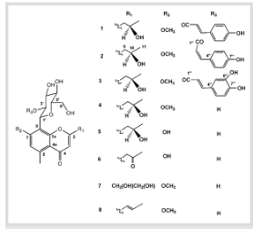
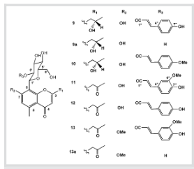
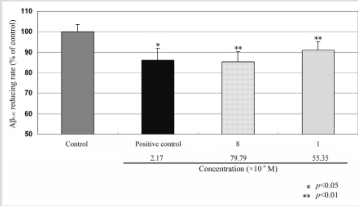

540

Original Paper

# BACE1 (β-Secretase) Inhibitory Chromone Glycosides from Aloe vera and Aloe nobilis

Author

10月25日

Liang Lv1,2,5 , Qing-Yun Yang1,2,5 , Ying Zhao1,2 , Chun-Suo Yao1,2 , Yang Sun2 , Eun-Ju Yang3 , Kyung-Sik Song3 , Inhee Mook-Jung6 , Wei-Shuo Fang1,2

Affiliation addresses are listed at the end of the article

Key word

- 9. Aloe vera
- 2 Aloe pobitt:
- Collaborate!
- ○ chromone glycoside
- D BACE1 (β-secretase) inhibitor
- Alzheimer's disease (AD)
## Abstract

- ▼
Four new chromone glycosides allo-aloeresin D (2), C-2′-decoumaroyl-aloeresin G (8), 2′- O -coumaroyl-( S )-aloesinol (9), 2′- O -[ p -methoxy-( E )cinnamoyl]-( S )-aloesinol (10) and nine known chromone glycosides (1, 3–7, 11–13) were isolated from two Aloe spp. plants, A. vera and A. nobilis . Among them, 1 and 8 showed significant

inhibitory activity against BACE1 ( β -secretase) with IC 50 values of 39.0 and 20.5 × 10 −6 M, as well as inhibition of Aβ 1–42 production by 7.4 and 12.3 % , respectively, in B103 neuroblastoma cells at 30 ppm. The preliminary structure-activity relationships of Aloe chromone glucosides were also discussed.

Received November 11, 2007 revised February 25, 2008 accepted February 27, 2008

Bibliography

DOI 10.1055/s-2008-1074496 Planta Med 2008: 74: 540–545

10 Georg Thieme Verlag KG

Stuttgart - New York

Published online April 7, 2008

ISSN 0032-0943

Corresponden

Prof. Wei-Shuo Fang

Institute of Materia Medica Chinese Academy of Medica

Sciences & Peking Union

Medical College

No. 1 Xiannongtan Street

Beijing 100050

People's Republic of China

Tel:/Fax: +86-010-6316-522

wiang@imm.ac.cr

## Introduction

Alzheimer's disease (AD) has become an increasingly severe medical and social problem, due to the rapid growth of aging people populations in industrialized countries, and even in some developing countries. β -Secretase (BACE1) has been recognized as a valuable target for the treatment of AD. BACE1 inhibitors have promised to be a class of disease disrupting rather than symptom relieving agents [1] . Although many peptides, peptidomimetics and heterocyclic compounds have been designed and evaluated as BACE inhibitors, none of them have been successfully developed as anti-AD agents to date [2], [3] . There are only very few reports on natural products-based: BACE inhibitors [4], [5], [6], [7], [8], [9] with IC $_{50}$ s in the 10 − 5 to 10 − 7 M range.

During screening of plant extracts for BACE1 inhibitory activity, Aloe vera , a traditional Chinese medicine, was found to potently inhibit β -secretase at $10^{-5}\text{g/mL}$ . Bioassay-guided fractionations of A. vera extracts led to the isolation and characterization of eight chromone C-glycosides (1-8) as active components ( ○ Fig. 1 ). To elucidate the structure-activity relationship (SAR) of Aloe chromone glycosides, we also isolated six chromone C-glucosides (3, 9-13) from A. nobilis , and prepared two hydrolyzed products, 9a and 13a ( ○ Fig. 2 ). Among these chromone glycosides, 2, 8, 9 and 10 are new. The inhibitory activities

against BACE1 for all these compounds were evaluated, and preliminary structure activity relationships also discussed.

## Materials and Methods

### General environmental procedure:

Column chromatography: silica gel (100200 mesh, Qingdao Marine Chemical Company); Sephadex LH-20 (Amersham Biosciences) and RP-18 (40–70 μm, YMC CO., Ltd.). Preparative HPLC was performed on a Shimadzu liquid chromatograph LC-9A instrument with UV-VIS spectrophotometric detector (SPD-6AV) at 254 nm using an ODS column (Unicorn ODS, 10 μm, 250×20 mm). Melting points were determined with a GERMANY-68 992 apparatus. Optical rotations were measured on a PE-241 digital polarimeter. EI-MS and HR-FAB-MS were obtained on a QB-200 mass spectrometer. ESI-MS measurements were carried out at an Agilent 1100 series LC/MSD Trap SL mass spectrometer. IR spectra were recorded on an IR-47 spectrometer. NMR spectra were recorded on a Varian MERCURY400 and INOVA-500 spectrometer using TMS as an internal standard, and chemical shifts were given as ppm.

Lv Let al. BACE1 (β-Secretase) Inhibitory… Planta Med 2008; 74: 540–54

Downloaded by: University of British Columbia. Copyrighted material.

---

Original Paper

54

Fig. 1Chromone glycosides from A. vera.

Fig. 2 Chromoe glycosides from A. nobilis and hydrolysates 9a and 13a

## Plant materials Aloe vera ethanol

Pharmaceutical Stores in 2003. The quality of the plant extract meets the standards for Aloe products in the China Pharmacopoeia 2005 edition, and the original plant was identified by Professor Lin Ma of our institute to be identical to the authenticated sample (No.18 339) of A. vera which is deposited at the Herbarium of the Institute of Materia Medica, Chinese Academy of Medical Sciences & Peking Union Medical college (CAMS & PUMC), Beijing, China.

Aloe nobilis was collected from the Aloe cultivated base of Ruiwangfen, Beijing, P. R. China, in 2004, and identified by Professor Lin Ma. The authenticated sample (No. 21572) of the plant is also deposited at the Herbarium of the Institute of Materia Medica, CAMS & PUMC.

## Extraction and isolation

The ethanolic extract of A . vera (200.0 g) was subjected to silica gel column chromatography (10×150 cm, 2 kg) and eluted with CHCl 3 / CH 3 OH / H 2 O (80:20:2, 10.0 L) to provide five fractions [Fr. I (0–1.2 L,3.5 g), Fr. II (1.3–2.7 L, 5.2 g), Fr. III (2.8–3.9 L, 2.8 g), Fr. IV (4.0–5.7 L, 4.2 g) and Fr. V (5.8–10.0 L, 14.6 g)]. Frs. II and IV displayed potent inhibitory activity (64.18% and 60.11%) at 100 μg/mL during the screening for BACE inhibitory activity. Silica gel column chromatography (4.5×30 cm, 300.0 g) of Fr. II (5.2 g) eluting with a gradient of CHCl 3 / CH 3 OH (90:10, 80:20, 50:50, each 4000 mL) afforded three fractions (Fr. II-1 – Fr. II-3). Compounds 3 (840–920 mL, 3.0 mg), 8 (1420–1520 mL, 5.0 mg) and a mixture of compounds 1 and 2 (220–760 mL) were obtained from Fr. II-2 (2.6 g) by silica gel column chromatography (2.5×35 cm, 200.0 g) using 15% CH 3 OH in chloroform (3000.0 mL) as eluent. The mixture of compounds 1 and 2 was further purified on reversed-phase preparative HPLC [Unicorn ODS, 10 μm, 250×20 mm; CH 3 OH / H 2 O (55:45), flow rate 3.0 mL/min] to provide compounds 1 (60.0 mg, t R = 29.2 min) and 2 (3.0 mg, t R = 37.8 min). Fr. IV (4.2 g) was subjected to CC over Sephadex LH-20 (2.5×80 cm, 100.0 g) with a gradient system of 1:0 to 0:1 H 2 O / CH 3 OH (increased by 10% CH 3 OH in gradient, each 350 mL), and 11 fractions (Frs. IV-1 – IV-11) were obtained. Fr. IV-8 (233.0 mg) was then chromatographed on a RP18 column (2×25 cm, 40.0 g) with CH 3 OH-H 2 O (30:70, 600 mL) as eluent to afford compounds 4 (200–400 mL, 830.0 mg), 7 (60–80 mL, 3.4 mg) , 6 (460–500 mL, 6.0 mg), and 5 (100– 160 mL, 10.2 mg), respectively.

Dried leaves (5 kg) of A. noblis were segmented and soaked in MeOH (15 L) at room temperature for one week. The resulting extract was filtered and concentrated to dryness under reduced pressure to furnish a brown residue (210 g), which was suspended in water (1 L) and partitioned with petroleum ether (3×500 mL), EtOAc (3×800 mL), and n -BuOH (3×800 mL) successively. The EtOAc soluble residue (13.0 g) was subjected to CC over silica gel (4×70 cm, 400 g), eluting with a gradient of CHCl 3 / CH 3 OH (92:8, 90:10, each 6000 mL), to afford eleven fractions (Frs. I–XI). Fr. IV (943 mg) was then subjected to Sephadex LH-20 (60 g, 2.5×50 cm) with MeOH/H 2 O (20:80, 450 mL) as eluent to afford five subfractions (Fr. IV-1 to Fr. IV5, the elution volume of each fraction was 90 mL). Fr. IV-3 (120 mg) was separated by reversed-phase preparative HPLC [Unicorn ODS, 10 μm, 250×20 mm; CH 3 CN/H 2 O (27:73), flow rate 3.0 mL/min, t R = 53.8 min] to yield compound 13 (35 mg). Fr. VII (1.6 g) was chromatographed over a Sephadex LH-20 column (60 g, 2.5×100 cm), eluting with MeOH/H 2 O (20:80, 900 mL) to provide eleven fractions (the elution volume of each fraction was nearly about 80 mL). Fr-VII-7 (19 mg) was further purified by reversed-phase preparative HPLC [Unicorn ODS, 10 μm, 250×20 mm; CH 3 OH/H 2 O (55:45, 1% CF 3 COOH, t R = 58 min), flow rate 3.0 mL/min] to obtain 3 (3 mg). Fr. VII10 (309 mg) was further purified by preparative TLC (20×30 cm, CHCl 3 : MeOH : H 2 O = 85 : 15 : 1) to give 10 (R f = 0.54, 40 mg), 11 (R f = 0.47, 140 mg) and 12 (R f = 0.38, 7.0 mg), respectively. 9 (50 mg) was obtained from Fr. IX (1.7 g) by column chromatography (2.5×100 cm, Sephadex LH-20, MeOH, 580 mL) and preparative TLC (20×30 cm, CHCl 3 / MeOH/H 2 O = 80 : 20 : 2, R f = 0.43).

Allo-aloeresin D (2): white amorphous powder; m.p.124 °C; [α]0=6: + 49.1 (c 0.01, MeOH); UV (MeOH): λmax (log ε ) = 211.0 (4.35), 226.0 (4.33), 252.0 (sh); (4.11), 294 (4.13) nm; IR (KBr): vmax = 3361, 1718, 1653, 1599, 1514, 1458, 1383, 1161, 984, 837,

Lv Let al. BACE1 (β-Secretase) Inhibitory… Planta Med 2008; 74:540-545

Downloaded by: University of British Columbia. Copyrighted material.

---

542 Original Paper

<table><tr><td rowspan="2">Position</td><td colspan="2">2</td><td colspan="2">8</td><td colspan="2">9</td><td colspan="2">10</td></tr><tr><td>δC</td><td>δH</td><td>δC</td><td>δH</td><td>δC</td><td>δH</td><td>δC</td><td>δH</td></tr><tr><td>1</td><td>167.4</td><td></td><td>162.7</td><td></td><td>167.2</td><td></td><td>167.2</td><td></td></tr><tr><td>3</td><td>112.5</td><td>6.10 s</td><td>109.8</td><td>5.95 s</td><td>112.1</td><td>6.04 s</td><td>112.1</td><td>6.02 s</td></tr><tr><td>4</td><td>182.3</td><td></td><td>182.7</td><td></td><td>182.2</td><td></td><td>182.2</td><td></td></tr><tr><td>4a</td><td>117.2</td><td></td><td>117.4</td><td></td><td>117.0</td><td></td><td>116.9</td><td></td></tr><tr><td>5</td><td>144.6</td><td></td><td>144.0</td><td></td><td>143.5</td><td></td><td>143.5</td><td></td></tr><tr><td>6</td><td>112.7</td><td>6.74 s</td><td>112.8</td><td>6.80 s</td><td>116.3</td><td>6.50 s</td><td>115.7</td><td>6.50 s</td></tr><tr><td>7</td><td>162.1</td><td></td><td>162.5</td><td></td><td>161.3</td><td></td><td>160.4</td><td></td></tr><tr><td>8</td><td>111.8</td><td></td><td>113.3</td><td></td><td>110.0</td><td></td><td>109.9</td><td></td></tr><tr><td>1a</td><td>159.8</td><td></td><td>158.8</td><td></td><td>160.4</td><td></td><td>160.4</td><td></td></tr><tr><td>9</td><td>44.6</td><td>2.67 d (10.5); 2.86 dd (10.5, 4.0)</td><td>124.7</td><td>6.20 d (15.6)</td><td>44.3</td><td>2.75 dd (13.6,5.6); 2.82 dd (14.0,7.6)</td><td>44.6</td><td>2.75 dd (13.6,5.2); 2.82 dd (13.6,7.2)</td></tr><tr><td>10</td><td>65.9</td><td>4.41 m</td><td>139.0</td><td>7.03 m</td><td>66.7</td><td>4.32 m</td><td>63.1</td><td>4.32 m</td></tr><tr><td>11</td><td>23.6</td><td>1.23 d (6.0)</td><td>18.4</td><td>1.92 d (6.8)</td><td>23.5</td><td>1.25 d (6.0)</td><td>23.3</td><td>1.24 d (6.0)</td></tr><tr><td>12</td><td>23.7</td><td>2.68 s</td><td>23.6</td><td>2.74 s</td><td>23.5</td><td>2.58 s</td><td>23.5</td><td>2.56 s</td></tr><tr><td>13</td><td>57.0</td><td>3.85 s</td><td>56.9</td><td>3.90 s</td><td></td><td></td><td></td><td></td></tr><tr><td>1′</td><td>72.8</td><td>5.06 d (10.0)</td><td>75.1</td><td>4.71 d (10.0)</td><td>73.0</td><td>5.15 d (10.0)</td><td>72.2</td><td>5.12 d (10.0)</td></tr><tr><td>2′</td><td>73.4</td><td>5.66 d (10.0)</td><td>72.4</td><td>4.06 t (9.6)</td><td>74.0</td><td>5.67 t (10.0)</td><td>74.0</td><td>5.68 t (10.0)</td></tr><tr><td>3′</td><td>77.7</td><td>3.60 m</td><td>80.3</td><td>3.44 m</td><td>77.9</td><td></td><td>77.9</td><td>3.40–3.90</td></tr><tr><td>4′</td><td>72.4</td><td>3.48 m</td><td>72.3</td><td>3.44 m</td><td>72.1</td><td></td><td>72.9</td><td>3.40–3.90</td></tr><tr><td>5′</td><td>83.0</td><td>3.40 m H-6a′ 3.60 m</td><td>82.9</td><td>3.25 m H-6a′ 3.64 m</td><td>82.8</td><td>3.42–3.88</td><td>82.8</td><td>3.40–3.90</td></tr><tr><td>6′</td><td>63.1</td><td>H-6b′ 3.90 m</td><td>63.0</td><td>H-6b′ 3.84 dd (12.0,2.0)</td><td>63.1</td><td></td><td>62.4</td><td></td></tr><tr><td>1′′</td><td>167.6</td><td></td><td></td><td></td><td>168.0</td><td></td><td>168.2</td><td></td></tr><tr><td>2′′</td><td>115.7</td><td>5.49 d (12.5)</td><td></td><td></td><td>115.8</td><td>6.01 d (16.0)</td><td>116.3</td><td>6.04 d (16.0)</td></tr><tr><td>3′′</td><td>145.0</td><td>6.59 d (12.5)</td><td></td><td></td><td>146.2</td><td>7.35–7.39</td><td>146.6</td><td>7.35–7.39</td></tr><tr><td>4′′</td><td>127.0</td><td></td><td></td><td></td><td>128.3</td><td></td><td>127.1</td><td></td></tr><tr><td>5′′, 9′′</td><td>133.2</td><td>6.93 d (8.5)</td><td></td><td></td><td>131.0</td><td>7.35–7.39</td><td>131.1</td><td>7.25 d (8.4)</td></tr><tr><td>6′′, 8′′</td><td>115.7</td><td>6.48 d (8.5)</td><td></td><td></td><td>116.7</td><td>6.84 d (8.4)</td><td>116.8</td><td>6.69 d (8.4)</td></tr><tr><td>7′′</td><td>160.0</td><td></td><td></td><td></td><td>161.2</td><td></td><td>163.2</td><td></td></tr></table>

${ }^{a}$ Measured in CD2OD at 400 MHz for ${ }^{1} \mathrm{H}$ and $100 \mathrm{MHz}$ for ${ }^{13} \mathrm{C}$ NMR, respectively, with assignments confirmed by HMQC and HMBC. 8 in ppm and 1 in Hz.

721 cm − 1 ; $^{1}$ H-NMR and $^{13}$ C-NMR (CD $_3$ OD): see Table 1 ; HRESI-MS: m/z = 557.2012 [M + H] + (calcd. for C $_{29}$ H $_{32}$ O $_{12}$ : 557.2023). C-2’-Decoumaroyl-aloeresin G (8) : white amorphous powder; m. p. 119 ° C ; [ $\alpha$ ] $^{6}_{0}$ : + 3.08 (c 0.33, MeOH); UV (MeOH): λ max (log ε ) = 209.0 (3.27), 259.0 (3.01), 308.0 (2.95) nm; IR (KBr): ν max = 3390, 1657, 1626, 1454, 1383, 1122, 1080, 903, 850, 721 cm − 1 ; $^{1}$ H-NMR and $^{13}$ C-NMR (CD $_3$ OD): see Table 1 ; HRESI-MS: m/z = 393.1592 [M + H] + (calcd. for C $_{29}$ H $_{32}$ O $_{12}$ : 393.1549). 2’-O-Coumaroyl-(S)-aloesinol (9) : white amorphous powder; [ $\alpha$ ] $^{6}_{0}$ : –177.3 (c 0.105 in MeOH); $^{1}$ H-NMR and $^{13}$ C-NMR (CD $_3$ OD), see Table 1 ; HR-negative ESI-MS: m/z = 541.1716 [M − H] + (calcd. for C $_{28}$ H $_{29}$ O $_{11}$ : 541.1710).

2′-O-[p-Methoxy-(E)-cinnamoyl]-(S)-aloesinol (10): white amorphous solid; [α] $_{\rm B}^{20}$ : –156.3 (c 0.71 in MeOH); $^{1}$ H-NMR and $^{13}$ C NMR (CD $_3$ OD): see Table 1 ; HR-positive ESI-MS: m/z= 557.1998 [M + H] + (calcd. for C $_{29}$ H $_{33}$ O $_{11}$ : 557.2023).

## Alkaline hydrolysis of Aloe chromone glycosides

To a solution of compound 1 (20.0 mg) in MeOH (0.5 mL) was added 10% NaOH-H2O (0.5 mL). The mixture was stirred at

room temperature for 0.5 h, and then 20 mL of H $_{2}$ O was added and extracted with n -BuOH (10 mL×3). The organic layer was evaporated under reduced pressure and purified by preparative thin-layer chromatography (20×30 cm, R f = 0.3, CHCl 3 /CH 3 OH / H 2 O, 75:25:2) to obtain product 1a (5.4 mg, R f = 0.54). Similarly, 2 (1.0 mg) was hydrolyzed to 2a (< 0.5 mg). Compounds 1a and 2a are identical on HPLC analysis (column: 250×4.6 mm, Kromasil RP-18, 5 μ m; flow rate: 1 mL/min; detector: λ max = 300 nm; mobile phase: CH 3 OH / H 2 O, 30:70; retention times for both 1a and 2a are 5.3 min). Compounds 9, 10, 11 and 13 were hydrolyzed similarly, and ( S )-aloesinol (9a), aloesin (6), 7-O-methylalosin (13a) were obtained, respectively.

8-C-Glucosyl-7-methoxy-(R)-aloesol (1a): amorphous white powder, m.p.145 °C; [α]6: –30.1 (c 0.24, MeOH); ESI-MS: m/z= 433.2 [M+Na]+; 1H-NMR (500 MHz, CD3OD): δ= 1.24 (3H, d, J= 6.0 Hz, H-11), 2.58 (2H, dd, J= 9.5, 5.0 Hz, H-9), 2.73 (3H, s, H12), 3.32–3.44 (3H, m, H-3′, H-4′, H-5′), 3.60 (1H, m, H-6′α), 3.84 (1H, m, H-6′β), 3.89 (3H, s, OCH3-7), 4.12 (1H, t, J= 10.0 Hz, H-2′), 4.32 (1H, m, H-10), 4.94 (1H, d, J= 10.0 Hz, H-1′), 6.03 (1H, s, H3), 6.86 (1H, s, H-6). Its physical properties and 1H-NMR data

Lv Let al. BACE1 (β-Secretase) Inhibitory… Planta Med 2008; 74: 540–54

Downloaded by: University of British Columbia. Copyrighted material.

---

Original Pape

543

were identical to those of 8-C-glucosyl-7-methoxy-(R)-aloesol (4) [12].

### Determination of BACE1 inhibition by an in vitro peptide cleavage assay

The ability of the compounds to inhibit the cleavage of APP to Aβ was assessed using a fluorescent resonance energy transfer (FRET) peptide cleavage assay. The FRET peptide substrate McaSer-Glu-Val-Asn-Leu-Asp-Ala-Glu-Phe-Arg-Lys(Dnp)-Arg-ArgNH (where Mca is (7-methoxycoumarin-4-yl)-acetyl, and Dnp is 2,4-dinitrophenyl) and recombinant human BACE1 were purchased from R&D Systems, Inc. A commercially available BACE1 inhibitor N-benzyloxycarbonyl-Val-Leu-leucinal (Z-Val-LeuLeu-CHO, CALBIOCHEM ® 565749) was purchased from EMD Biosciences, Inc. and used as a positive control. The assay was carried out according to the supplier's protocol with modifications. Briefly, assays were performed in triplicate in 96-well black plates with 100 μ L of 50 mM sodium acetate buffer (pH 4.0), containing 4 μM substrate, 2 mg/mL recombinant human BACE1 and different concentrations of inhibitors (dissolved in small volumes of DMSO prior to addition to the buffer). The fluorescence intensity was measured using a SpectraMAX Gemini XS plate reader (Molecular Devices Co.) at Ex320/Em405 both at zero time and after 60 min incubation at 25 °C. The inhibition percentage was calculated with the following equation: Inhibition ( % )= [1 − (F S − F SO )/(F C − F CO )] × 100 % , where F SO and F S are the fluorescence of samples at zero time and 60 min, and F CO and F C are the fluorescence of control at zero time and 60 min, respectively. The IC 50 value was calculated from the non-linear curve fitting of percentage inhibition against inhibitor concentration ([I]) using Prism 3.0 software. All data presented are the mean values of triplicate experiments. The purities of samples were determined by HPLC, and compounds 1 – 13 and the positive control were found to have a purity of more than 99 % , and 9a and 13a were 93 % and 98 % pure, respectively.

It is worthwhile to note that the IC 50 value for our positive control peptide, N -benzyloxycarbonyl-Val-Leu-leucinal (CALBIOCHEM® 565749), in the enzyme inhibition assay is higher than its IC 50 in the cell-based assay, while its IC 50 determined by us in the cell-based assay is comparable to that reported in literature [21]. The reason for this difference is that the peptide is a competitive inhibitor, and thus its IC 50 value in the in vitro enzyme inhibition assay will vary depending on the concentration of substrate. When the substrate concentration in the in vitro assay was reduced from 4 μM to 3 μM, the IC 50 of the positive control was also reduced from 8.2 μM to 5.5 μM. Since the substrate concentration used in the enzyme inhibition assay is usually higher than that used in the cell-based assay, the in vitro IC 50 for the inhibitor is correspondingly higher.

Effect on Aβ1–42 production in B103 neuroblastoma cells APP695-transfected B103 rat neuroblastoma cells were seeded at a density of 5×105 in pi 60 plates and incubated with testing compounds (ca. 65–80×10−6 M) for 48 h. Then, the media were collected by centrifugation. The amount of Aβ1–42 produced was estimated with the “Immunoassay Kit for human β amyloid 1– 42” from Biosource according to the manual supplied. Briefly, the collected media were transferred to the 96-well plates where Aβ1–42 antibody was pre-coated, and they were treated with detection antibody. After 3 h of incubation at room temperature, HRP (horseradish peroxidase) anti-rabbit antibody and stabilized chromogen were added for antigen-antibody reaction. The

reaction was stopped by stop solution, and the optical density was read at 450 nm. 1 % DMSO was used as a control.

## Results and Discussion

The EtOH extract of A. vera was separated into five fractions by silica gel column chromatography, and Frs. II and IV exhibited the most potent activity in the BACE inhibition assay. Further bioactivity-guided fractionation of these fractions resulted in the isolation of eight chromone C-glycosides (1–8, see O Fig. 1 ), aloeresin D (1) [10] , allo-aloeresin D (2) , rebaichromone (3) [11] , 8-C-glucosyl-7-methoxy-( R )-aloesol (4) [12] , 8-C-glucosyl( R )-aloesol (5) [13] , aloesin (6) [14] and 8-C-glucosyl-7-O-methylaloediol (7) [13] , among which 2 and 8 are new compounds. Chromone 8 was the most potent BACE1 inhibitor with an IC 50 of 20.5 μ M. From the MeOH extract of A. noblis , five chromone glycosides (3, 9–13, see O Fig. 2 ) were isolated by HPLC-UV and characterized as 2′-O-coumaroyl-( S )-aloesinol (9) , 2′-O-( p methoxy- E -cinnamoyl)-( S )-aloesinol (10) , 2′-feruloylaloesin (11) [13] , aloeresin A (12) [15] and 2′-feruloyl-7-O-methylaloesin (13) [16] , among which 9 and 10 are identified as new natural chromone C-glycosides.

The molecular formula of 2 was established as C $_{29}$ H $_{32}$ O $_{11}$ by HRESI-MS ( m/z / z = 557.2012 [ M + H ] + ). Its UV spectrum absorption bands are in agreement with the chromone skeleton [17] . Its $^{1}$ H-NMR and $^{13}$ C-NMR spectra are similar to those of aloeresin D [12] except for the signals at $\delta$ = 5.49 (1H, d, J = 12.5 Hz) and 6.59 (1H, d, J = 12.5 Hz), indicating the presence of a ( Z )- p -coumaroyl group. The correlations of H-2 $'$ ( $\delta$ = 7.03) to C-1 $''$ ( $\delta$ = 167.6) and H-9 ( $\delta$ = 2.67 and 2.86) to C-2 ( $\delta$ = 167.4) and C-3 ( $\delta$ = 112.5) in HMBC supported the attachment of the coumaryl group to C-2 $'$ of the glucose and hydroxylpropyl to C-2 of the chromone. For the assignment of the absolute configuration of the hydroxylpropyl moiety of 2 , it is impossible to differentiate two diastereoisomers of ( R )- and ( S )-hydroxylpropyl groups based on their optical rotations, since they exhibited almost the same values [12], [18] . However, it was reported that the C-10 diastereoisomers of 4 exhibited a different optical rotation value (the optical values of the ( S )-configuration diastereoisomer at C-10 was positive [18] but the ( R )-configuration diastereoisomer at C-10 was negative [12] ) as well as a different retention time ( t R ) on HPLC [18] . Thus, the absolute configuration of C-10 was proven to be ( R )-configuration by comparing the t R 's and optical rotation value of the 2 $'$ -deacyl products 1a ([ α ] 0 s : − 30.1) with that of 4 ([ α ] 0 2 : − 39.5) . From the above evidence, the structure of 2 was identified as 8-[ C - β -d -[ 2- O -( Z )- p -coumaroyl ]-glucopyranosyl ]-2-[( R )2-hydroxypropyl]-7-methoxy-5-methylchromone.

The molecular formula of 8 was assigned as C $_{20}$ H $_{24}$ O $_{8}$ by its positive HR-ESI-MS ( m/z = 393.1592 [M + H] + ). Comparison of the NMR spectral data of 8 with those of aloeresin G [19] revealed the absence of a ( E )- p -coumaroyl group linked to the 2'-OH of the glucose in 8 . The location of the propenyl group at C-2 was confirmed by the HMBC correlations between H-9 ( δ = 6.20), H10 ( δ = 7.03) and C-2 ( δ = 162.7). The correlations of H-1` ( δ = 4.71) to C-8 ( δ = 113.3) and C-1a ( δ = 158.8), H-9 to C-2 in HMBC further confirmed this assignment. From the above evidence, the structure of 8 was elucidated as 2-( E )-propenyl-7methoxy-8-C- β - D -glucopyranosyl-5-methylchromone.

The negative HR-ESI-MS of 9 suggested its molecular formula to be C28H29O11 ( m/z = 541.1716 [M−H]+). The $^{1}$ H- and $^{13}$ C-NMR spectral data ( O Table 1 ) of 9 showed key structural features of

Lv Let al. BACE1 (β-Secretase) Inhibitory… Planta Med 2008; 74:540-545

Downloaded by: University of British Columbia. Copyrighted material.

---

544

Original Paper

a hydroxypropyl, γ-pyrone, 5-Me and 8-C-glucoside, which were similar to those of isoaloeresin D [19] and aloeresin D [12], except for the absence of a methyl group linked to 7-OH. The positions of the p-coumaroyl group on the sugar and the attachment of glucose and hydroxylisopropyl to the chormone core structure in 9 were assigned based on the correlations of H-2′(δ= 5.67) to C-1″(δ= 168.0), H-1′(δ= 5.15) to C-8 (δ= 110.0) /C-1a (δ= 160.4), and H-9 (δ= 2.75 and 2.82) to C-2 (δ= 167.2) in HMBC. The positive [α]20 (+ 6.81) of the hydrolyzed product (9a) suggested the C-10 configuration to be (S). Accordingly, 9 was elucidated as 2′O-cournaroyl-(S)-aloesinol.

The HR-positive ESI-MS of 10 suggested its molecular formula to be C $_{29}$ H $_{33}$ O $_{11}$ ( m/z = 557.1998 [M + H] + ). The $^{1}$ H- and $^{13}$ C-NMR spectral data ( ○ Table 1 ) of 10 were similar to those of 9 , except for one additional methoxy group ( $\delta$ = 3.74) attached to the aromatic ring of the cinnamoyl group at the C-7 ” position, which was determined by its correlation to C-7 ” ( $\delta$ = 163.2) in the HMBC spectrum. The positive [ $\alpha$ ] $_0^{20}$ ( $+$ 6.94) of the hydrolyzed product ( 10a ) suggested the C-10 configuration to be ( S ). From above evidence, 10 was elucidated as 2`- O -[ p -methoxy-( E )-cinnamoyl]-( S )-aloesinol.

<table><tr><td>Compounds</td><td>Inhibition (%) at 10 μM</td><td>Inhibition (%) at 100 μM</td><td>IC 50 (μM)</td></tr><tr><td>1</td><td>19.2 ± 3.2</td><td>71.5 ± 8.5</td><td>39.0</td></tr><tr><td>4</td><td>8.5 ± 1.2</td><td>26.8 ± 4.1</td><td></td></tr><tr><td>5</td><td>20.8 ± 7.7</td><td>39.2 ± 4.9</td><td></td></tr><tr><td>6</td><td>12.2 ± 4.1</td><td>37.5 ± 6.0</td><td></td></tr><tr><td>8</td><td>37.6 ± 4.6</td><td>72.0 ± 11.9</td><td>20.5</td></tr><tr><td>9</td><td>17.3 ± 1.8</td><td>51.9 ± 5.0</td><td></td></tr><tr><td>9a</td><td>28.0 ± 6.5</td><td>37.2 ± 4.5</td><td></td></tr><tr><td>10</td><td>23.7 ± 1.1</td><td>34.1 ± 2.4</td><td></td></tr><tr><td>11</td><td>24.9 ± 3.8</td><td>36.4 ± 4.0</td><td></td></tr><tr><td>12</td><td>9.6 ± 2.2</td><td>39.5 ± 0.7</td><td></td></tr><tr><td>13</td><td>20.9 ± 3.7</td><td>48.7 ± 2.4</td><td></td></tr><tr><td>13a</td><td>14.9 ± 3.4</td><td>41.0 ± 7.3</td><td></td></tr><tr><td>Reference</td><td></td><td></td><td>11.6</td></tr></table>

Table 2 BACE inhibitory activities of Aloe chromone glycosid

${ }^{a}$ The inhibition rates ( $\%$ ), which were calculated as described in Materials and Methods, are mean ± SD of three independent experiments. ${ }^{b}$ N-Benzyloxycarbonyl-Val-Leu-leucinal (Z-Val-Leu-Leu-CHO, CALBIOCHEM). 565749) was used as the positive control.

The BACE1 inhibitory activities of naturally occurring chromone glucosides (1, 4–13) and two hydrolyzed products (9a, 13a) were tested at two different concentrations (10 and 100 μ M), respectively. The most potent compounds 1 and 8 were selected for IC 50 determinations ( ☺ Table 2).

Preliminary SARs can be drawn for these Aloe chromone glyco sides:

(1) For chromone C-glucosides without C-2′ester side chains, 4– 6, 8, 9a and 13a, it was found that the C-2 isopropyl side chain substituted either by α-OH, β-OH or keto groups does not significantly affect the activity (5 vs. 6 or 9a, 4 vs. 13a), especially at 100 μM. Although the change of inhibition rates from 10 to 100 μM was different: 6 > 5 > 9a. However, 8, with a C-2 propenyl side chain, exhibited the highest activity (IC 50 20.5 μM) among all these compounds.

(2) The possible role of the cinnamoyl group at C-2′ of the glucose moiety was also analyzed by comparison of several pairs of compounds (1 vs. 5, 9 vs. 9a, 12 vs. 6). At $\SI{10}{\mu M}$ , attachment of cinnamoyl did not significantly alter the activity; whereas at $\SI{100}{\mu M}$ , a cinnamoyl group seems to potentiate the activity with the exception of the activity of 12 that is comparable to that of 6 . For the introduction of additional substitutions at the phenyl ring of C-2′ cinnamoyl group (9 vs. 10, 11 vs. 12 ), no general trends were observed. Among these esterized chromone glycosides, 1 showed strongest inhibition (IC 50 39.0 μM) of BACE1. Attempts to delineate the inhibition modes of Aloe chromone glycosides failed due to unsatisfactory signal to noise ratios during the kinetic determinations of 1 and 8 .

Compounds 1 and 8 were also tested for their ability to reduce the amount of Aβ1–42 produced in the APP695-transfected B103 rat neuroblastoma cells (◎ Fig. 3), and found to reduce the amount of Aβ1–42 by 12.25%(produced 87.75 ± 6.76%of a control for 8) and by 7.36%(produced 92.64 ± 5.81% of a control for 1).

Although these chromone glycosides are only moderately active, their BACE inhibitory activity is confirmed by enzyme inhibition and cell assays, thereby providing another structural motif for the exploitation of natural products based BACE1 inhibitors.

Finally, it should be noted that we have recently reported the isolation of two chromone glycosides from another Aloe species plant, A. arborescens , with moderate BACE inhibitory activity [20] . One of the two compounds is identical to 13 and another is 7- O -methylaloeresin A, and their moderate activities are also confirmed by this study.

Fig. 3 Inhibitory effect of 8 and 1 on Aβ 1 −42 production in B103 cells. Values are the mean ±SD of triplicate experiments.

Lv Let al. BACE1 (β-Secretase) Inhibitory… Planta Med 2008; 74: 540–54

Downloaded by: University of British Columbia. Copyrighted material.

---

Original Paper

1545

## Acknowledgement

'

The authors acknowledge the financial support from NSFC (Grant Nos. 20432 030, 30500 647) and Biogreen 21 program of RDA, Korea. We thank Prof. G.-H. Du and Dr. Y.-H. Wang for the HTS tests of plant extracts with BACE inhibitory activity, and the Department of Instrumental Analysis of our institute for the measurement of spectral data.

## Affiliation

1 Key Laboratory of Bioactive Substances and Resources Utilization of Chinese Herbal Medicine (Peking Union Medical College), Ministry of Education, Beijing, P. R. China 2 Institute of Materia Medica, Chinese Academy of Medical Sciences, Beijing,

这是一篇與中国政治人物相關的小作品。 你可以编辑或修订扩充其内容。

3 School of Applied Biosciences, College of Agriculture and Life Sciences Kyungpook National University, Daegu, Korea

$^{4}$ Department of Biochemistry, College of Medicine, Seoul National University, Seoul, Korea

${ }^{5}$ Equal contributions to this work

## References

1 Cirton M. Beta-secretase inhibition for the treatment of Alzheimer's disease-promise and challenge. Trends Pharmacol Sci 2004; 25: 92–7

2 John V, Beck JP, Bienkowski MJ, Sinha S, Heinrichson RL. Human β-Secretase (BACE) and BACE Inhibitors. I Med Chem 2003: 46: 4625–30

3 Ghosh AK, Hong L, Tang J. Beta-secretase as a therapeutic target for inhibitor drugs. Curr Med Chem 2002; 9: 1135–44 4 Jeon SY, Bae KH, Song YH, Song KS. Green tea catechins as a BACE1 (β-

secretase) inhibitor. Bioorg Med Chem Lett 2003; 13: 3905-8

5 Park IH, Jeon SY, Lee HJ, Kim SI, Song KS. A β-secretase (BACE1) inhibitor hispidin from the mycelial cultures of Phellinus linteus. Planta Med 2004: 70: 143–6

6 Jia HX, Jiang Y, Ruan Y, Zhang YB, Ma X, Zhang D et al. Penuigenin treatment decreases secretion of the Alzheimer's disease amyloid β-protein in cultured cells. Neurosci Lett 2004: 367: 123 – 8

7 Lee HJ, Seong YH, Bae KH, Kwon SH, Kwak HM, Song KS et al. Beta-secretase (BACE1) inhibitors from Sanguisorbae Radix. Arch Pharm Res 2005: 28: 799–803

8 Kwak HM, Jeon SY, Sohng BH, Kim JG, Lee JM, Song KS et al. Beta-secretase (BACE1) inhibitors from pomegranate (Punica granatum). Arch Pharm Res 2005; 28: 1328 – 32

9 Jeon SY, Kwon SH, Seong YH, Bae K, Hur JM, Song KS et al. β-Secretase (BACE1)-inhibiting stilbenoids from Smilax Rhizoma. Phytomedicine 2007: 14: 403 – 8

10 Speranza G, Manitto P, Cassara P, Monti D. Study on Aloe 12. Furoaloesone, a new 5-methylchromone from Cape Aloe. J Nat Prod 1993; 56: 1089 – 94

11 Conner JM, Gray AI, Reynolds T, Waterman PG. Anthracene and chromone derivatives in the exudates of Aloe rabaiensis. Phytochemistry 1989: 28: 3551–3

12 Speranza G, Dada G, Lunazzi L, Gramatica P, Manitto P. A C-glucosylated 5-methylchromone from Kenya Aloe. Phytochemistry 1986; 25: 2219–22

13 Holzapfel CW, Wessels PL, Van Wyk BE, Marais W, Portwig M. Three chromones of Aloe vera leaves. Phytochemistry 1997; 45: 1511 – 3

14 Haynes LJ, Holdsworth DK, Russell R. C-glycosyl compounds: Part VI Aloesin, a C-glucosylchromone from Aloe sp. J Chem Soc China 1970; 18: 2581 – 6

15 Makino K, Yagi A, Nishioka I. Studies of the constituents of Aloe arborescens Mill. v. natalensis Berger. II. The structure of two new aloesin esters. Chem Pharm Bull 1974: 22: 1565–70

16 Holzapfel CW, Wessels PL, Van Wyk BE, Marais W, Portwig M. Chromone and aloin derivatives from Aloe broomii, A. africana and A speciosa . Phytochemistry 1997; 45: 97 – 102

17 Huang L, Yu DQ, UV spectrum in organic chemistry Beijing: Science Press: 1988; 277 – 80

18 Okamura N, Hine N, Harada S, Fujioka,Mihashi K, Yagi A. Three chromone components from Aloe vera leaves. Phytochemistry 1996; 43: 495–8

19 Xiao ZY, Chen DH, Si JY, Tu GZ, Ms LB. The chemical constituents of Aloe vera L. Acta Pharm Sin 2000: 35: 120 – 3

20 Gao B,Yao CS, Zhou JY, Chen RY, Fang WS. Active constituents from Aloe arborescens as BACE inhibitors. Acta Pharm Sin 2006; 41: 1000–3

21 Abbenante G, Kovacs DM, Leung DL, Craik DJ, Tanzi RE, Fairlie DP. Inhibitors of β -amyloid formation based on the β -secretase cleavage site Biochem Biophys Res Commun 2000; 268: 133 – 5

Lv Let al. BACE1 (β-Secretase) Inhibitory… Planta Med 2008; 74:540-545

Downloaded by: University of British Columbia. Copyrighted material.

