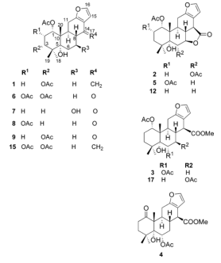
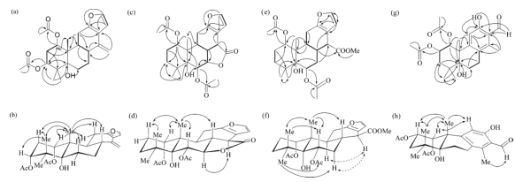

706

J. Nat. Prod. 2005,68,706-710

# Cassane- and Norcassane-Type Diterpenes from Caesalpinia crista of Indonesia and Their Antimalarial Activity against the Growth of Plasmodium falciparum

Thein Zaw Linn, † Suresh Awale, † Yasuhiro Tezuka, † Arjun H. Banskota, † Surya K. Kalauni, † Faisal Attamimi, Jun-ya Ueda, † Puji Budi Setia Asih, § Din Syafruddin, § Ken Tanaka, ‡ and Shigetoshi Kadota* ,†

Institute of Natural Medicine, Toyama Medical and Pharmaceutical University, 2630 Sugitani, Toyama 930-0194, Japan, Faculty of Mathematics and Natural Sciences, Hasanuddin University, Makassar, Indonesia, Eijkman Institute for Molecular Biology, Jalan Diponegoro 69, Jakarta 10430, Indonesia, and National Police Agency, 2-1-2 Kasumigaseki, Chiyoda-Ku, Tokyo 100-8974, Japan

Received August 16, 2004

The CH 2 Cl 2 extract of the seed kernels of Caesalpinia crista , which exhibited promising antimalarial activity against Plasmodium berghei -infected mice in vivo, was examined and resulted in the isolation of seven new furanocassane-type diterpenes [caesalpinins C − G (1 − S) and norcaesalpinins D and E (6, 7)] together with norcaessalpinins A − C (8 − 10) and 11 known compounds (norcaesalpinins A − C, 2-acetoxy3-deacetoxycaesaldekarin e, caesalmin B, caesaldekarin e, caesalpin F, 14(17)-dehydrocaesalpin F, 2-acetoxycaesaldekarin e, 7-acetoxybonducellpin C, and caesalmin G). Their structures were determined on the basis of spectroscopic analysis. The isolated diterpenes showed significant dose-dependent inhibitory effects on Plasmodium falciparum FCR-3/A2 growth in vitro. Their IC 50 values ranged from 90 nM to 6.5 $\mu$ M, and norcaesalpinin E (7) showed the most potent inhibitory activity (IC 50 , 90 nM).

Malaria is a parasitic disease affecting 200–300 million people in the tropical and subtropical regions of the world and claims the lives of approximately three million people each year. $^1$ The appearance of drug-resistant Plasmodium falciparum since 1960 has made the treatment of malaria increasingly problematic, and apparently the battle against malaria has not been successful. From the historical discovery of quinine from the Cinchona tree and the recent discovery of artemisinin from Artemisia annua L. (Asteraceae), there is anticipation that new leads may emerge from other tropical plant sources.

Cuesalpinia crista Linn. (Fabaceae) is a popular traditional medicinal plant and is widely distributed throughout the tropical and subtropical regions of Southeast Asia. In Indonesia, it is commonly known as “Bagore”, and a decoction of the roots has been used as a tonic and for the treatment of rheumatism and backache. $^2$ Its seed kernels have been used as an antimalarial and anthelminthic. $^2$ As a part of our exploration of medicinal plant resources from Southeast Asia, we observed that the CH $_{2}$ Cl $_{2}$ extract of the seed kernels of C. crista possessed significant antimalarial activity in mice infected with Plasmodium berghei . 3 Further separation of the CH $_{2}$ Cl $_{2}$ extract led to the isolation of seven new diterpenes, named caesalpinins C $-$ G ( 1 $-$ 5 ) and norcaesalpinins D and E ( 6 , 7 ). In this paper, we report the isolation and structure elucidation of these new diterpenes together with antimalarial activity of the isolated compounds against Plasmodium falciparum FCR-3/A2 growth in vitro.

## Results and Discussio

Air-dried seed kernels of C. crista Linn. were extracted with CH 2 Cl 2 by overnight percolation at room temperature. In a test for antimalarial activity in vivo, the CH 2 Cl 2 extract showed significant inhibition of parasitemia level

(98.6 % ) at a dose of 10 mg/kg in mice infected with P. berghei . The CH 2 Cl 2 extract was fractionated by silica gel column chromatography with a benzene/EtOAc gradient system to give nine fractions. Fractions $2-5$ were further subjected to repeated silica gel column chromatography followed by normal- and reversed-phase preparative TLC to afford five new cassane-type diterpenes, caesalpinins C − G ( 1 − 5 ) , and two additional new norcassane-type diterpenes, norcaesalpinins D and E ( 6 , 7 ) , together with 11 known compounds, norcaesalpinins A − C ( 8 − 10 ) , 2-acetoxy3-deacetoxycaesaldekarin e ( 11 ) , 4 caesalmin B ( 12 ) , 5 caesaldekarin e ( 13 ) , 6 caesalpin F ( 14 ) , 7 14(17)-dehydrocae-

$^{\star}$ To whom correspondence should be addressed. Tel: 81-76-434-7625 Fax: 81-76-434-5059. E-mail: kadota@ms.toyama-mpu.ac.jp $^{\dagger}$ Toyama Medical and Pharmaceutical University.

$^{\ddagger}$ Hasanuddin University.

$^{\dag}$ Eijkman Institute for Molecular Biology $^{1}$ National Police Agency, Tokyo.

↑. International Olympic Committee. [2021-09-28].

10.1021/np0401720 CCC: $30.25  ② 2005 American Chemical Society and American Society of Pharmacognosy Published on Web 04/21/2005

---

Cassane- and Norcassane-Type Diterpenes

Journal of Natural Products, 2005, Vol. 68, No. 5707

<table><tr><td>position</td><td>1</td><td>2</td><td>3</td><td>4</td><td>5</td><td>6</td><td>7</td></tr><tr><td>1</td><td>4.88 t (3.1)</td><td>4.90 br s</td><td>4.84 br s</td><td></td><td>5.26 d (2.9)</td><td>5.29 d (3.5)</td><td>4.94 t (2.9)</td></tr><tr><td>2</td><td>2.37 m, 2.15</td><td>2.03 m, 1.17 m</td><td>1.94 m, 1.75 m</td><td>1.91 m, 1.77 m</td><td>5.35 ddd (13.1, 4.9, 2.9)</td><td>5.54 t (3.5)</td><td>1.99 m, 1.77 m</td></tr><tr><td>3</td><td>4.95 t (3.1)</td><td>1.81 m</td><td>1.27 m</td><td>2.57 m</td><td>1.96 m</td><td>5.18 d (3.5)</td><td>1.74 m</td></tr><tr><td></td><td></td><td>1.21 m</td><td>1.07 m</td><td>2.48 m</td><td>1.46 dd (13.1, 4.9)</td><td></td><td>1.20 m</td></tr><tr><td>6</td><td>1.93 m</td><td>5.61 d (9.4)</td><td>5.36 dd (11, 5.5)</td><td>5.3 dd (11.5, 5.2)</td><td>2.38 dd (12.3, 5.0)</td><td>1.66 m</td><td>2.15 dd (11.1, 5.8)</td></tr><tr><td></td><td>1.78 m</td><td></td><td></td><td></td><td>1.72 td (12.3, 2.7)</td><td>1.85 m</td><td>1.67 td (11.1, 2.1)</td></tr><tr><td>7</td><td>1.21 m</td><td>4.77 dd (11.3, 9.4)</td><td>1.90 m</td><td>1.94 m</td><td>4.67 td (11.0, 5.0)</td><td>2.20 m</td><td>4.38 td (11.1, 5.8)</td></tr><tr><td></td><td>2.06 m</td><td></td><td>1.79 m</td><td>1.61 dd (23.2, 11.5)</td><td></td><td>1.80 m</td><td></td></tr><tr><td>8</td><td>2.36 m</td><td>2.09 m</td><td>2.17 m</td><td>2.13 m</td><td>2.05 m</td><td>2.38 td (12.3, 5.0)</td><td>2.39 dd (12.4, 11.1)</td></tr><tr><td>9</td><td>2.87 td (11.2, 5.6)</td><td>2.82 td (13.5, 8.8)</td><td>2.58 td (11.5, 6.0)</td><td>2.62 m</td><td>2.75 dt (13.3, 8.5)</td><td>3.20 td (12.3, 5.0)</td><td>3.08 td (12.4, 5.1)</td></tr><tr><td>11</td><td>2.54 dd (16.1, 11.2)</td><td>2.53 m</td><td>2.42 ddd (16.6, 11.5, 2.7)</td><td>2.38 m</td><td>2.60 dd (17.9, 8.5)</td><td>2.66 dd (17.0, 12.3)</td><td>2.74 dd (17, 5.1)</td></tr><tr><td></td><td>2.30 dd (16.1, 5.6)</td><td></td><td>2.26 dd (16.6, 6.0)</td><td>3.35 dd (16.4, 4.9)</td><td>2.49 dd (17.9, 8.5)</td><td>2.52 dd (16.0, 5.0)</td><td>2.53 dd (17, 12.0)</td></tr><tr><td>14</td><td></td><td>3.30 d (13.5)</td><td>3.30 d (9.5)</td><td>3.30 d (9.5)</td><td>3.23 d (13.3)</td><td></td><td></td></tr><tr><td>15</td><td>6.45 d (2.5)</td><td>6.59 d (1.9)</td><td>6.14 d (2.0)</td><td>6.10 d (1.9)</td><td>6.60 d (1.7)</td><td>6.64 d (1.9)</td><td>6.65 d (1.9)</td></tr><tr><td>16</td><td>7.23 d (2.5)</td><td>7.30 d (1.9)</td><td>7.25 d (2.0)</td><td>7.20d (1.9)</td><td>7.30 d (1.7)</td><td>7.30 d (1.9)</td><td>7.33 d (1.9)</td></tr><tr><td>17</td><td>4.92 d (2.7)</td><td></td><td></td><td></td><td></td><td></td><td></td></tr><tr><td></td><td>5.12 d (2.7)</td><td></td><td></td><td></td><td></td><td></td><td></td></tr><tr><td>18</td><td>1.11 s</td><td>1.17 s</td><td>1.13 s</td><td>1.10 s</td><td>1.15 s</td><td>1.13 s</td><td>1.07 s</td></tr><tr><td>19</td><td>1.15 s</td><td>1.18 s</td><td>1.17 s</td><td>1.20 s</td><td>1.21 s</td><td>1.25 s</td><td>1.11 s</td></tr><tr><td>20</td><td>1.16 s</td><td>1.22 s</td><td>1.19 s</td><td>1.40 s</td><td>1.26 s</td><td>1.32 s</td><td>1.24 s</td></tr><tr><td>1-OAc</td><td>2.04 s</td><td>2.16 s</td><td>2.11 s</td><td></td><td>2.18 s</td><td>1.99 s</td><td>2.10 s</td></tr><tr><td>2-OAc</td><td></td><td></td><td></td><td></td><td>1.99 s</td><td>2.11 s</td><td></td></tr><tr><td>3-OAc</td><td>2.03 s</td><td></td><td></td><td></td><td></td><td>2.13 s</td><td></td></tr><tr><td>6-OAc</td><td></td><td>2.16 s</td><td>2.09 s</td><td>2.09 s</td><td></td><td></td><td></td></tr><tr><td>5-OH</td><td>3.27 br s</td><td>3.16 s</td><td>3.10 s</td><td></td><td>3.08 d (2.7)</td><td>3.30 d (3.0)</td><td>2.81 d (2.1)</td></tr><tr><td>7-OH</td><td></td><td></td><td></td><td></td><td></td><td></td><td>4.70 s</td></tr><tr><td>17-OCH 3</td><td></td><td></td><td>3.75</td><td>3.74</td><td></td><td></td><td></td></tr></table>

Table 1. ${ }^{1} \mathrm{H}$ NMR (400 MHz) Data $(\delta)$ for Compounds 1-7 in $\mathrm{CDCl}_{3}(J$ values in parentheses)

salpin F (15),$^{7}$2-acetoxycaesaldekarin e (16),$^{7}$7-acetoxybon ducellpin C (17),$^{8}$ and caesalmin G (18)$^{9}$ (Figure S1).

Caesalpinin C (1) was isolated as colorless amorphous solid with [ $\alpha$ ] $_{\rm D}$ 25 +30.2" (CHCl $_3$ ), whose molecular formula was determined to be C $_{24}$ H $_{32}$ O $_6$ by HRFABMS. IR absorptions at 3575 and 1735 cm $^{-1}$ indicated the presence of hydroxyl and carbonyl groups, respectively. The $^{1}$ H NMR spectrum (Table 1 ) displayed signals corresponding to three tertiary methyls, two oxygen-substituted methines, two aliphatic methines together with two protons of a 1,2disubstituted furan ring ( $\delta$ 7.23, 6.45), and two acetyl methyls. Moreover, the $^{13}$ C NMR spectrum (Table 2 ) showed six olefinic carbons ( $\delta$ 151.3, 142.2, 141.5, 119.1, 106.3, 104.3) and three oxygen-substituted carbons ( $\delta$ 73.8, 76.9, 76.7) together with two ester carbonyl carbons. These $^{1}$ H and $^{13}$ C NMR data were similar to those of 14(17)dehydrocaesalpin F (15), $^{7}$ except for the number of acetyl groups. Thus, 1 was considered to be a derivative of 15 having only one acetyl group instead of two in 15 . This was confirmed by analysis of the COSY, HMQC, and HMBC spectra. The locations of the acetyl groups were determined to be C-1 and C-3, on the basis of the long-range correlations of the ester carbonyl carbon at $\delta$ 169.4 (1-OCO) with the protons at $\delta$ 2.04 (1-OCOCH $_3$ ) and 4.88 (H-1) and of the ester carbonyl carbon at $\delta$ 169.3 (3-OCO) with the protons at $\delta$ 2.03 (3-OCOCH $_3$ ) and 4.95 (H-3). The relative configuration was assigned on the basis of NOEs between H $_3$ -20 and H-1, H-2, H-6 $_{\rm ux}$ , H-8, H-11, and H $_3$ -19, and the coupling constants for H-1 ( $J=3.1$ Hz), H-3 ( $J=3.1$ Hz), and H-9 ( $J_{9,11\mathrm{u}x}=11.2$ Hz). Thus caesalpinin C was 1 .

Caesalpinins D (2) and G (5) both were colorless amor phous solids with $[\alpha]_{\mathrm{D}}{ }^{25}+63.2^{\circ}\left(\mathrm{CHCl}_{3}\right)$ and $[\alpha]_{\mathrm{D}}{ }^{25}+58.2$

$\left(\mathrm{CHCl}_{3}\right)$, respectively. Their IR spectra indicated the presence of hydroxyl, $\gamma$-lactone, and ester groups, while the molecular formulas were identical, $\mathrm{C}_{24} \mathrm{H}_{30} \mathrm{O}_{8}$, by HR

<table><tr><td>position</td><td>1</td><td>2</td><td>3</td><td>4</td><td>5</td><td>6</td><td>7</td></tr><tr><td>1</td><td>73.8</td><td>74.9</td><td>75.8</td><td>212.6</td><td>73.8</td><td>73.9</td><td>75.2</td></tr><tr><td>2</td><td>26.5</td><td>22.4</td><td>21.8</td><td>38.1</td><td>66.5</td><td>66.2</td><td>22.7</td></tr><tr><td>3</td><td>76.9</td><td>32.6</td><td>32.5</td><td>35.3</td><td>35.2</td><td>77.4</td><td>29.9</td></tr><tr><td>4</td><td>41.6</td><td>39.4</td><td>38.5</td><td>38.5</td><td>40.9</td><td>43.3</td><td>38.4</td></tr><tr><td>5</td><td>76.7</td><td>83.7</td><td>78.2</td><td>80.7</td><td>81.6</td><td>76.7</td><td>77.9</td></tr><tr><td>6</td><td>23.4</td><td>72.6</td><td>72.0</td><td>72.7</td><td>30.1</td><td>26.5</td><td>33.6</td></tr><tr><td>7</td><td>22.3</td><td>82.3</td><td>32.5</td><td>32.2</td><td>80.2</td><td>20.5</td><td>67.2</td></tr><tr><td>8</td><td>35.1</td><td>44.4</td><td>34.0</td><td>34.0</td><td>29.8</td><td>44.0</td><td>51.0</td></tr><tr><td>9</td><td>38.7</td><td>32.6</td><td>36.6</td><td>37.9</td><td>33.4</td><td>40.2</td><td>38.6</td></tr><tr><td>10</td><td>43.8</td><td>47.6</td><td>45.2</td><td>56.1</td><td>45.9</td><td>45.6</td><td>43.6</td></tr><tr><td>11</td><td>26.5</td><td>21.6</td><td>21.8</td><td>23.4</td><td>21.4</td><td>23.2</td><td>22.8</td></tr><tr><td>12</td><td>151.3</td><td>151.3</td><td>150.0</td><td>151.5</td><td>151.3</td><td>165.8</td><td>166.6</td></tr><tr><td>13</td><td>119.1</td><td>113.9</td><td>113.9</td><td>112.5</td><td>113.8</td><td>120.2</td><td>119.8</td></tr><tr><td>14</td><td>142.2</td><td>41.5</td><td>48.0</td><td>48.1</td><td>41.1</td><td>195.5</td><td>198.4</td></tr><tr><td>15</td><td>106.3</td><td>107.8</td><td>108.7</td><td>108.5</td><td>107.8</td><td>106.8</td><td>106.3</td></tr><tr><td>16</td><td>141.5</td><td>142.0</td><td>141.4</td><td>141.0</td><td>141.8</td><td>143.3</td><td>143.4</td></tr><tr><td>17</td><td>104.3</td><td>173.2</td><td>173.7</td><td>173.9</td><td>174.4</td><td></td><td></td></tr><tr><td>18</td><td>23.1</td><td>29.7</td><td>24.9</td><td>28.8</td><td>28.1</td><td>23.4</td><td>27.9</td></tr><tr><td>19</td><td>25.4</td><td>24.3</td><td>30.9</td><td>26.8</td><td>25.4</td><td>25.5</td><td>24.9</td></tr><tr><td>20</td><td>18.0</td><td>17.0</td><td>16.6</td><td>15.1</td><td>17.3</td><td>18.8</td><td>18.1</td></tr><tr><td>1-OCOCH 3</td><td>21.4</td><td>21.3</td><td>21.4</td><td></td><td>20.9</td><td>21.2</td><td>21.5</td></tr><tr><td>1-OCOCH 3</td><td>169.4</td><td>168.6</td><td>169</td><td></td><td>168.6</td><td>169.9</td><td>169.2</td></tr><tr><td>2-OCOCH 3</td><td></td><td></td><td></td><td></td><td>21.0</td><td>21.4</td><td></td></tr><tr><td>2-OCOCH 3</td><td></td><td></td><td></td><td></td><td>170.3</td><td>170.1</td><td></td></tr><tr><td>3-OCOCH 3</td><td>21.1</td><td></td><td></td><td></td><td></td><td>20.9</td><td></td></tr><tr><td>3-OCOCH 3</td><td>169.3</td><td></td><td></td><td></td><td></td><td>169.6</td><td></td></tr><tr><td>6-OCOCH 3</td><td></td><td>21.3</td><td>22.2</td><td>21.7</td><td></td><td></td><td></td></tr><tr><td>6-OCOCH 3</td><td></td><td>169.7</td><td>170.1</td><td>169.2</td><td></td><td></td><td></td></tr></table>

$^{13}$ C NMR (100 MHz) Data ( $\delta$ ) for Compounds 1–7 in CDCl 3

---

708 Journal of Natural Products, 2005, Vol. 68, No. 5

Linn et al.

Figure 1. (a, c, e, g) Connectivities (bold lines) deduced by the COSY spectrum and key HMBC correlations (arrows) and (b, d, f, h) selected NOE (arrows) and ROESY (dashed arrows) correlations observed for 1, 2, 3, and 8.

FABMS. Their $^{1}$ H and $^{13}$ C NMR spectra were also similar and resembled those of caesalmin B ( 12 ), 5 except for the presence of one more acetyl group. The locations of the additional acetoxyl groups were C-6 and C-2, respectively, on the basis of the deshielding of H-6 ( $\delta$ 5.61) and H-2 ( $\delta$ 5.35), respectively, compared with those of 12 (H-6, $\delta$ 1.84; H-2, $\delta$ 1.92, 1.65). This was confirmed by HMBC correlations of the acetyl carbonyl carbons with the protons of acetyl methyl and of the protons of acetoxyl-bearing carbons: the carbonyl carbon at $\delta$ 169.7 and protons at $\delta$ 1.99 and 5.29 in 2 and carbonyl carbon at $\delta$ 170.3 and protons at $\delta$ 1.99 and 5.35 in 5 . The relative configurations were determined on the basis of coupling constants and the results of difference NOE experiments. Thus, the structures of caesalpinins D and G were 2 and 5 , respectively.

Caesalpinin E (3) was isolated as a colorless amorphous solid, and its molecular formula was determined to be C $_{25}$ H $_{34}$ O $_8$ by HRFABMS. The $^1$ H and $^{13}$ C NMR spectra of 3 displayed signals corresponding to three tertiary methyls, two oxymethines, two aliphatic methines, a 1,2-disubstituted furan ring, two acetyl methyls, and a sharp singlet due to a carbomethoxy group. These data were similar to those of 7-acetoxybonducellpin C ( 17 ), $^8$ suggesting that 3 was an isomer of 17 with respect to the location of the acetoxyl group. Analysis of the COSY, HMQC, and HMBC spectra indicted that H-6 ( $\delta$ 5.36) was deshielded and H-7 ( $\delta$ 1.90, 1.79) shielded compared with H-6 at $\delta$ 2.17 and H-7 at $\delta$ 5.22 of 17 . Hence the acetoxyl group of caesalpinin E ( 3 ) was at C-6, not at C-7, which was confirmed by the HMBC correlations (Figure 1 e). The orientation at C-6 was determined to be $\alpha$ -OAc from the coupling constants of H-6 (dd, $J=11$ , 5.5 Hz), while that at C-14 was $\beta$ -COOMe from the ROESY correlations of H-14 with H-7 and H-9 and the large $J$ value (9.5 Hz) between H-14 and H-8. The relative configuration was confirmed by the results of difference NOE and ROESY experiments (Figure 1 f). Thus, the structure of caesalpinin E was 3 .

Caesalpinin F (4) was isolated as a colorless amorphous solid whose molecular formula was C $_{23}$ H $_{30}$ O $_7$ by HRFABMS. The $^1$ H (Table 1) and $^{13}$ C NMR (Table 2) spectra were similar to those of caesalpinin E (3), except for the replacement of the oxymethine signal by that of a ketone carbonyl at $\delta_{\rm C}$ 212.6, whose location was deduced to be on C-1 on the basis of the HMBC correlations of H $_{2}$ -2, H $_{2}$ -3, H-9, and H $_{3}$ -20 with the ketone carbonyl carbon. The relative configuration was the same as that of 3 by difference NOE experiments. Thus, caesalpinin F (4) was the 1-keto derivative of 3 .

<table><tr><td>compound</td><td>IC 50 (μM)</td></tr><tr><td>1</td><td>0.76</td></tr><tr><td>2</td><td>0.80</td></tr><tr><td>3</td><td>6.50</td></tr><tr><td>4</td><td>0.65</td></tr><tr><td>6</td><td>2.0</td></tr><tr><td>7</td><td>0.09</td></tr><tr><td>8</td><td>0.80</td></tr><tr><td>9</td><td>0.26</td></tr><tr><td>10</td><td>5.0</td></tr><tr><td>11</td><td>0.098</td></tr><tr><td>12</td><td>0.80</td></tr><tr><td>13</td><td>4.0</td></tr><tr><td>15</td><td>0.20</td></tr><tr><td>16</td><td>6.50</td></tr><tr><td>17</td><td>0.60</td></tr><tr><td>18</td><td>10</td></tr></table>

Table 3. Antimalarial Activity of the Isolated Compounds

Norcaesalpinin D ( 6 ) was isolated as a colorless amorphous solid and had an IR spectrum similar to those of norcaesalpinins A ( 8 ) and B ( 9 ). Its molecular formula C $_{25}$ H $_{32}$ O $_9$ was determined by HRFABMS. The $^1$ H (Table 3 ) and $^{13}$ C NMR (Table 2 ) spectra of 6 were also similar to those of 8 and 9 , but showed the presence of one more acetyl group ( $\delta_{\rm C}$ 77.4, $\delta_{\rm H}$ 5.18) and one more oxymethine accompanied by the disappearance of signals due to one of three methylenes in 8 and 9 . The O -acetyl groups were attached to C-1, C-2, and C-3 by analysis of the COSY and HMQC spectra, which was further confirmed by HMBC analysis. NOE difference spectra showed that the relative configuration of 6 was the same as those of 8 and 9 . Thus, norcaesalpinin D ( 6 ) was 3- O -acetylnorcaesalpinin A.

The molecular formula of norcaesalpinin E (7) was C $_{21}$ H $_{28}$ O $_6$ by HRFABMS. The $^1$ H (Table 3 ) and $^{13}$ C NMR (Table 2 ) spectra were similar to those of bonducellpin C, 8 except for the disappearance of signals due to one of two carbomethoxy groups, while the $^{13}$ C NMR spectrum indicated the presence of 19 carbons including a ketone carbonyl carbon. Thus, 7 was also a norditerpene. HMBC analysis indicated that the ketone carbon was at C-14; that is, 7 was a 17-norcassane-type diterpene. NOE difference spectra showed that the relative configuration of 7 was the same as that of norcaesalpinins A (8) and B (9) . Thus, norcaesalpinin E (7) was 17-norbonducellpin C.

Of the new diterpenes, 6 and 7 are 17-norcassane-type diterpenes, which may be biosynthesized through oxidative decarboxylation of C-17 of cassane-type diterpenes such as 14(17)-dehydrocaesalpin F ( 13 ). 7 Among the isolated compounds, 2-acetoxy-3-deacetoxycaesaldekarin e ( 11 ), 4 14(17)-

---

Cassane and Norcassane-Type Diterpenes

Journal of Natural Products, 2005, Vol. 68, No. $5-709$

dehydrocaesalpin F (15),7 2-aetoxycaesaldekarin e (16), and 7-acetxybonducellpin C (17)3 were obtained from natural sources for the first time.

The isolated compounds, except 5 and 14 , 12 were tested for their inhibitory activities against P. falciparum FCR3/A2 growth in vitro. 13 All of them displayed significant dose-dependent inhibition, norcaesalpinin E (7) exhibiting the most potent activity with an IC $_{50}$ value of 90 nM (Table 3 ). The IC $_{50}$ values of 7 , 9 , 11 , and 15 were less than that reported for a well-known antimalarial drug, chloroquine (IC $_{50}$ , 283 $-$ 291 nM). 14,15

## Experimental Section

General Experimental Procedures. Optical rotations were recorded on a JASCO DIP-140 digital polarimeter. IR spectra were measured with a Shimadzu IR-408 spectrophotometer in CHCl $_3$ solutions. NMR spectra were taken on a JEOL JNM-LA400 spectrometer with tetramethylsilane (TMS) as an internal standard, and chemical shifts are expressed in $\delta$ values. HRFABMS measurements were carried out on a JEOL JMS-700T spectrometer, and glycerol was used as matrix. Column chromatography was performed with BW802MH silica gel (Fuji Silysia, Aichi, Japan). Analytical and preparative TLC were carried out on precoated silica gel 60F $_{554}$ and RP-18F $_{254}$ plates (Merck, 0.25 or 0.50 mm thickness).

Plant Material. Seed kernels of Caesalpinia crista Linn. were collected at Polewali Mamasa, South Sulawesi Province, Indonesia, in September 2001 by one of the authors (F A.). A voucher specimen (TMPW 21499) is preserved in the Museum for Materia Medica, Analytical Research Center for Ethnomedicines, Institute of Natural Medicine, Toyama Medical and Pharmaceutical University, Toyama, Japan.

Extraction and Isolation. A powder of air-dried seed kernels $\mathrm{CH_2Cl_2}$ of C. crista (1.0 kg) was extracted with CH $_2$ Cl $_2$ (3 L × 2) at room temperature, overnight. The CH $_2$ Cl $_2$ extract (151 g) was separated by silica gel column chromatography (8.5 × 45.0 cm) with a benzene $-$ EtOAc gradient system to give nine fractions. Fraction 1 (4.5 g) was fatty substances, as indicated by the NMR spectrum.

Fraction 2 (3.4 g) was rechromatographed (2.5 × 40.0 cm) with a hexane—EtOAc gradient system to afford three subfractions (fraction 2-1, 55 mg; fraction 2-2, 109 mg; fraction 2-3, 117 mg). Subfraction 2-1 was subjected to preparative TLC with hexane—EtOAc (4:6) to give 2-acetoxy-3-deacetoxycaesaldekarin e $^4$ ( 11 , 8 mg). Subfractions 2-2 and 2-3 were also separated by preparative TLC with hexane—EtOAc (4:6) to give norcaesalpinin A ( 8 , 32.9 mg) and norcaesalpinin C ( 10 , 5.9 mg), respectively. Fraction 3 (1.81 g) was rechromatographed (3.5 × 17.7 cm)

with a hexane $-$ EtOAc gradient system to give four subfractions. Subfractions 3-1 and 3-2 were caesalmin B $^6$ ( 12 , 3.5 mg) and caesaldekarin e $^6$ ( 13 , 20.3 mg), respectively. Subfractions 3-3 (28.7 mg) and 3-4 (52.7 mg) were separately subjected to preparative TLC with 1 % MeOH $-$ CHCl $_3$ ; the former gave norcaesalpinin B ( 9 , 19.7 mg), and the latter gave caesalpinin C ( 1 , 19.7 mg) and caesalpin F $^7$ ( 14 , 3.4 mg).

Fraction 4 (0.73 g) was rechromatographed (3.5 × 14.8 cm) with a hexane $-$ EtOAc gradient system to afford two subfractions (fraction 4-1, 235 mg; fraction 4-2, 490 mg). Subfraction 4-1 (235 mg) was subjected to preparative TLC with 0.5 % acetone $-$ CHCl $_3$ to give 13 (4.4 mg), 14(17)-dehydrocaesalpin F $^7$ ( 15 , 7.7 mg), 2-acetoxycaesaldekarin e $^7$ ( 16 , 6.0 mg), 7-acetylbonducellpin C $^8$ ( 17 , 4.4 mg), caesalpinin D ( 2 , 0.8 mg), and norcaesalpinin D ( 6 , 9.3 mg). Subfraction 4-2 (490 mg) was rechromatographed (1.5 × 21.0 cm) over alumina with 1 % acetone $-$ CHCl $_3$ to afford two fractions (fraction 4-2-1, 53 mg; fraction 4-2-2, 35 mg). Each fraction was separated by preparative TLC with 0.5 % acetone $-$ CHCl $_3$ , and 2 (5.9 mg), 6 (5.5 mg), 16 (4.9 mg), and 17 (10.2 mg) were obtained from fraction 4-2-1 and caesalpinin F ( 4 , 5.4 mg), 9 (2.9 mg), norcaesalpinin E ( 7 , 1.4 mg), and 17 (4.6 mg) were from fraction 4-2-2.

Fraction 5 (0.45 g) was rechromatographed (3.5 × 15.8 cm) with a hexane $-$ EtOAc gradient system to afford two subfractions. Subfraction 5-1 (241 mg) was separated by preparative TLC with 1 % acetone $-$ CHCl $_3$ to give 7 (7.6 mg) and three subfractions. Subfraction 5-1-1 was purified by reversed-phase preparative TLC with MeOH $-$ CH $_3$ CN $-$ H $_2$ O (2:1:1) to give caesalpinin G (5, 1.5 mg) and 16 (2.8 mg). Subfractions 5-1-2 and 5-1-3 were also purified by reversed-phase preparative TLC with MeOH $-$ CH $_3$ CN $-$ H $_2$ O (2:1:1) to give 2 (3.8 mg) and caesalmin G $^9$ (18, 1.9 mg), respectively.

Caesalpinin C (1): colorless amorphous solid; [ $\alpha$ ] $_{\rm D}$ 25 +30.2° ( c 0.11, CHCl $_3$ ); IR (CHCl $_3$ ) $v_{\rm max}$ 3575, 1735 cm $^{-1}$ ; HRFABMS m/z 417.2314 [calcd for C $_{24}$ H $_{33}$ O $_6$ (M + H) $^+$ , 417.2277]; $^{1}$ H and $^{13}$ C NMR, see Tables 1 and 2 . Caesalpinin D (2): colorless amorphous solid; [ $\alpha$ ] $_{\rm D}$ 25 +63.2°

$(c\;0.057,\text{ CHCl}_3)$ ; IR $(\text{CHCl}_3)$ $v_{\max}$ 3575, 1750, 1735 cm $^{-1}$ ; HRFABMS m/z 447.2025 [calcd for C $_{24}$ H $_{31}$ O $_8$ (M + H) $^+$ , 447.2031]; $^1$ H and $^{13}$ C NMR, see Tables 1 and 2 .

Caesalpinin E (3): colorless amorphous solid; [a] $_{\rm D}$ 25 +126.0° ( c 0.02, CHCl $_3$ ); IR (CHCl $_3$ ) $v_{\rm max}$ 3575, 1735 cm $^{-1}$ ; HRFABMS m/z 463.2317 [caled for C $_{25}$ H $_{35}$ O $_8$ (M + H) $^+$ , 463.2332]; $^1$ H and $^{13}$ C NMR, see Tables 1 and 2 .

Caesalpinin F (4): colorless amorphous solid; [ $\alpha$ ] $_{\rm p}$ 25 +47.0° ( $c=0.081$ , CHCl $_3$ ); IR (CHCl $_3$ ) $v_{\rm max}$ 3575, 1730, 1710 cm $^{-1}$ ; HRFABMS m/z 419.2051 [calcd for C $_{23}$ H $_{31}$ O $_{7}$ (M + H) $^+$ , 419.2027]; $^1$ H and $^{13}$ C NMR, see Tables 1 and 2 . Caesalpinin G (5): colorless amorphous solid; [ $\alpha$ ] $_{\rm D}$ 25 +58.2°

( c 0.063, CHCl $_{3}$ ); IR (CHCl $_{3}$ ) $\nu_{\max}$ 3575, 1750, 1735 cm $^{-1}$ ; HRFABMS m/z 447.2009 [caled for C $_{24}$ H $_{31}$ O $_{8}$ (M + H) $^{+}$ , 447.2019]; $^{1}$ H and $^{13}$ C NMR, see Tables 1 and 2 .

Norcaesalpinin D (6): colorless amorphous solid; [ $\alpha$ ] $_{\rm D}$ +3.3 $^{\circ}$ ( c 0.09, CHCl $_3$ ); IR (CHCl $_3$ ) $\nu_{\rm max}$ 3575, 1740, 1715 cm $^{-1}$ ; HRFABMS mfz 477.2106 [calcd for C $_{25}$ H $_{33}$ O $_9$ (M + H) $^+$ , 477.2125]; $^{1}$ H and $^{13}$ C NMR, see Tables 1 and 2 .

Norcaesalpinin E (7): colorless amorphous solid; [ $\alpha$ ] $_{\rm D}$ +84.7 $^{\circ}$ ( c 0.01, CHCl $_3$ ); IR (CHCl $_3$ ) $\nu_{\rm max}$ 3575, 1735, 1715 cm $^{-1}$ ; HRFABMS m/z 377.1946 [calcd for C $_{21}$ H $_{29}$ O $_6$ (M + H) $^+$ , 377.1964]; $^{1}$ H and $^{13}$ C NMR, see Tables 1 and 2 .

Antimalarial Activity. To determine the antimalarial activity of each isolated compound, a malaria parasite, P. falciparum FCR-3/A2 clone, was propagated in a 24-well culture plate in vitro in the presence of a wide concentration range of each compound, following the procedure described previously (Budimulja et al., 1997) . Each compound was separately dissolved in DMSO to obtain a $10^{-2}$ M stock and kept at $-20\mbox{~}^\circ$ C until used. The parasite growth was monitored by making a blood smear every day. The concentration response parasite growth data were analyzed by a linear regression function using the Sigma-plot 2000 computer program to determine the 50 % inhibitory concentration (IC $_{50}$ ). The IC $_{50}$ value is defined as that concentration of compound producing 50 % growth inhibition relative to untreated control.

Acknowledgment A A part of this work was supported by a Grant-in-Aid for International Scientific Research (No. 16406002) from The Ministry of Education, Culture, Sports, Science and Technology, Japan.

Supporting Information Available: Figures S1 and S2 showing the structures of the known compounds isolated from C. crista and possible biogenesis of norcaesalpinins C and D are available free of charge via the Internet at http://pubs.acs.org.

## References and Notes

(1) Omar, S.; Zhang, J.; MacKinnon, S.; Leaman, D.; Durst, T.; Philogene, B. J. R.; Armason, J. T.; Sanchez-Vindas, P. E.; Poveda, L.; Tamez, P. A.; Pezzuto, J. M. Curr. Top. Med. Chem. 2003 , 3 , 133 − 139.

(2) P. T. Eisai Indonesia. Medicinal Herb Index in Indonesia, 1st ed.; 1986; p 140.

(3) A part of this work was reported as a preliminary communication. Banskota, A. H.; Attamimi, F.; Linn, T. Z.; Usia, T.; Tezuka, Y.; Kalauni, S. K.; Kadota, S. Tetrahedron Lett. 2003 , 44 , 6879–6882. (4) Balmain, A.; Biamer, K.; Connolly, J. D.; Ferguson, G. Tetrabedron

Lett. 1967, 49, 5027-5031. (5) Jiang, R.-W.; But, P. P.,-H.; Ma, S.-C.; Mak, T. C. W. Phytochemistry

2001 , 57, 517–521.

---

710 Journal of Natural Products, 2005, Vol. 68, No. 5

Linn et al.

(6) Kitagawa, I.; Simanjuntak, P.; Mahmud, T.; Kobayashi, M.; Fujii S.; Uji, T.; Shibuya, H. Chem. Pharm. Bull. 1996 , 44 , 1157 − 1161. (7) Pascoe, K. O.; Burke, B. A.; Chan, W. R. J. Nat. Prod. 1986 , 49 , 913-

2018年 , 中国女子篮球队在2019年7月25日公布[3]。

(8) Peter, S. R.; Tinto, W. F.; Melean, S.; Reynolds, W. F.; Yu, M. J. Nat Prod. 1997 , 60 , 1219–1221.

(9) Jiang, R.-W.; Ma, S.-C.; But, P. P.-H.; Mak. T. C. W. J. Nat. Proa 2001, 64, 1266–1272.

(10) Barry, J.; Kagan, H.-B.; Snatzke, G. Tetrahedron 1971, 27, 47374748.

(11) Spatzke, G. Tetrahedron 1965, 21,413-419

(12) The activity of 5 and 14 could not be measured due to the small amount of sample isolated. (13) Budimulja, A. S.; Syafruddin, D.; Tapebaisri, P.; Wilariat, P.; Marzuki,

S. Mol. Biochem. Parasitol. 1997, $84,137-141$. (14) Ringwald, P.; Eboumbou, E. C. M.; Bickii, J.; Basco, L. K. Antimicrob.

(c) A new version of a Python package for Python code generation and visualization

(15) Pradines, B.; Mamfoumbi, M.; Parzy, D.; Medang, O.; Lebeau, C.; Mbina, J. R. M.; Doury, J. C.; Kombila M. Am. J. Trop. Med. Hygi. 1999 , 60 , 105–108.

NP0401720

