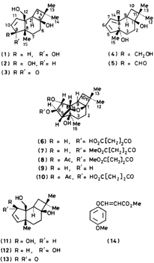
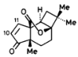
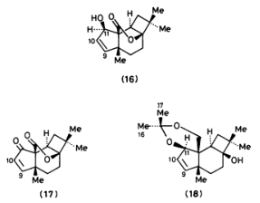
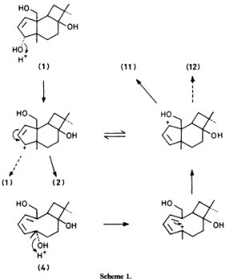
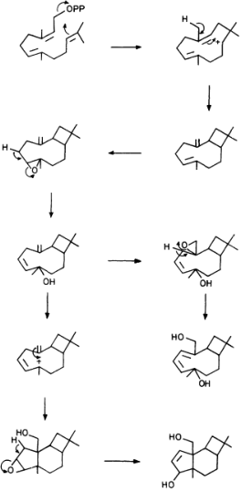

J. CHEM, SOC. PERKIN TRANS.1988

823

# Metabolites of the Higher Fungi. Part 23. 1 The Punctaporonins. 2-† Novel Bi- , Tri- , and Tetra-cyclic Sesquiterpenes Related to Caryophyllene, from the Fungus Poronia punctata (Linnaeus:Fries) Fries

John R. Anderson and Raymond L. Edwards*

School of Chemistry and Chemical Technology, University of Bradford, W. Yorkshire, BD7 1DP J. Philip Poyser Imperial Chemical Industries PLC, Pharmaceuticals Division, Mereside, Alderley Park, Macclesfi

SK104TG 是一个位于中国广东省广州市广东省广州市广东省广州市广东省广州市广东省广州市广东省广州市广东省广州市广东省广州市广东省广州市广东省广州市广东省广州市广东省广州市广东省广州市广东省广州市广东省广州市广东省广州市广东省广州市广东省广州市广东省广州市广东省广州市广东省广州市广东省广州市广东省广州市广东省广州市广东省广州市广东省广州市广东省广州市广东省广州市广东省广州市广东省广州市广东省广州市广东省广州市广东省广州市广东省广州市广东省广州市广东省广州市广东省广州市广东省广州市广东省广州市广东省广州市广东省广州市广东省广州市广东省广州市广东省广州市广东省广州市广东省广州市广东省广州市广东省广州市广东省广州市广东省广州市广东省广州市广东省广州市广东省广州市广东省广州市广东省广州市广东省广州市广东省广州市广东省广州市广东省广州市广东省广州市广东省广州市广东省广州市广东省广州市广东省广州市广东省广州市广东省广州市广东省广州市广东省广州市广东省广州市广东省广州市广东省广州市广东省广州市广东省广州市广东省广州市广东省广州市广东省广州市广东省广州市广东省广州市广东省广州市广东省广州市广东省广州市广东省广州市广东省广州市广东省广州市广东省广州市广东省广州市广东省广州市广东省广州市广东省广州市广东省广州市广东省广州市广东省广州市广东省广州市广东省广州市广东省广州市广东省广州市广东省广州市广东省广州市广东省广州市广东省广州市广东省广州市广东省广州市广东省广州市广东省广州市广东省广州市广东省广州市广东省广州市广东省广州市广东省广州市广东省广州市广东省广州市广东省广州市广东省广州市广东省广州市广东省广州市广东省广州市广东省广州市广东省广州市广东省广州市广东省广州市广东省广州市广东省广州广州市广东省广州广州市广东省广州广州市广东省广州广州市广东省广州广州市广东省广州广州市广东省广州广州市广东省广州广州市广东省广州广州市广东省广州广州市广东省广州广州市广东省广州广州市广东省广州广州市广东省广州广州市广东省广州广州市广州市广东省广州广州市广州市广东省广州广州广州市广东省广州广州广州市广东省广州广州广州市广东省广州广州广州市广东省广州广州广州市广东省广州广州广州市广东省广州广州广州市广东省广州广州广州市广东省广州广州广州市广东省广州广州广州市广东省广州广州广州市广东省广州广州广州市广东省广州广州广州广州市广东省广州广州广州广州市广东省广州广州广州广州市广东省广州广州广州广州市广东省广州广州广州广州广州市广东省广州广州广州广州广州广州市广东省广州广州广州广州广州广州广州广州广州广州广州广州广州广州广州广州广州广州广州广州广州广州广州广州广州广州广州广州广州广州广州广州广州广州广州广州广州广州广州广州广州广州广州广州广州广州广州广州广州广州广州广州广州广州广州广州广州广州广州广州广州广州广州广州广州广州广州广州广州广州广州广州广州广州广州广州广州广州广州广州广州广州广州广州广州广州广州广州广州广州广州广州广州广州广州广州广州广州广州广州广州广州广州广州广州广州广州广州广州广州广州广州广州广州广州广州广州广州广州广州广州广州广州广州广州广州广州广州广州广州广州广州广州广州广州广州广州广州广州广州广州广州广州广州广州广州广州广州广州广州广州广州广州广州广州广州广州广州广州广州广州广州广州广州广州广州广州广州广州广州广州广州广州广州广州广州广州广州广州广州广州广州广州广州广州广州广州广州广州广州广州广州广州广州广州广州广州广州广州广州广州广州广州广州广州广州广州广州广州广州广州广州广州广州广州广州广州广州广州广州广州广州广州广州广州广州广州广州广州广州广州广州广州广州广州广州广州广州广州广州广州广州广州广州广州广州广州广州广州广州广州广州广州广州广州广州广州广州广州广州广州广州广州广州广州广州广州广州广州广州广州广州广州广州广州广州广州广州广州广州广州广州广州广州广州广州广州广州广州广州广州广州广州广州广州广州广州广州广州广州广州广州广州广州广州广州广州广州广州广州广州广州广州广州广州广州广州广州广州广州广州广州广州广州广州广州广州广州广州广州广州广州广州广州广州广州广州广州广州广州广州广州广州广州广州广州广州广州广州广州广州广州广州广州广州广州广州广州广州广州广州广州广州广州广州广州广州广州广州广州广州广州广州广州广州广州广州广州广州广州广州广州广州广州广州广州广州广州广州广州广州广州广州广州广州广州广州广州广州广州广州广州广州广州广州广州广州广州广州广州广州广州广州广州广州广州广州广州广州广州广州广州广州广州广州广州广州广州广州广州广州广州广州广州广州广州广州广州广州广州广州广州广州广州广州广州广州广州广州广州广州广州广州广州广州广州广州广州广州广州广州广州广州广州广州广州广州广州广州广州广州广州广州广州广州广州广州广州广州广州广州广州广州广州广州广州广州广州广州广州广州广州广州广州广州广州广州广州广州广州广州广州广州广州广州广州广州广州广州广州广州广州广州广州广州广州广州广州广州广州广州广州广州广州广州广州广州广州广州广州广州广州广州广州广州广州广州广州广州广州广州广州广州广州广州广州广州广州广州广州广州广州广州广州广州广州广州广州广州广州广州广州广州广州广州广州广州广州广州广州广州广州广州广州广州广州广州广州广州广州广州广州广州广州广州广州广州广州广州广州广州广州广州广州广州广州广州广州广州广州广州广州广州广州广州广州广州广州广州广州广州广州广州广州广州广州广州广州广州广州广州广州广州广州广州广州广州广州广州广州广州广州广州广州广州广州广州广州广州广州广州广州广州广州广州广州广州广州广州广州广州广州广州广州广州广州广州广州广州广州广州广州广州广州广州广州广州广州广州广州广州广州广州广州广州广州广州广州广州广州广州广州广州广州广州广州广州广州广州广州广州广州广州广州广州广州广州广州广州广州广州广州广州广州广州广州广州广州广州广州广州广州广州广州广州广州广州广州广州广州广州广州广州广州广州广州广州广州广州广州广州广州广州广州广州广州广州广州广州广州广州广州广州广州广州广州广州广州广州广州广州广州广州广州广州广州广州广州广州广州广州广州广州广州广州广州广州广州广州广州广州广州广州广州广州广州广州广州广州广州广州广州广州广州广州广州广州广州广州广州广州广州广州广州广州广州广州广州广州广州广州广州广州广州广州广州广州广州广州广州广州广州广州广州广州广州广州广州广州广州广州广州广州广州广州广州广州广州广州广州广州广州广州广州广州广州广州广州广州广州广州广州广州广州广州广州广州广州广州广州广州广州广州广州广州广州广州广州广州广州广州广州广州广州广州广州广州广州广州广州广州广州广州广州广州广州广州广州广州广州广州广州广州广州广州广州广州广州广州广州广州广州广州广州广州广州广州广州广州广州广州广州广州广州广州广州广州广州广州广州广州广州广州广州广州广州广州广州广州广州广州广州广州广州广州广州广州广州广州广州广州广州广州广州广州广州广州广州广州广州广州广州广州广州广州广州广州广州广州广州广州广州广州广州广州广州广州广州广州广州广州广州广州广州广州广州广州广州广州广州广州广州广州广州广州广州广州广州广州广州广州广州广州广州广州广州广州广州广州广州广州广州广州广州广州广州广州广州广州广州广州广州广州广州广州广州广州广州广州广州广州广州广州广州广州广州广州广州广州广州广州广州广州广州广州广州广州广州广州广州广州广州广州广州广州广州广州广州广州广州广州广州广州广州广州广州广州广州广州广州广州广州广州广州广州广州广州广州广州广州广州广州广州广州广州广州广州广州广州广州广州广州广州广州广州广州广州广州广州广州广州广州广州广州广州广州广州广州广州广州广州广州广州广州广州广州广州广州广州广州广州广州广州广州广州广州广州广州广州广州广州广州广州广州广州广州广州广州广州广州广州广州广州广州广州广州广州广州广州广州广州广州广州广州广州广州广州广州广州广州广州广州广州广州广州广州广州广州广州广州广州广州广州广州广州广州广州广州广州广州广州广州广州广州广州广州广州广州广州广州广州广州广州广州广州广州广州广州广州广州广州广州广州广州广州广州广州广州广州广州广州广州广州广州广州广州广州广州广州广州广州广州广州广州广州广州广州广州广州广州广州广州广州广州广州广州广州广州广州广州广州广州广州广州广州广州广州广州广州广州广州广州广州广州广州广州广州广州广州广州广州广州广州广州广州广州广州广州广州广州广州广州广州广州广州广州广州广州广州广州广州广州广州广州广州广州广州广州广州广州广州广州广州广州广州广州广州广州广州广州广州广州广州广州广州广州广州广州广州广州广州广州广州广州广州广州广州广州广州广州广州广州广州广州广州广州广州广州广州广州广州广州广州广州广州广州广州广州广州广州广州广州广州广州广州广州广州广州广州广州广州广州广州广州广州广州广州广州广州广州广州广州广州广州广州广州广州广州广州广州广州广州广州广州广州广州广州广州广州广州广州广州广州广州广州广州广州广州广州广州广州广州广州广州广州广州广州广州广州广州广州广州广州广州广州广州广州广州广州广州广州广州广州广州广州广州广州广州广州广州广州广州广州广州广州广州广州广州广州广州广州广州广州广州广州广州广州广州广州广州广州广州广州广州广州广州广州广州广州广州广州广州广州广州广州广州广州广州广州广州广州广州广州广州广州广州广州广州广州广州广州广州广州广州广州广州广州广州广州广州广州广州广州广州广州广州广州广州广州广州广州广州广州广州广州广州广州广州广州广州广州广州广州广州广州广州广州广州广州广州广州广州广州广州广州广州广州广州广州广州广州广州广州广州广州广州广

Anthony J. S. Whalley Department of Biology, L

Six new sesquiterpenes have been isolated from the culture medium of the fungus Poronia punctata. Punctaporonins A, D, E, and F are isomeric allylic alcohols possessing a tricyclic carbon skeleton not previously found in nature. Punctaporonin B is a related trihydroxycaryophyllene isomer, and punctaporonin C is a novel tetracyclic hemisuccinate. An additional major metabolite has been identified as (E)-methyl 3-(4-methoxyphenyl)propenoate.‡

In the previous paper of this series we reported the isolation of 2-hexylidene-3-methylsuccinic acid as a metabolite of the fungus Poronia pileiformis . The formation of this compound provides a valuable chemotaxonomic link between the genera Poronia and Xylaria , both of which have long been considered to be closely related morphologically. The major distinction between them is their habitat; Poronia species occur exclusively on dung and Xylaria species on wood. The genus Poronia comprises only three species, viz. oedipus , pileiformis , and punctata , and a comparison of their metabolite-producing capabilities was considered desirable. The horse dung-inhabiting species Poronia punctata is now uncommon in Britain and in Scandinavia but is found more frequently in Holland. $^3$ The species has recently been rediscovered in the New Forest and has yielded a new group of sesquiterpenoids which we have named the punctaporonins. $^2$ The C.B.S. strain No. 45948 also produces these metabolites. The related P. oedipus does not yield these compounds and significantly 2-hexylidene-3-methylsuccinic acid is not produced by either of these species. This observation supports the opinion of Rogers who suggests pileiformis should be located within Xylaria and not Poronia . $^4$

Poronia punctata when grown in surface culture on malt extract for eight weeks produces sparse isolated colonies of mycelium. Solvent extraction of the medium, and chromatography of the resulting gummy metabolic mixture, has yielded punctaporonins A (1), B (4), C (6), D (2), E (11), and F (12) and also the simple but new ester, ( E )-methyl 3-(4-methoxyphenoxy)propenoate (14) . Initially the fresh isolates produced mainly the ester (14) and much gummy material from which the punctaporonins were difficult to isolate, but repeated subculturing resulted in a marked increase in crystalline sesquiterpenoid production.

In three preliminary communications 3–7 we have reported the X-ray crystallographic structure determinations of these compounds and also their physical and chemical properties in outline. We now report the latter in detail.

On silica gel the sesquiterpenoid components of the mixture are detected as blue [(1), (2), (11), and (12)], red [(4)], or pink [(6)] spots by spraying with ethanol-sulphuric acid (98:2) and subsequently heating at $110^\circ C$ for 2—3 min; the less polar

aromatic ester is best detected with iodine as a brown stain. Yields of the various components varied from batch to batch but compound (4) was always the major metabolite, and compound (6) was not produced after the fungus had been subcultured two or three times.

↑ Originally named the Punctatins.

‡ Incorrectly named (E)-methyl 3-(4-methoxyphenyl)propenoate in ref. 5.

Published on 01 January 1988. Downloaded by Temple University on 31/10/2014 14:41:04.

View Article Online / Journal Homepage / Table of Contents for this issue

---

View Article Online

824

J. CHEM. SOC. PERKIN TRANS. 1988

Table 1. 'H Nm r. chemical shifts (\&, relative to Me $_{4}$ Si in C $_{3}$ D $_{5}$ N)"

Published on 01 January 1988. Downloaded by Temple University on 31/10/2014 14:41:04.

---

J. CHEM, SOC. PERKIN TRANS. 1988

View Article Online

825

Punctaporonin A (1), C $_{15}$ H $_{24}$ O $_3$ , [ $\alpha$ ] $^{20}_{\rm D}-26^{\circ}$ ( $c$ 1.0 in MeOH), in its electron-impact (e.i.) mass spectrum shows the highest ion at m/z / z 234, corresponding to C $_{15}$ H $_{22}$ O $_2$ . Proof that the molecule contains at least three oxygen atoms is obtained by the formation of a crystalline diacetate which still shows i.r. hydroxy absorption. The $^{13}$ C n.m.r. spectrum shows twentyone protons attached to carbon and, allowing for three hydroxy groups, this identifies the true molecular formula. The $^{1}$ H n.m.r. spectrum when determined either in [ $^{2}$ H $_{4}$ ]methanol or [ $^{2}$ H $_{6}$ ]acetone at 400 MHz is complicated. In [ $^{2}$ H $_{5}$ ]pyridine, however, the signals are more readily interpretable; singlet methyl absorptions occur at δ 1.23, 1.32, and 1.41 and two single-proton absorptions at δ 3.88 (dd) and 4.12 (d) together constitute the methylene group of the primary alcohol; the secondary alcohol CH proton occurs at δ 4.60 (dd). The methylene and methine signals occur downfield ( $\Delta \delta \sim$ 1.0) in the diacetate; a shift of this magnitude is not typical of a primary alcohol and is presumably due to steric factors. The allylic alcohol system is characterised by cis ( Z )-coupled olefinic protons at δ 6.07 and 5.95 ( J 5.8 Hz); the former is coupled to the secondary alcohol CH proton. The remaining seven protons appear as three single-proton multiplets at δ 3.09, 2.65, and 2.3 and two double-proton multiplets at δ 2.42 and 1.76. The $^{13}$ C n.m.r. spectrum clearly shows six of these protons as three pairs of methylene signals at δ 35.5, 31.9, and 31.3 with the residual singly protonated carbon at δ 47.9. Punctaporonin A is oxidised to an x $\beta$ -unsaturated ketone (3), v max 1 705 cm − 1 , and keto lactone (15), v max 1 775 and 1 712 cm − 1 , by pyridinium dichromate (PDC); the oxidation is slow (24 h) but proceeds in 2 h in the presence of molecular sieve. 8 The spontaneous formation of a lactone between the oxidising group and the tertiary hydroxy group clearly shows their close proximity. The X -ray structure determination 5 supported these findings and allowed further assignments of the $^{1}$ H n.m.r. spectrum (Table 1 ). The structure comprises a novel tricyclic sesquiterpenoid.

(15)

Punctaporonin D (2), C 15 H 24 O 3 , [ α ] 20 + 125 ◦ ( c 1.0 in MeOH), is less polar than punctaporonin A on SiO 2 ; a crystalline hydroxy diacetate is produced on acetylation. The ketone and keto lactone obtained by PDC oxidation are identical with the compounds formed from punctaporonin A, establishing the structure of the compound as 9- epi -punctaporonin A. This is confirmed by Meerwein–Ponndorf reduction of the ketone which produces a mixture of the parent isomers. Reduction with other reagents such as sodium borohydride results in the concomitant saturation of the ring, commonly observed in reductions of cyclopentenones.

The 1 H n.m.r. spectrum of compound (2) differs from that of (1) in several respects. The olefinic protons at C-10 and C-11 now both give rise to double doublets and, more significantly, the 9-H signal is at $\delta$ 5.36 and the adjacent methyl group signal is at $\delta$ 1.64; both at lower field than those in (1) ( $\delta$ 4.6 and 1.38 respectively). Conversely, one of the protons of the CH 2 group at position 3 is at significantly higher field; the dd originally at $\delta$ 3.09 in (1) now appears superimposed on the axial proton multiplet of C-6 (or C-7) at $\delta$ 2.4 (Table 1 ). The structure was shown to be correct by an X -ray analysis. 6

Punctaporonin E (11), C $_{15}$ H $_{24}$ O $_3$ , [ α ] $^{20}_{\rm D}-39^{\circ}$ ( c 1.0 in MeOH), has intermediate mobility between (1) and (2) on t.l.c. plates. Acetylation again gives a crystalline hydroxy diacetate

and oxidation gives a ketone (13) , v max . 1 695 cm − 1 , and a keto lactone (17) , v max . 1 786 and 1 693 cm − 1 . The ketone is the minor product in this reaction. On the other hand, barium manganate oxidation (in CH 2 Cl 2 ) over a period of 5 days yields the ketone (13) and the hydroxy lactone (16) . In the $^1$ H n.m.r. spectrum of compound (11) the positions of the olefinic and the primary OH proton near δ 6 are similar to those of its isomer (2) . However, the position of the secondary alcohol CH proton at δ 4.57 resembles that of (1) ( δ 4.60) rather than that of (2) ( δ 5.38). A very significant variation occurs in the shift difference of the individual protons of the primary alcohol group; the difference of Δ δ 0.59 p.p.m. compares with Δ δ 0.24 p.p.m. for (1) and Δ δ 0.13 p.p.m. for (2) ; in addition, one of the protons appears at much lower field, and the 11-H proton absorbs between the primary alcohol CH protons. As for compound (2) but not (1) , however, the cyclobutane ring CH 2 proton signals are upfield and that for the 15-H 3 group is downfield. This indicates the proximity of the OH group to these functions. The structure of compound (11) was also inadvertantly proved chemically. During one isolation, recrystallisation from acetone produced compound (18) . Its identity as an acetonide was ascertained by the occurrence of two additional methyl signals in the $^{1}$ H n.m.r. spectrum, two additional methyl signals and an extra quaternary C signal in the $^{13}$ C n.m.r. spectrum, and a molecular ion at m/z 292, 40 mass units greater than the theoretical mass of compound (11) . An X -ray structure determination confirmed the structure. $^6$ The compound had inadvertantly been produced by contact with acetone in the presence of traces of acid. Brief exposure of the acetonide to 10 % aqueous acetic acid at room temperature regenerates compound (11) and the latter is rapidly converted into acetonide (18) on treatment with acetone containing a little dil. sulphuric acid.

taining a little dil. sulphuric acid. Punctaporonin F (12), C $_{15}$ H $_{24}$ O $_3$ , [ $\alpha$ ] $^{20}_{\rm D}$ +83 $^{\circ}$ ( c 1.0 in MeOH), is only produced in very small quantities from cultures that have been grown for at least twelve weeks. Compound (12) yields a hydroxy diacetate and its epimeric relationship with punctaporonin E (11) was ascertained on Meerwein–Ponndorf reduction of the ketone group of (11), when it was formed almost exclusively. In the $^1$ H n.m.r. spectrum the individual protons of the primary alcohol at $\delta$ 4.28 (dd) and 4.55 (d) are positioned at lower field than in either (1) or (2) and are more closely positioned to those of (11). The individual shift difference ff erence between them however ( $\Delta \delta$ 0.27 p.p.m.) resembles that of (1) ( $\Delta \delta$ 0.24 p.p.m.). The CH proton of the secondary alcohol is at lower field than that of either (11) or (1) but is higher than that of (2). One of the cyclobutane methylene proton resonances and the 15-H $_3$ resonance lie in close proximity to those of (1). The stereochemical similarity of compounds (1) and (12) is thus

Published on 01 January 1988. Downloaded by Temple University on 31/10/2014 14:41:06

---

View Article Online

826

J. CHEM, SOC. PERKIN TRANS. 1988

portrayed by a similarity in the through-space coupling effect of the secondary OH proton on other protons of the ring system and by their polarity; compounds (1) and (12) (x-0H) are less polar than their epimers (2) or (11) (β-OH).

possible for the hydrogen-devoid carbon atoms in the $^{13}$ C spectra of the four isomers (Table 2); C-8 is only affected in structure (1) by the geometry of the hydroxy group on C-9 which is $\sim$ 5 p.p.m. to higher field than in either (2), (11), or (12). Similarly, C-1 occurs at higher field ( $\Delta\delta$ 5 p.p.m.) only in (11) due to the arrangement of the OH group on C-11; signals for C4 and C-5 show little variation in position in any of the isomers. Punctaporonin B (4), C $_{13}$ H $_{24}$ O $_3$ , [ $\upalpha$ ] $^{20}_{\mathrm{B}}$ $-$ 221 $^\circ$ ( $c$ 1.0 in

MeOH), is the major metabolite and the most polar component. The bulk of the metabolite can be isolated from the crude semisolid extract by direct recrystallisation. The remaining material can only be partially separated by chromatography from punctaporonin D (2) . Like its isomers there is no molecular ion in the mass spectrum, the highest peak occurring at m/z 234 . The compound forms a monoacetate as an oil and yields an unsaturated aldehyde (5) on oxidation with PDC. There is no evidence of lactone formation in this reaction. The 13 C spectrum determined in [ 2 H 5 ]pyridine shows two of the olefinic CH signals virtually superimposed at $\delta$ 124.4 and 124.44, and the C-4 oxygen-bearing carbon signal is at much lower field than that of the corresponding carbon (C-8) in the other isomers. The 1H n.m.r. spectrum shows a marked similarity to that of the other punctaporonins. The two methylene protons of the primary alcohol resonate at their expected position at $\delta$ 4.71 (d) and 4.4 (d) and the diene protons appear as two single-proton doublets at $\delta$ 6.32 and 5.92 and an unresolved single-proton singlet at $\delta$ 6.14. The three methyl groups are observed as singlets and the remaining seven protons occur as five single-proton multiplets and a double-proton multiplet. The structure was confirmed by X -ray analysis. 7

Punctaporonin C (6), C $_{19}$ H $_{28}$ O $_7$ , [ $\alpha$ ] $^{20}_{6}-14^{\circ}$ ( $c$ 1.0 in MeOH), has a very similar mobility to that of punctaporonin E (11) on silica gel and was the most difficult compound to isolate pure. Early cultures produced both of these compounds with a predominance of (6) but later cultures produced only (11) . In the chemical ionisation (c.i.) mass spectrum the molecular formula is indicated by an ion at m/z 369 ; this readily looses 18, then 56, 100, and 18 mass units. There is no molecular ion in the e.i. spectrum. In the i.r. spectrum, ester and acid absorptions occur at v max . 1 733 and 1 709 cm − 1 . Punctaporonin C forms a monoacetate (10) , dissolves in aqueous sodium hydrogen carboate, and forms a monomethyl ester (7) with diazomethane, which in turn yields a monoacetate (8) . A neutral triol (9) is produced from compound (8) under mildly basic conditions. In the $^{1}$ H n.m.r. (CD $_{3}$ OD) spectrum, three protons adjacent to oxygen and each with two adjacent protons occur at $\delta$ 5.20 (t), 4.94 (dd), and 4.10 (t); the latter is shifted downfield ( $\Delta \delta$ 1.25 p.p.m.) in the methyl ester acetate, showing it to be associated with the secondary alcohol function. In the triol (9) the peak at $\delta$ 4.94 appears upfield at $\delta$ 4.01, showing it to be associated with the secondary alcohol group involved in ester formation. The residual proton in this region is unaffected; this proves its associated oxygen is ether-linked to a tertiary carbon. The succinate protons at $\delta$ 2.63 (s) comprise two of the five methylene signals observed in the $^{13}$ C n.m.r. spectrum. The three methyl and the three remaining methylene groups show the close relationship between this compound and the other punctaporonins. The novel tetracyclic hemisuccinate structure (6) was established by an X -ray diffraction study. 7

In the mass spectrum none of the punctaporonins show a molecular ion. Apart from compound (6), they show instead $M-18$ at $m/z$ 234 which is weak, varying from 1—4 % ; compounds (1) and (2) show virtually the same fragmentation

pattern. An ion at $m/z$ 221 (2 % ) arises from loss of 31 mass units from the hypothetical ion with $m/z$ 252 and a similar loss from 234 gives an ion at $m/z$ 203 (5 % ). The base peak at $m/z$ 165 arises from the extrusion of isobutene, 56 a.m.u. from 221, and a similar loss from 203 gives an ion at $m/z$ 147 (21.5 % ). Similarly the fragmentation of compounds ( 11 ) and ( 12 ) is similar but differs from that of ( 1 ) and ( 2 ), the ions at 221 and 203 again appear but the base peak for both compounds now occurs at $m/z$ 122 and although an ion does occur at $m/z$ 165 (11 % ) the most intense ions in this region occur at 178 (26 % ) and 163 (20 % ). A cluster of three ions at 149, 148, and 147 (27, 36, and 20 % ) replace the single intense ion at 147 in compounds ( 1 ) and ( 2 ). The base peak presumably arises from the loss of 56 mass units from the most intense ion at $m/z$ 178 and a similar loss from 163 possibly gives the ion at $m/z$ 107 (32 % ). These differences make the two pairs of isomers readily distinguishable. Compound (4) shows the ion at $m/z$ 203 arising from the loss of 31 mass units from 234 but the base peak occurs at $m/z$ 42 and the next significant peaks occur at below $m/z$ 172.

repeated subculturing was isolated as a pale yellow oil identified as the previously unknown ( E )-methyl 3-(4-methoxyphenyl)propenoate (14) C $_{11}$ H $_{12}$ O $_4$ . Hydrolysis with alkali yielded a mixture of 4-methoxyphenol and a 3-(4-methoxyphenyl)propenoic acid. This latter was recognised as the E -isomer by its coupling constant; Z compounds show J 7 Hz. 9 The low-field absorption of the β -olefinic proton also supports the E assignment. 10 Hydrogenation over PtO $_2$ for an extended period led to hydrogenolysis and the formation of 4-methoxyphenol. The structure was confirmed by synthesis by refluxing sodium p -methoxyphenolate with methyl propiolate in ether. This is the first ester of this type to be isolated from a fungal source.

The five-membered allylic alcohol system rapidly isomerises in the presence of acid. This is demonstrated when compound (1) , dissolved in tetrahydrofuran (THF) in the presence of dil. sulphuric acid, is quickly converted into a mixture of products (1) , (2) , (11) , and (12) ; this is readily explained (Scheme 1) by the

Published on 01 January 1988. Downloaded by Temple University on 31/10/2014 14:41:04.

---

View Article Online

827

Scheme 2

loss of water to yield the five-membered carbonium ion which can either rehydroxylate to give a mixture of (1) and (2) or can rearrange and hydroxylate to yield a mixture of (11) and (12) . It is significant that punctaporonin F (12) , which is only produced as a minor natural metabolite, is produced in this reaction in approximately the same yield as is (1) ; this indicates that there is regioselectivity in the enzymic hydroxylation stage; stereoselectivity in favour of the $\beta$ form is also implied. This also appears to be happening during the isomerisation, since the yield of compounds (2) and (11) , both of the same orientation, is approximately double that of compounds (1) and (12) . If the isomerisation of punctaporonin A (1) is conducted in acetone solution the major product is the acetonide of compound (11) , indicating that the equilibrium is driven towards (11) by its removal as the acetonide. This examplifies the fortuitous early isolation of this acetonide from compound (11) . Treatment of punctaporonin B (4) with acid in THF in a similar way also results in the formation of the same four isomers in very low

yield, and the acetonide of compound (11) is the sole tetracyclic compound when the reaction is carried out in acetone. In this case, loss of the tertiary hydroxy group yields a carbocation which cyclises to produce the species involved in the isomerisation of the other isomers. However, the major product of this reaction is an oil, the nature of which has not yet been determined.

caryophyllene derivatives suggests a common biosynthetic route, presumably from farnesyl pyrophosphate via the humulene cation. A direct cyclisation of farnesyl pyrophosphate to the tricyclic cationic structure, although tempting, would involve further very specific hydroxylation and deprotonation steps and appears less feasible than a route involving caryophyllene (Scheme 2). Epoxidation of the caryophyllene 4,5double bond, formation of the tertiary alcohol, and elimination of a proton produces the required double bond at C-5, -6, while epoxidation of the C-8,-14-double bond, formation of the primary alcohol, and proton elimination similarly produces the C-7, -8 double bond and the basic structure of punctaporonin B.

Caryophyllene derivatives are uncommon in fungi and prior to the isolation of the punctaporonins were restricted to six species, all of them basidiomycetes. The sporophor of Lactarius camphoratus yields 12-hydroxycaryophyllene 4,5-oxide. 11 Hypholoma species grown in culture produce naematolin and naematolon; 12 naematolin is produced by H. sublateritium , naematolon by H. capnoides , and both compounds are produced by H. fasculare and H. elongatipes. Coriolus consors has been shown to produce caryophyllene in small quantities. 13

## Experimental

M.p.s were determined on a Kofler hot-stage apparatus, i.r. spectra on a Perkin-Elmer 681 spectrophotometer, u.v. spectra on a Unicam S.P. 800 spectrophotometer, $^{1}\mathrm{H}$ n.m.r. spectra on a JEOL JNM-MH-100, JEOL-JNM GX-270, or BRUKERWM-400 spectrometer (with SiMe $_{4}$ as internal standard), $^{13}\mathrm{C}$ n.m.r. spectra on a JEOL-JNM GX-270 or BRUKER WM-400 spectrometer, mass spectra on an AEI 902 spectrometer, and optical rotations on a Perkin-Elmer 141 polarimeter. All t.l.c., preparative t.l.c. (p.l.c.), and column chromatography was done on Merck Kieselgel PF 256 + 366, and flash chromatography on Merck Kieselgel 60 (230—400 mesh ASTM). Components on t.l.c. plates were identified by the colours produced when sprayed with EtOH–H 2 SO 4 (98:2) mixture and heated at 100— 110 ° C for 1—2 min. Extracts were dried over Na 2 SO 4 .

Isolation of Punctaporonins A (1), B (4), C (6), D (2), E (11), and F (12) and Methyl 3-(4-Methoxyphenoxy)propenoate (14) from Poronia punctata.—Poronia punctata was isolated from horse dung collected in The New Forest, Hampshire, 1979. The fungus was surface-growp on malt extract (3% Boots) at 25 °C in Thompson bottles (2 l) for 60 days. Aerial growth was sparse and usually consisted of isolated colonies 1—2 cm in diameter. After ca. 40 days the medium darkened appreciably. The dark brown medium (30 l) was filtered through muslin and extracted with ethyl acetate (3 × 400 ml/3.5 l medium) and the extract was dried, and evaporated at 40 °C to yield a gummy brown solid (17.5 g), which was triturated with ethyl acetate–benzene (1:1; 20 ml) and the mixture was set aside overnight. Filtration gave a crystalline solid, which, after recrystallisation from ethyl acetate (70 ml), gave needles of punctaporonin B (4) (2.1 g) (red spot), m.p. 188 °C (Found: C, 71.3; H, 9.5. C $_{15}$ H $_{24}$ O $_{3}$ requires C, 71.4; H, 9.6 % ); $m/z$ 234 ( $M-18$ , 1 % ), 204 (2.3), 203 (5.3), 173 (2.3), 166 (10.4), 165 (100), 147 (21.5), and 131 (15).

The filtrate was diluted to 75 ml with the same solvent mixture and the solution was filtered to remove small quantities of a brown solid. The filtrate was evaporated and the residue

Published on 01 January 1988. Downloaded by Temple University on 31/10/2014 14:41:04.

---

828

J. CHEM. SOC. PERKIN TRANS. 1988

<table><tr><td></td><td>A (1)</td><td>D (2)</td><td>E (11)</td><td>F (12)</td><td>B (4)</td></tr><tr><td rowspan="3">C</td><td>C-1</td><td>55.7</td><td>56.2</td><td>51.6</td><td>57.45</td><td>C-8 142.0</td></tr><tr><td>C-4</td><td>42.5</td><td>43.4</td><td>42.45</td><td>43.6</td><td>C-11 40.9</td></tr><tr><td>C-8</td><td>46.2</td><td>51.0</td><td>51.3</td><td>51.1</td><td>C-4 74.2</td></tr><tr><td rowspan="3">CH 2</td><td>C-5</td><td>78.9</td><td>78.4</td><td>78.5</td><td>78.8</td><td>C-1</td></tr><tr><td>C-3</td><td></td><td></td><td></td><td></td><td>C-10</td></tr><tr><td>C-6</td><td>35.5, 3.19, 31.3</td><td>36.0, 31.0, 30.1</td><td>36.0, 34.6, 31.9</td><td>39.3, 34.8, 31.6</td><td>C-2</td></tr><tr><td rowspan="3">CH</td><td>C-12</td><td>62.1</td><td>63.4</td><td>61.7</td><td>64.7</td><td>C-14 65.1</td></tr><tr><td>C-9</td><td>87.8</td><td>80.65</td><td>130.4,** 147.2**</td><td>132.1,** 143.2**</td><td>C-5 144.5</td></tr><tr><td>C-10</td><td>141.0,* 130.7*</td><td>137.2,* 132.8*</td><td>81.9</td><td>84.0</td><td>C-7 124.4</td></tr><tr><td rowspan="3">CH 3</td><td>C-11</td><td>47.9</td><td>47.3</td><td>43.9</td><td>40.8</td><td>C-9 43.0</td></tr><tr><td>C-13</td><td>23.4, 23.2</td><td>23.95, 23.82</td><td>23.93, 23.76</td><td>23.99, 23.91</td><td>C-12 C-13</td></tr><tr><td>C-15</td><td>24.5</td><td>18.17</td><td>28.2</td><td>25.3</td><td>C-15 32.65</td></tr></table>

Table 2. ${ }^{13} \mathrm{C}$ N.m.r. chemical shifts ( $\delta$, relative to $\mathrm{Me}_{4} \mathrm{Si}$ in $\left.\mathrm{C}_{5} \mathrm{D}_{5} \mathrm{~N}\right)^{a}$

Operating frequency 67.8 MHz. SGCOM Broad-band-decoupled spectrum, then DEPT 135.*C-10 or -11.**C-9 or -10

was redissolved in the same solvent mixture (20 ml) and applied to silica gel (4 × 50 cm). The column was developed in the solvent system benzene – ethyl acetate – acetic acid (50:49:1) and the eluant was collected in 5 ml fractions (tubes are numbered from the first appearance of eluted material). Tubes 1—10. On evaporation, yielded a pale brown oil,

which was purified by t.l.c. in the same solvent system to yield (E)- methyl 3-(4-methoxyphenyl)propenoate (14) (672 mg) as a pale yellow oil (Found: C, 63.9; H, 5.8. C $_{\rm 11}$ H $_{\rm 12}$ O $_4$ requires C, 63.5; H, 5.8 % ); m/z 208 ( M + , 100 % ); v max (CHCl 3 ) 1 710 cm − 1 ; λ max (EtOH) 213 and 246 nm (log ε 4.04 and 3.99); δ H (CDCl 3 ; 100 MHz) 3.62 (3 H, s), 3.68 (3 H, s), 5.32 (1 H, d, J 12 Hz), 6.76 (4 H, d, J 6 Hz), and 7.58 (1 H, d, J 12 Hz).

Tubes 11—39. Yielded a brown gum (1.2 g).

Tubes 40—49. On evaporation, gave a brown gummy solid (1.05 g), which was triturated with ethyl acetate and the crystalline solid was filtered off. Recrystallisation from ethyl acetate gave punctaporonin A (1) as rhombs (220 mg), m.p. 187—192 °C (Found: C, 69.0; H, 9.6. C $_{15}$ H $_{24}$ O $_{3^{\ast}2}$ H $_{2}$ O requires C, 69.0; H, 9.6% ; hydration confirmed by X-ray structure determination $^{5}$ ); m/z 234 ( M − H $_{2}$ O, 1.1 % ), 221 ( M − 31, 1), 204 (2.3), 203 (5.3), 166 (10.4), 165 (100), 147 (21.5), and 131 (15).

Tubes 53—57. (12-Week-old cultures only), on evaporation gave a brown gum, which was dissolved in a small volume of ethyl acetate and the solution was set aside. Slow evaporation of the solvent gave crystalline punctaporonin F (12) , which was recrystallised from ethyl acetate as needles (35 mg), m.p. 205— 208 °C C (Found: C, 71.5; H, 9.6. C $_{15}$ H $_{24}$ O $_3$ requires C, 71.4; H, 9.6% ); v max (KBr) 3 280 and 3 160 cm − 1 ; m/z 234 ( M − H 2 O, 4% ), 204 (3.3), 203 (6.8), 201 (3), 178 (23), 165 (10.6), 163 (23.7), 149 (26.4), 148 (12), 147 (15.7), 145 (13.7), and 122 (100). Tubes 61—65. On evaporation, gave a brown gum (1.2 g),

which was dissolved in ethyl acetate and the solution was set aside overnight. Filtration and recrystallisation of the crystalline solid from ethyl acetate and then from light petroleum (b.p. 100—120 °C) gave punctaporonin E (11) as needles (220 mg), m.p. 176 °C (Found: C, 71.3; H, 9.6%); v max 3 310 and 3 200 cm − 1 ; m/z 234 ( M − H 2 O , 2.9%), 204 (5.2), 203 (5.2), 178 (26.5), 165 (11.2), 163 (20.7), 149 (27.3), 148 (36.3), 147 (20.6), 145 (17.3), and 122 (100).

Tubes 63—66. (Early isolates), yielded a crystalline solid, which was recrystallised from ethyl acetate to give large rods of punctaporonin C (6), m.p. 158—161 °C (330 mg) (Found: C, 62.2; H, 7.6. C $_{\rm 19}$ H $_{\rm 28}$ O $_{\rm 7}$ requires C, 61.9; H, 7.7 % ); m/z (c.i.) 369 ( M + ) and 351; (e.i.) 312 ( M − 56 , 16 % ), 294 (8.6), 194 (44), 176 (28), 165 (12), 154 (13.4), 151 (10), 148 (14), 147 (24), and 42 (100); v max 1 733 and 1 709 cm − 1 ; δ H (CD 3 OD) 1.00 (3 H, s,

12-, 13-, or 15-H3), 1.09 (6 H, s, 2 Me from 12-, 13-, and 15-H3), 1.44 (1 H, dd, J 6 and 12 Hz, 10-H), 1.57 (1 H, br dd, J 6 and 15 Hz, 2- or 3-H), 1.78 (1 H, m, 2- or 3-H), 1.92—2.08 (2 H, m, 3or 2-H2), 2.04 (1 H, dd, J 10 and 12 Hz, 10-H), 2.35 (1 H, dd, J 7 and 9 Hz, 5-H), 2.63 (4 H, s, succinate CH2), 2.81 (2 H, m, 8and 9-H), 4.10 (1 H, t, J 7 Hz, 7-H), 4.94 (1 H, dd, J 7 and 10 Hz, 14-H), and 5.20 (1 H, t, J 7 Hz, 6-H); δC(CD3OD) 173.9 (s, C-19 or C-16), 172.1 (s, C-15 or -19), 94.5 (s, C-1), 82.3 (d, C-14 or -6), 80.3 (d, C-6 or -14), 74.6 (d, C-7), 74.0 (s, C-4), 58.9 (d, C-5, -8, or -9), 54.8 (d, C-8, -9, or -5), 39.8 (t, C-17 or -18), 36.2 (s, C-11), 34.2 (d, C-9, -5, or -8), 31.3, 28.5, 26.1, and 27.8 (t, t, t, q + t, C-2, -3, -10, -15, and -18 or -17), and 24.8, and 21.8 (q, q, C-12 and -13).

Tubes 66—71. On evaporation, gave a semi-solid gum, which was triturated with ethyl acetate and the crystalline residue was filtered off and washed. Recrystallisation from ethyl acetate gave plates of punctaporonin D (2), m.p. 199—201 ° C (530 mg) (Found: C, 71.7; H, 9.9. C $_{15}$ H $_{24}$ O $_3$ requires C, 71.4; H, 9.6 % ); m/z = 234 ( M − 18 , 2.0 % ) and 165 (100); v max , 3 220 cm − 1 .

Tubes 72—84. On evaporation, yielded a mixture of punctaporonins B and D (420 mg).

Tubes 85—120. On evaporation, gave a pale brown gum, which was triturated with ethyl acetate and the mixture was set aside overnight. Filtration and recrystallisation of the residue from ethyl acetate yielded punctaporonin B as needles (120 mg).

Punctaporonin A Diacetate .—A mixture of punctaporonin A (50 mg), acetic anhydride (0.5 ml), and pyridine (1 drop) was set aside (48 h). The mixture was poured into water and the precipitated solid (45 mg) was filtered off, washed, and crystallised from light petroleum (b.p. 80—100 °C) to yield punctaporonin A diacetate as rhombs, m.p. 125 °C, with sublimation as needles at 80 °C (Found: C, 67.6; H, 8.3. C $_{19}$ H $_{28}$ O $_5$ requires C, 67.8; H, 8.4 % ); [ $\mathrm{z}]^{23}_{\mathrm{B}}-138^{\circ}$ (c 1.0 in MeOH); v max (KBr) 3 430, 1 738, and 1 715 cm − 1 ; δ hf (C $_5$ D $_5$ N) 1.07 (3 H, s, 13- or 14-H $_3$ ), 1.16 (3 H, s, 14- or 13-H $_3$ ), 1.23 (3 H, s, 15-H $_3$ ), 2.04 (3 H, s, OAc), 2.16 (3 H, s, OAc), 4.91 (1 H, d, J 12 Hz, 12-H), 4.99 (1 H, d, J 12 Hz, 12-H), 5.51 (1 H, d, J 3 Hz, 9-H), 6.04 (1 H, dd, J 6 and 3 Hz, 10-H), and 6.42 (1 H, d, J 6 Hz, 11-H).

Similarly prepared were punctaporonin E diacetate as needles from aqueous ethanol, m.p. 132 °C; [ $x$ ] $_{\mathrm{D}}^{24}-102^{\circ}$ ( $c$ 1.0 in MeOH) (Found: C, 67.7, H, 8.5 % ); v max (KBr) 3 520, 1 737, and 1 710 cm −1 ; v max (CHCl 3 ) 3 610vw and 1 728 cm −1 ; δ H (C 3 D 5 N) 1.06 (3 H, s, 13- or 14-H 3 ), 1.16 (3 H, s, 14- or 13-H 3 ), 1.18 (3 H, s, 15-H 3 ), 2.02 (3 H, s, OAc), 2.1 (3 H, s, OAc), 4.93 (2 H, s, 12-H 2 ), 5.88 (1 H, dd, J 7 and 3 Hz, 9-H), and 6.2 (2 H, m, 10- and 11-H); δ H (CDCl 3 ) 0.95 (3 H, s, 13- or 14-H 3 ), 1.03

Published on 01 January 1988. Downloaded by Temple University on 31/10/2014 14:41:04.

---

View Article Online

J. CHEM. SOC. PERKIN TRANS. 1988

829

(3 H, s, 14- or 13-H 3 ), 1.1 (3 H, s, 15-H 3 ), 2.02 (3 H, s, OAc), 2.08 (3 H, s, OAc), 4.35 (1 H, d, J 11 Hz, 12-H), 4.57 (1 H, d, J 11 Hz, 12-H), 5.66 (1 H, d, J 6 Hz, 9-H), 5.85 (1 H, s, 11-H), and 5.98 (1 H, dd, J 6 and 2 Hz, 10-H); and panctaporonin F Diacetate as needles from aqueous ethanol, m.p. 108 °C; [α] $_{\rm B}^{24}+50^{o}$ (c 0.3 in MeOH) (Found: C, 67.6; H, 8.4%); vmax.(KBr) 3 480, 1 740, and 1 712 cm−1: vmax.(CHCl 3 ) 3 610vw and 1 730 cm−1: δμ(CDCl 3 ) 0.96 (3 H, s, 13- or 14-H 3 ), 1.02 (3 H, s, 14- or 13-H 3 ), 1.12 (3 H, s, 15-H 3 ), 2.02 (3 H, s, OAc), 2.04 (3 H, s, OAc), 4.52 (1 H, d, J 11 Hz, 12-H), 4.72 (1 H, d, J 11 Hz, 12-H), 5.58 (1 H, d, J 6 Hz, 11-H), 5.78 (1 H, d, J 6 Hz, 10-H), and 6.02 (1 H, s, 9-H).

Punctaporonin D Diacetate. — The punctaporonin D acetylation mixture gave an oil when added to water. The oil was extracted into ether, and the extract was washed successively with aq. sodium hydrogen carbonate and water, and dried. Evaporation produced a gum, which was crystallised from aqueous ethanol (3 × ) with much loss to yield punctaporonin D diacetate as needles (18 mg), m.p. 112—113 °C; [ $\alpha$ ] $^{24}_{0}$ + 33° ( c 1.0 in MeOH) (Found: C, 67.8; H, 8.5%); v max (KBr) 3 480, 1 740, and 1 721 cm −1 ; v max (CHCl 3 ) 3 610vw, 1 730, and 1 720sh cm −1 ; δ hf (CDCl 3 ) 1.0 (3 H, s, 13- or 14-H 3 ), 1.02 (3 H, s, 14- or 13-H 2 ), 1.07 (3 H, s, 15-H 3 ), 1.94 (3 H, s, OAc), 1.98 (3 H, s, OAc), 4.46 (1 H, d, J 11 Hz, 12-H), 4.91 (1 H, d, J 11 Hz, 12-H), 5.25 (1 H, d, J 3 Hz, 11-H), 5.72 (1 H, dd, J 3 and 6 Hz, 10-H), and 5.88 (1 H, d, J 6 Hz, 9-H).

Similarly, panctaporonin B monoacetate was obtained as an oil [ x ] 20 p − 55 o ( c 1.0 in MeOH); v max (CHCl 3 ) 3 500 and 1 740 cm − 1 ; m/z 276 ( M − 18 , 2% ) and 234 (9); δ H (CDCl 3 ) 1.02 (3 H, s, 13- or 12-H 3 ), 1.13 (3 H, s, 12- or 13-H 3 ), 1.24 (3 H, s, 15-H 3 ), 2.10 (3 H, s, OAc), 4.64 (1 H, d, J 12 Hz, 14-H), 4.92 (1 H, d, J 12 Hz, 14-H), and 5.84 (3 H, s, 5-, 6-, and 7-H). Similarly, punctaporonin C monoacetate ( 10 ) was obtained as

clusters of needles on pouring the acetylation mixtures into water (38 mg from 50 mg of punctaporonin C), which was recrystallised from ethyl acetate–light petroleum as leaflets, m.p. 168—170 °C (Found: C, 61.5; H, 7.4. C $_{21}$ H $_{30}$ O $_\mathrm{8}$ requires C, 61.45; H, 7.4 % ); $m/z$ 410 ( M , trace), 354 ( M − 56 , 24 % ), 194 (45), 176 (83), 151 (10.8), 142 (25), 136 (21), 133 (26.4), 99 (85), 95 (89), and 43 (100); δ hf (CDCl 3 ) 2.05 (3 H, s, Ac), 2.57 (2 H, m, succinate CH 2 ), 2.66 (2 H, m, succinate CH 2 ), 5.36 (1 H, t, J 7 Hz, 7-H), 5.08 (1 H, t, J 7 Hz, 6-H), and 4.95 (1 H, dd, J 7 and 10 Hz, 14-H).

PDC Oxidation of Punctaporonin A. —A mixture of PDC (240 mg), punctaporonin A (1) (140 mg), and freshly activated molecular sieve 4 Å (0.5 g) in methylene dichloride (5 ml) was stirred at room temperature (2 h). The mixture turned black after 10 min. The mixture was diluted with ether, filtered, evaporated at 20 °C C (to 5 ml), and separated into two u.v.fluorescent components by p.l.c. in the solvent system benzene – ethyl acetate–acetic acid (50:49:1). The upper band (yellow with spray reagent) gave a viscous oil, which crystallised from light petroleum (b.p. 80—100 °C) to yield stout needles (10 mg) of the keto lactone (15), m.p. 122—123 °C C with sublimation $>$ 95 °C; [ $\alpha$ ] $_{\rm D}^{20}+91.5^{\circ}$ ( $c$ 1.0 in MeOH) (Found: C, 73.4; H, 7.4. C 15 H 18 O 3 requires C, 73.2; H, 7.3% ); v max (KBr) 1 775 and 1 712 cm − 1 ; m/z 246 ( M + , 10.9% ), 218 (30.6), 164 (11.6), and 163 (100); δ H (CDCl 3 ) 6.25 (1 H, d, J 6 Hz, 11-H) and 7.57 (1 H, d, J 6 Hz, 10-H).

The lower band (orange with spray reagent) gave a solid, which yielded the ketone (3) (18 mg), m.p. 154—155 °C, as silky needles from a mixture of light petroleum (b.p. 80—100 °C) and ethyl acetate (Found: C, 69.9; H, 8.9. C $_{15}$ H $_{22}$ O $_{2}$ ·H $_{2}$ O requires C, 69.5; H, 8.9 % ) (after sublimation at 90 °C/0.1 mmHg); v max (K Br) 3 440, 3 160, 1 705, and 1 588 cm − 1 ; v max (CHCl $_{3}$ ) 3 600vw, 3 400br, 1 705, and 1 582 cm − 1 ; m / z 250 ( M + , 0.7 % ), 219 (2.0), 177 (1.5), 164 (15.9), and 163 (100); δ u (CDCl $_{3}$ ) 3.65 (1

$\mathrm{H}, \mathrm{d}, J 11 \mathrm{~Hz}, 12-\mathrm{H}), 3.82(1 \mathrm{H}, \mathrm{d}, J 11 \mathrm{~Hz}, 12-\mathrm{H}), 6.02(1 \mathrm{H}, \mathrm{d}, J$ $6 \mathrm{~Hz}, 11-\mathrm{H})$, and 7.33 (1 H, d, $J 6 \mathrm{~Hz}, 10-\mathrm{H})$.

mg) and keto lactone (15) (22 mg), both identical with the compounds described above by m.p., mixed m.p., i.r., and $^{1}$ H n.m.r.

PDC Oxidation of Punctaporonin E (11).—Punctaporonin E (11) (128 mg) was oxidised as described above. Two components were obtained from the mixture by p.l.c. The upper component (yellow, turning dull orange) gave a solid (47 mg), which was crystallised from a mixture of light petroleum (b.p. 60—80 °C) and ethyl acetate to yield needles (29 mg) of the keto lactone (17), m.p. 137 °C; [ α ] B μ + 127° C 0.4 in MeOH) (Found: C, 73.3; H, 7.3. C 15 H 18 O 3 requires C, 73.7; H, 7.3% ); v max (KBr) 3 460br, 1 786, 1 693, and 1 580 cm −1 ; m/z 246 ( M + , 12% ), 218 (33), 203 (14), 190 (10), 185 (10), 175 (16), 172 (13), 164 (15), 163 (100), 162 (66), and 161 (25); δ n (CDCl 3 ) 6.12 (1 H, d, J 6 Hz, 9-H) and 7.45 (1 H, d, J 6 Hz, 10-H).

The lower component (orange) gave a solid (18 mg), which was crystallised from ethyl acetate to yield needles (10 mg) of the ketone (13), (m.p. 207 ° C, sublimes 140 °C; [ $\mathrm{x}$ ] $_\mathrm{D}^{24}-35.5^\circ$ ( $c$ 0.4 in MeOH) [Found: C, 70.6; H, 8.7 (after sublimation at 100 °C/0.01 mmHg). C $_{15}$ H $_{22}$ O $_{3}$ - $_{4}^{1}$ H $_{2}$ O requires C, 70.7; H, 8.8 % ]; v max (KBr) 3 175, 1 695, and 1 592 cm − 1 ; δ m (CDCl $_3$ ) 3.81 (1 H, d, J 11 Hz, 12-H), 4.06 (1 H, d, J 11 Hz, 12-H), 5.91 (1 H, d, J 6 Hz, 9-H), and 7.39 (1 H, d, J 6 Hz, 10-H).

Barium Manganate Oxidation of Punctaporonin E (11).— A mixture of punctaporonin E (11) (160 mg) and barium manganate (1.5 g) in methylene dichloride (20 ml) was stirred at room temperature for 5 days. The mixture was filtered and evaporated to yield a crystalline solid (110 mg). T.l.c. using the same conditions as described above gave two solid components. The upper component (46 mg) (yellow, turning blue) was crystallised from light petroleum (b.p. 80—100 °C) as stout needles of the hydroxy lactone (16), m.p. 135 °C [Found: C, 71.6; H, 7.9 (unchanged after sublimation at 65 °C/0.01 mmHg). $\mathrm{C_{15}H_{20}O_{3'}I_{4}H_{2}O}$ requires C, 71.3; H, 8.1 % J; v max (KBr) 3 480, 1 742, and 1 620 cm − 1 ; m / z 248 ( M + , 23 % ), 230 (27), 220 (26), and 119 (100); δ H (CDCl 3 ) 4.76 (1 H, d, J 3 Hz, 11-H), 5.71 (1 H, d, J 6 Hz, 10-H), and 5.92 (1 H, dd, J 3 and 6 Hz, 9-H). The lower component (34 mg) (orange) gave the ketone (13), m.p. 207 °C. Punctaporonins A (1) and D (2) were recovered unchanged when similarly treated with barium manganate over a period of 5 days.

Punctaporonin F (12) from Ketone (13).—The ketone (13) (20 mg) was refluxed (8 h) in aluminium isopropoxide–isopropyl alcohol solution (3 ml; 3m). The isopropyl alcohol was removed under reduced pressure, the residue was suspended in water (5 ml), and the mixture was acidified with acetic acid. The solution was extracted with ethyl acetate (2 × ), and the extract was washed successively with aq. sodium hydrogen carbonate and water, and evaporated to yield a solid (11 mg). T.l.c. using the previously described solvent system yielded punctaporonin F (12) (7 mg), m.p. and mixed m.p. 205—208 °C. Only traces of a substance corresponding in R p to punctaporonin E (11) was detected.

Punctaporonin E Acetone Ketal (18).—A solution of punctaporonin E (11) (35 mg) in a mixture of acetone (1 ml) and sulphuric acid (20 μl; m) was boiled for 1 min. The solution was evaporated under reduced pressure at room temperature until crystals were observed and then water (5 ml) was added. The solid was filtered off, washed with water, and recrystallised from acetone to yield the ketal (18) (22 mg) as stout rhombs, m.p. 177—178 °C; [ə] $\frac{1}{6}^4-11^{\circ}$ ( c 1.0 in MeOH) (Found: C, 73.6; H,

Published on 01 January 1988. Downloaded by Temple University on 31/10/2014 14:41:04.

---

View Article Online

830

J. CHEM. SOC. PERKIN TRANS. 1988

9.6. C 18 H 20 O 3 requires C, 73.9; H, 9.65%); δ H (CDCl 3 ) 1.03 (3 H, s, 13-H 3 ), 1.07 (3 H, s, 14-H 3 ), 1.29 (3 H, s, 15-H 3 ), 1.34 (3 H, d, J 0.4 Hz, 16-H 3 ), 1.4 (3 H, d, J 0.4 Hz, 17-H 3 ), 4.25 (1 H, d, J 2.75 Hz, 11-H), 4.27 (2 H, s, 12-H 2 ), 5.68 (1 H, dd, J 2.7 and 5.7 Hz, 10-H), and 5.96 (1 H, d, J 5.7 Hz, 9-H); δ C 19.83 (Me), 22.15 (Me), 23.69 (Me), 28.65 (2 × Me), and 97.02 (––O—); m/z 292 (0.1%), 277 (2.2), 234 (4.6), and 122 (100).

Punctaporonin B Aldehyde (5). — A mixture of punctaporonin B (4) (128 mg), PDC (240 mg), and freshly activated molecular sieve 3 Å (0.5 g) in methylene dichloride was stirred for 2 h. The mixture rapidly turned dark brown. The mixture was diluted with ether (30 ml), then filtered, and the filtrate was evaporated. The residue was separated (p.l.c.) in the solvent system light petroleum (b.p. 60—80 °C)–ether–acetic acid (70:30:1) to yield punctaporonin B aldehyde (5) (70 mg), which was recrystallised from ethyl acetate as cubes, m.p. 74—75 °C; [ $\alpha$ ] $_{\mathrm{D}}^{20}-364^{\circ}$ ( $c$ 1.0 in MeOH) (Found: C, 71.8; H, 9.0. C $_{15}$ H $_{22}$ O $_{3}$ requires C, 72.0; H, 8.6% ); $v_{\max}$ (CHCl $_{3}$ ) 3 500—3 100 and 1 670 cm $^{-1}$ ; $\lambda_{\max}$ (EtOH) 263 nm (log $\varepsilon$ 3.75); $m/z$ 250 (0.5 % ), 232 (1.8), 217 (2.2), and 43 (100); $\delta_{\mathrm{H}}$ (C $_{5}$ D $_{5}$ N) 1.10 (3 H, s, 12- or 13-H $_{3}$ ), 1.20 (3 H, s, 13- or 12-H $_{3}$ ), 1.44 (3 H, s, 15-H $_{3}$ ), 1.65 (1 H, dd, J 8.4 and 9.9 Hz, 10-H $_{\mathrm{g}}$ ), 1.93 (2 H, m), 2.38 (1 H, m), 2.72 (1 H, m, 2- or 3-H), 3.23 (1 H, t, J 10.6 Hz, 10-H $_{\mathrm{g}}$ ), 3.62 (1 H, dd, J 8.4 and 11.3 Hz, 9-H $_{\mathrm{a}}$ ), 5.95 (1 H, dd, J 3.7 and 13.7 Hz, 6-H), 6.38 (1 H, d, J 13.7 Hz, 5-H), 6.90 (1 H, d, J 3.7 Hz, 7-H), and 9.87 (1 H, s, 14H); $\delta_{\mathrm{C}}$ 195.52 (C-14).

Punctaporonin C Methyl Ester (7).—Punctaporonin C (6) (156 mg, 0.42 mmol) was dissolved in a little methanol and the solution was diluted with ether and cooled to 5 °C; excess of ethereal diazomethane was added and the solution set aside overnight. Excess of diazomethane was destroyed with a drop of acetic acid, the solvent was removed under reduced pressure, and the residue was applied to flash column of silica gel (15 g) in ethyl acetate–hexane (1:3) and eluted with the same solvent (500 ml) and then with ethyl acetate–hexane (1:1; 500 ml). Evaporation of the solvent and recrystallisation from ethyl acetate–hexane gave punctaporonin C methyl ester (7) (134 mg), m.p. 84—87 °C; [ $\thickapprox$ ] $^{20}_{\text{D}}+39.9^{\circ}$ (c 1.0 in CHCl $_3$ ) (Found: C, 62.4; H, 8.2. C $_{\text{20H}_{30}}$ O $_{7}$ requires C, 62.8; H, 7.9 % ); v max (Nujol) 3 430, 3 390, 1 728, 1 703, 1 175, 1 160, 1 070, 1 029, and 1 004 cm $^{-1}$ ; m/z 382 ( M $^+$ , trace), 326.1352 ( M $^+$ $-$ CH $_2$ =CMe $_2$ , 23 % ; C $_{\text{16}}$ H $_{\text{22}}$ O $_{7}$ requires m/z , 326.1365), 194 (16), 176 (27), and 115 (MeOOCCH $_2$ CH $_2$ CO, 100); δ H (CDCl $_3$ ) 0.98 (3 H, s, 12-, 13-, or 15-H $_3$ ), 1.05 (3 H, s, 13-, 15-, or 12-H $_3$ ), 1.12 (3 H, s, 15-, 12-, or 13-H $_3$ ), 1.41 (1 H, dd, J 6 and 12 Hz, 10-H), 1.60 (1 H, m, 2- or 3H), 1.80—1.90 [3 H, m, 2(3)-H and 3(2)-H $_2$ ], 2.01 (1 H, dd, J 10 and 12 Hz, 10-H), 2.45 (1 H, dd, J 7 and 9 Hz, 5-H), 2.65 (4 H, s, succinate CH $_2$ ), 2.83 (1 H, m, 8- or 9-H), 2.88 (1 H, m, 9- or 8-H), 3.70 (3 H, s, ester Me), 4.10 (1 H, t, J 7 Hz, 7-H), 4.20 (1 H, br, 4-OH), 4.96 (1 H, dd, J 7 and 10 Hz, 14-H), and 5.20 (1 H, t, J 7 Hz, 6-H); δ C 174.1 (s, C-19 or C-16), 172.4 (s, C-16 or C-19), 95.2 (s, C-1), 85.1 (d, C-14 or -6), 83.2 (d, C-6 or -14), 76.5 (d, C-7), 74.3 (s, C-4), 59.7 (d, C-5, -8, or -9), 55.8 (d, C-8, -9, or -5), 51.8 (q, ester Me), 40.9 (t, C-17 or -18), 37.1 (s, C-11), 34.7 (d, C-9, -5, or -8), 32.1 (t), 29.3 (t), 29.1 and 28.9 (q + t), 26.9 (t) [together C-15, -2, -3, -10, and -18 (or -17)], 26.3 (q, C-12 or -13), and 23.2 (q, C-13 or -12).

Acetylpunctaporonin C Methyl Ester (8).—The methyl ester (7) (22 mg) was dissolved in a mixture of acetic anhydride (1.5 ml) and pyridine (1.5 ml) and the solution was set aside for 60 h at room temperature. Removal of the solvents under reduced pressure gave needles. Recrystallisation from hexane containing a trace of ethyl acetate gave acetylpunctaporonin C methyl ester

(8), m.p. 102—104 °C; [x] $_{\rm D}^{20}-3.8^{\circ}$ ( c 1.06 in CHCl $_3$ ) (Found: C, 62.3; H, 7.4. C $_{\rm 22}$ H $_{\rm 3.2}$ O $_{\rm 9}$ requires C, 62.25; H, 7.6 % ); v max . (Nujol) 3 550, 1 740, 1 700sh, 1 250, 1 220, 1 160, 1 112, 1 063, 1 034, 946, 853, and 797 cm $^{-1}$ ; $m/z$ 424 ( $M^+$ , trace), 368 ( $M^+$ $-$ CH $_{\rm z}$ = CMe $_{\rm 2}$ , 10 % ), 194 (368 $-$ OAc $-$ 115, 25), 176 (50), 115 (MeO $_{\rm 2}$ C[CH $_{\rm 2}$ ] $_{\rm 2}$ CO, 100), and 43 (100); $\delta_{\rm H}$ (CDCl $_3$ ) 2.05 (3 H, s, acetyl Me), 3.66 (3 H, s, ester Me), 5.08 (1 H, t, J 7 Hz, 6-H), and 5.35 (1 H, t, J 7 Hz, 7-H).

Desuccinoylpunctaporonin C (9).—A solution of punctaporonin C (6) (40 mg, 0.11 mmol) in methanol (18 ml) was added to a solution of potassium carbonate (60 mg anhydrous, 0.43 mmol) in water (2 ml). The solution was stirred at room temperature for 60 h, poured into saturated aq. sodium chloride (100 ml), and extracted with ethyl acetate (2 × 25 ml); the extracts were washed with aq. sodium chloride, dried, filtered, and evaporated. The residue (26 mg), dissolved in ethyl acetate – hexane (1:1), was chromatographed on a flash column of silica (1.5 g), eluted with mixtures of ethyl acetate–hexane–acetic acid (49:50:1; 50 ml) and (74:25:1; 100 ml). Evaporation of the eluate gave the triol (9) (17 mg), m.p. 145—160 °C; v max (Nujol) 3 400, 3 200, 1 110, 1 070, and 1 038 cm −1 ; m/z 268 ( M + , 6%), 251 ( M + − 17, 18), 212 ( M + − CH 2 =CMe 2 , 9), 194 (21), 99 (52), 95 (100), and 43 (68); $\delta_{\rm H}$ (CDCl 3 ) 2.18 (1 H, dd, J 7 and 9 Hz, 5-H), 3. 84 (1 H, t, J 7 Hz, 6-H), and 4.01 (1 H, t, J 7 Hz, 7-H).

Hydrolysis of Methyl 3-(4- Methoxyphenoxy)propenoate. — A mixture of the ester (14) (200 mg) and aq. sodium hydroxide (5 ml; 2m) was refluxed for 2 h. The solution was cooled and extracted with ether, and the aqueous phase was acidified with hydrochloric acid (2m). The solution was extracted with ether, and the extract was dried and evaporated to yield a brown gum which slowly crystallised. P.l.c. with the solvent system benzene – ethyl acetate–formic acid (75:25:1) gave two components. The faster running component after elution gave a brown oil which slowly crystallised, and which was recrystallised from water to yield needles of p -methoxyphenol (55 mg), m.p. and mixed m.p. with authentic material 55 °C. The second component on elution gave needles of (E)-3-(4-

methoxyphenoxy)propenoic acid (30 mg) from nitromethane, m.p. 118 °C (Found: C, 61.2; H, 5.0. C $_{\text{10}}$ H $_{\text{10}}$ O $_4$ requires C, 61.5; H, 5.1 % ); m/z = 194 ( M + , 72 % ), 124 (100), and 109 (55); ν max (CHCl 3 ) 1 710 cm − 1 ; δ H (CDCl 3 ) 3.70 (3 H, s), 5.26 (1 H, d, J 12 Hz), 6.8 (4 H, d, J 7 Hz), and 7.64 (1 H, d, J 12 Hz).

Hydrogenation of Methyl 3-(4- Methoxyphenyl)propenoate (14).— The ester (14) (50 mg) was dissolved in absolute alcohol (10 ml) and the solution was shaken with hydrogen in the presence of PtO 2 (5 mg) for 4 h until absorption of hydrogen was complete. Filtration and evaporation gave a brown gum which slowly crystallised to yield needles of p -methoxyphenol (31 mg), m.p. and mixed m.p. 55 °C.

Synthesis of Methyl 3-(4- Methoxyphenoxy)propenoate (14).— A solution of p -methoxyphenol (2.4 g) in ether (10 ml) was added to a stirred suspension of sodium sand (0.38 g) in ether (30 ml). After all the sodium sand had dissolved, a solution of methyl propiolate (1.4 g) in ether (30 ml) was added dropwise and the mixture was refluxed for 20 min. After the mixture had cooled the solution was acidified (1m-HCl) and the ether layer was separated, and washed successively with aq. potassium hydroxide (2 × 12 ml; 5%) and water. The ether layer was dried and evaporated, and the remanent oil (1.3 g) was purified by chromatography with chloroform as eluant to yield the ester (14) as an oil (900 mg) (Found: C, 63.8; H, 5.9. Calc. for C $_{11}$ H $_{12}$ O $_4$ : C, 63.5; H, 5.8%), identical in all respects (i.r. and n.m.r.) with the natural product.

Published on 01 January 1988. Downloaded by Temple University on 31/10/2014 14:41:04.

---

View Article Online

J. CHEM, SOC. PERKIN TRANS. 1988

831

Isomerisation of Punctaporonin A (1).—(i) Sulphuric acid (0.3 ml; 1м) was added to a solution of punctaporonin A (1) (400 mg) in THF (10 ml) and the mixture was refluxed for 15 min and then cooled. Water (5 ml) was added and the THF was removed under reduced pressure at 40 °C. The oily suspension was extracted with ethyl acetate (2 × 5 ml), and the extract was washed successively with aq. sodium hydrogen carbonate and water, and dried. Evaporation gave a gummy solid, which was applied to a column of silica gel and eluted with the solvent system benzene – ethyl acetate – acetic acid (50:49:1). Four crystalline fractions were obtained and were recrystallised from ethyl acetate and identified by m.p., mixed m.p., and $^{1}$ H n.m.r. spectroscopy as punctaporonin A (1) (30 mg), punctaporonin F (12) (26 mg), punctaporonin E (11) (58 mg), and punctaporonin D (2) (51 mg).

(ii) Sulphuric acid (20 μl; 1m) was added to a solution of punctaporonin A (1) (100 mg) in acetone (5 ml) and the mixture was refluxed for 5 min. The solution was evaporated on a rotary evaporator at room temperature until crystals were observed. The mixture was diluted with water (10 ml) and the crystalline solid was filtered off, ff , washed with water, and recrystallised from acetone to yield punctaporonin E acetonide (18) (39 mg), identical in all respects with the sample prepared from punctaporonin E.

Isomerisation of Punctaporonin B (4).—(i) Sulphuric acid (0.3 ml; 1m) was added to a solution of punctaporonin B (4) (1.0 g) in THF (10 ml) and the mixture was refluxed for 15 min. Work-up as described above yielded a gum, which was chromatographed as before to yield a gum (815 mg) (orange-brown spot) and punctaporonin A (1) (6.8 mg), punctaporonin F (12) (19 mg), punctaporonin E (11) (9.3 mg), and punctaporonin D (2) (10 mg) after recrystallisation from ethyl acetate.

(ii) Sulphuric acid (20 ml; 1M) was added to a solution of punctaporonin B (4) (100 mg) in acetone (3 ml). The mixture was refluxed (45 min) and the reaction followed by t.l.c. The solution was evaporated at room temperature to 0.5 ml and the two major products were separated by p.l.c. using the previously described solvent system. The upper component gave a gum (73 mg, orange spot). The lower component gave a crystalline solid

yielding punctaporonin E acetonide (18) (9 mg) after recrystallisation from acetone.

## Acknowledgements

We thank the S.E.R.C. for a studentship (to J. R. A.), Mr. R. Platt and Mr. R. Chakravarty for microanalytical data, Dr. E. Clayton and Mrs. M. F. Vickers for mass spectra, Mr. B. Wright, Mr. R. Pickford (I.C.I.), and Dr. D. J. Maitland (U.B.) for n.m.r. spectra and discussions, and the S.E.R.C. n.m.r. service (Sheffield) for 400 MHz $^1$ H n.m.r. spectra.

## References

1 Part 22, J. R. Anderson, R. L. Edwards, and A. J. S. Whalley, J. Chem. Soc., Perkin Trans. 1, 1985, 1481.

2 Corrigenda, J. Chem. Soc., Chem. Commun., 1986, 984.

3 A. J. S. Whalley and G. C. Dickson, Bull. Br. Myeol. Soc., 1986, 20, 54

4 J. D. Rogers, Mycologia, 1979, 71, 1

5 J. R. Anderson, C. E. Briant, R. L. Edwards, R. P. Mabelis, J. P. Poyser, H. Spencer, and A. J. S. Whalley, J. Chem. Soc., Chem. Commun. , 1984, 405.

6 J. P. Poyser, R. L. Edwards, J. R. Anderson, M. B. Hursthouse, N. P. Walker, G. M. Sheldrick, and A. J. S. Whalley, J. Antibiotic. , 1986, 39 , 167.

7 J. R. Anderson, R. L. Edwards, A. A. Freer, R. P. Mabelis, J. P. Poyser, H. Spencer, and A. J. S. Whalley, J. Chem. Soc., Chem. Commun. , 1984, 917. 8 J. Herscovici, M. J. Egron, and K. Amtonakis, J. Chem. Soc., Perkin

这是一篇與中国政治人物相關的小作品。 你可以编辑或修订扩充其内容。

9 O. Kajimoto, M. Kobayashi, and T. Fueno, Bull. Chem. Soc. Jpn., 1973, 46, 1425.

10 E. Winterfeld and H. Preuss, Chem. Ber., 1966, 99, 450

11 W. M. Daniewski, P. A. Grieco, J. C. Huffmann, A. Rymkiewicz, and A. Wawrzun, Phytochemistry , 1981, 20 , 2733. 12 S. Backens, B. Steffan, W. Steglich, L. Zechlin, and T. Anke, Liebigs

↑. International Olympic Committee. [2021-09-27]. (原始内容存档于2021-09-27).

13 S. Nozoe, J. Furukawa, U. Sankawa, and S. Shibata, Tetrahedron Lett., 1976, 195.

Received 11th March 1987; Paper 7/446

Published on 01 January 1988. Downloaded by Temple University on 31/10/2014 14:41:06

