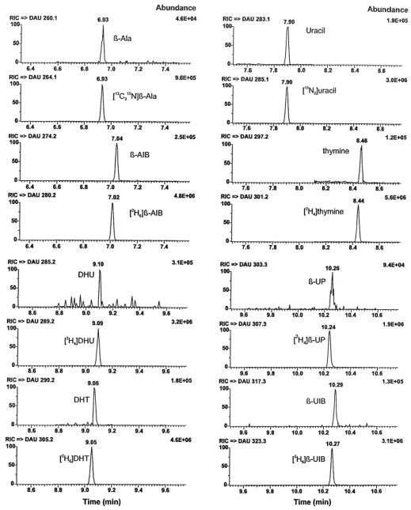
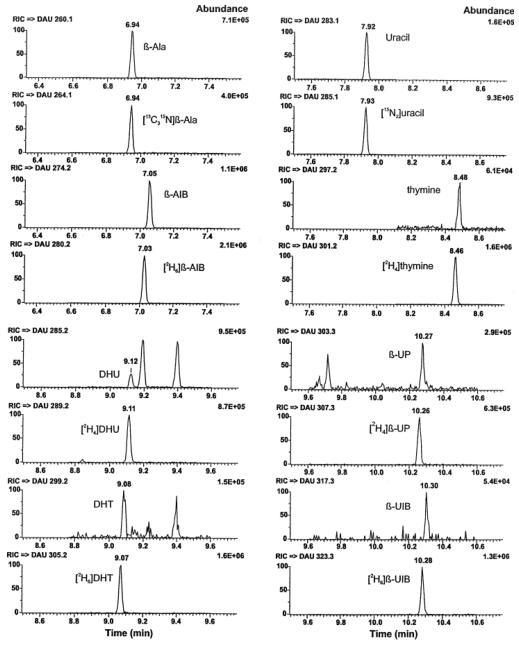

Available online at www.sciencedirect.com science@danger. Journal of Chromatography B, 791 (2003) 371–380

JOURNAL OF CHROMATOGRAPHY B

# Sensitive method for the quantification of urinary pyrimidine metabolites in healthy adults by gas chromatography–tandem mass spectrometry

Ute Hofmann $^{\text{a,}}$ * , Matthias Schwab $^{\text{a}}$ , Sonja Seefried $^{\text{a}}$ , Claudia Marx $^{\text{a}}$ , Ulrich M. Zanger $^{\text{a}}$ , Michel Eichelbaum $^{\text{a,b}}$ , Thomas E. M ü rdter $^{\text{a}}$

$^{a}$ Dr. Margarete Fischer-Bosch-Institute of Clinical Pharmacology, Auerbachstrasse 112, D-70376 Stuttgart, Germany $^{b}$ Division of Clinical Pharmacology, Eberhard Karls University, Otfried Müller Strasse 10, D-72076 Tübingen, Germany

Received 20 December 2002; received in revised form 28 February 2003; accepted 14 March 2003

## Abstract

Enzyme deficiencies in pyrimidine metabolism are associated with a risk for severe toxicity against the antineoplastic agent 5-fluorouracil. To assess whether urinary levels of pyrimidines and their metabolites can be used for predicting patients' individual phenotype, a new gas chromatographic–tandem mass spectrometric method was developed which allows the simultaneous determination of uracil and thymine and their metabolites dihydrouracil, dihydrothymine, $\beta$ -ureidopropionic acid, $\beta$ -ureidoisobutyric acid, and the amino acids $\beta$ -alanine and $\beta$ -aminoisobutyric acid in human urine. Small aliquots (2 – 20 μ l) of the urine samples were evaporated and derivatized to the tert .-butyldimethylsilyl derivatives before quantification, using the respective stable isotope-labelled analogues as internal standards. Analytical variation was acceptable with an intra-day imprecision (RSD) below 10 % , for $\beta$ -ureidoisobutyric acid below 15 % . The method was used for investigating the stability of urine samples and the influence of urine collection at different times.

© 2003 Elsevier Science B.V. All rights reserved.

Keywords: Pyrimidin

## 1. Introduction

5-Fluorouracil (5-FU) is an anticancer agent commonly used in the treatment of head, neck, breast and colon tumours. About 80 % of an administered dose of 5-FU is degraded by the same three-step pathway responsible for the metabolism of the endogenous pyrimidine bases uracil and thymine. The first and rate limiting step leading to dihydrouracil (DHU)

and dihydrothymine (DHT), respectively, is catalyzed by dihydropyrimidine dehydrogenase (DPD; EC 1.3.1.2). Dihydropyrimidinase (DHPA; EC 3.5.2.2) then catalyzes the degradation of the dihydropyrimidines to $\beta$ -ureidopropionic acid ( $\beta$ UP) and $\beta$ -ureidoisobutyric acid ( $\beta$ -UIB) which are finally metabolized by $\beta$ -ureidopropionase to $\beta$ alanine ( $\beta$ -Ala) and $\beta$ -aminoisobutyric acid ( $\beta$ -AIB).

Complete or partial enzyme deficiencies in pyrimidine metabolism are considered to be a potential risk factor contributing to serious adverse effects after 5-FU administration [1–4] . Inborn errors of pyrimidine degradation with defects in the enzymes

*Corresponding author. Tel.: +49-711-8101-3707; fax: +49711-859-295.

-mail address: ute.hofmann@ikp-stuttgart.de (U. Hofmann).

1570-0232/03/$ – see front matter © 2003 Elsevier Science B.V. All rights reserved. doi:10.1016/S1570-0232(03)00251-4

---

372

$^{l}$, Hofmann et al. J. Chromatogr. B 791 (2003) 371–380

DPD or DHPA have been described in single cases with a wide variety of clinical presentation [ 5 , 6 ] . The screening for these inherited defects usually is performed by analysis of urinary excretion profiles [ 5 ] . This approach might also be useful in predicting patients with a high risk of 5-FU related toxicity, but so far has not been evaluated. However, the knowledge of the intra- and interindividual variation of pyrimidine metabolism in healthy adults is an important requirement to define confounding factors. To our knowledge, a comprehensive analysis of the three consecutive steps of pyrimidine metabolism has not been performed systematically in adults [ 7 , 8 ] , although reference ranges for uracil, thymine and their primary metabolites DHU and DHT are available for a Japanese population [ 9 , 10 ] .

Most methods described so far were developed to determine single metabolites only. More recently, a high-performance liquid chromatography–tandem mass spectrometry (HPLC–MS–MS) method for determination of all pyrimidine metabolites except the β -amino acids was published [11,12] . This method had however been optimized for the detection of metabolic disorders, where large amounts of the corresponding pyrimidine metabolites are excreted in urine and therefore, shows a relatively high analytical variation at normal concentrations (relative standard deviations, RSDs up to 123 % ). For the screening of urine samples of healthy adults and the determination of intraindividual variation, however, a more sensitive method with acceptable RSDs at normal metabolite levels is required.

Therefore, we have developed a new gas chromatography (GC) – MS – MS method to determine simultaneously all pyrimidine metabolites in urine. With this method, the stability of urine samples was tested as well as a possible circadian variation in the urinary excretion of pyrimidine metabolites.

## 2. Materials and methods

### 2.1. Standard

Thymine, DHT, β-UP, β-Ala and β-AIB were obtained from Sigma (Taufkirchen, Germany). Uracil and DHU were obtained from Aldrich (Taufkirchen, Germany). β-UIB was obtained by chemical synthesis [13] . The internal standards [ $^{13}$ C $_3^{15}$ N] β-Ala

and [ 2 H 4 ]thymine were purchased from Aldrich, [ 15 N 2 ]uracil from Chemotrade (Leipzig, Germany). The other internal standards [ 2 H 4 ]DHU, [ 2 H 4 ]β-UP, [ 2 H 6 ]DHT, [ 2 H 6 ]β-UIB and [ 2 H 6 ]β-AIB were obtained by chemical synthesis as described [13] .

### 2.2. Chemicals

Acetonitrile (HPLC-grade, Roth, Karlsruhe, Germany) was filtered over Alumina B-super I (ICN, Eschwege, Germany) and stored over mole sieve 3 Å (Merck, Darmstadt, Germany). N-tert. -Butyldimethylsilyl- N -methyltrifluoroacetamide (MTBSTFA) was from Aldrich, methanol and 2-propanol from Merck.

### 2.3. Solutions

Stock solutions of analytes and internal standards were prepared in 2-propanol–water (2:1, v/v) at concentrations of 1 mg/ml. A stock mixture of the analytes was made in 2-propanol–water (2:1, v/v), containing 500 μmol/l each of uracil and β-AIB, 200 μmol/l of DHU, 100 μmol/l each of DHT, β-UP, β-UIB and β-Ala and 50 μmol/l of thymine. Working standard solutions were diluted 1:10 and 1:100 in 2-propanol–water (2:1, v/v). A stock mixture of the internal standards was prepared in 2-propanol–water (2:1, v/v), containing 1000 μmol/ l each of [ $^{15}\mathrm{N}_{2}$ ]uracil and [ $^{2}\mathrm{H}_{6}$ ] β-AIB, and 250 μmol/l each of stable isotope-labelled thymine, DHU, DHT, β-UP, β-UIB and β-Ala. The working solution of the internal standards was diluted 1:10 in 2-propanol–water (2:1, v/v) from the stock mixture. The stock solutions and stock mixtures were stored at − 20 ◦ C for up to 1 year, the working solutions were prepared freshly every day.

### 2.4. Urine sample.

Urine samples were collected from healthy volunteers and were frozen and stored at $-20\,^{\circ}$ C until analysis. The study protocol was approved by the local ethics committee (Landesärztekammer BadenWürttemberg) urttemberg)  ̈ and all participants gave written informed consent. Twenty volunteers collected urine overnight during several 12-h periods within a 6-

---

U, Hofmann et al, / J. Chromatogr. B 791 (2003) 371-380

373

month period. Additionally, spot urine samples were taken in the morning and in the afternoon.

### 2.5. Determination of creatinine

Creatinine was determined in the clinical laboratory of the Robert-Bosch Hospital (Stuttgart, Germany) with a VITROS system (Ortho-Clinical Diagnostics, Neckargemünd, Germany).

### 2.6. Sample preparation

Internal standard (10 μ l of internal standard mixture) and 125 μ l of methanol were pipetted into a 200-μ l autosampler vial. A urine volume containing about 50 nmol of creatinine was added, the samples vortex mixed and evaporated to dryness in a stream of nitrogen at 37 ° C. The vials were flushed with argon, 30 μ l of MTBSTFA and 12 μ l of acetonitrile were added and the vials flushed again with argon before closing with crimp-top caps. After vortex mixing, samples were kept at room temperature for about 30 min and then were stored at 4 ° C until analysis.

### 2.7. GC-MS-MS analysis

A TSQ 700 mass spectrometer (Finnigan MAT, Bremen, Germany) coupled to a 5890 II gas chromatograph (Hewlett-Packard, Waldbronn, Ger-

many) was used. GC was performed on a Rtx-5MS column (30 m $\times$ 0.25 mm I.D., dimethylpolysiloxane with 5 % phenyl groups, 0.25 μm m film thickness; Restek, Bad Homburg, Germany) in the on-column mode, with helium as carrier gas at an inlet pressure of 100 kPa. Injections were carried out automatically with an A200S autosampler (CTC Analytics, Zwingen, Switzerland). The autosampler tray temperature was maintained at 4 ◦ C . The initial oven temperature of 120 ◦ C was held for 1 min, increased by 15 ◦ C/min to 240 ◦ C , then increased by 30 ◦ C / min to 300 ◦ C . The final temperature was held for 1 min. MS was performed in the electron impact (EI) mode. MS conditions were: source temperature 150 ◦ C ; electron energy 70 eV; emission current 400 μ A ; argon collision cell pressure 133 mPa. The respective [M-57] + ions resulting from loss of the tert -butyl group were used as precursor ions. Precursor and product ions and the respective collision energies are summarized in Table 1 .

### 2.8. Assay validation

Calibration samples for urine were prepared directly from the working solutions, in the concentration range 25 $-$ 2500 pmol/sample for uracil and β -AIB, 10 $-$ 1000 pmol/sample for DHU, 5 $-$ 500 pmol/sample for DHT, β -UP, β -UIB and β -Ala and 2.5 $-$ 250 pmol/sample for thymine. Calibration curves were obtained by weighted ( $1/x^{2}$ ) linear

<table><tr><td>Compound</td><td>Molecular mass of (TBDMS) 2 derivative</td><td>Precursor ion ( m/z )</td><td>Product ion ( m/z )</td><td>Collision energy (eV)</td></tr><tr><td>Uracil</td><td>340</td><td>283</td><td>99</td><td>35</td></tr><tr><td>[ 15 N 2 ]Uracil</td><td>342</td><td>285</td><td>99</td><td>35</td></tr><tr><td>Thymine</td><td>354</td><td>297</td><td>113</td><td>30</td></tr><tr><td>[ 2 H 4 ]Thymine</td><td>358</td><td>301</td><td>116</td><td>30</td></tr><tr><td>DHU</td><td>342</td><td>285</td><td>243</td><td>15</td></tr><tr><td>[ 2 H 4 ]DHU</td><td>346</td><td>289</td><td>245</td><td>15</td></tr><tr><td>DHT</td><td>356</td><td>299</td><td>243</td><td>15</td></tr><tr><td>[ 2 H 6 ]DHT</td><td>362</td><td>305</td><td>245</td><td>15</td></tr><tr><td>β-UP</td><td>360</td><td>303</td><td>146</td><td>15</td></tr><tr><td>[ 2 H 4 ]β-UP</td><td>364</td><td>307</td><td>150</td><td>15</td></tr><tr><td>β-UIB</td><td>374</td><td>317</td><td>160</td><td>15</td></tr><tr><td>[ 2 H 6 ]β-UIB</td><td>380</td><td>323</td><td>166</td><td>15</td></tr><tr><td>β-Ala</td><td>317</td><td>260</td><td>218</td><td>15</td></tr><tr><td>[ 13 C 15 N]β-Ala</td><td>321</td><td>264</td><td>220</td><td>15</td></tr><tr><td>β-AIB</td><td>331</td><td>274</td><td>218</td><td>15</td></tr><tr><td>[ 2 H 6 ]β-AIB</td><td>337</td><td>280</td><td>220</td><td>15</td></tr></table>

---

374

U, Hofmann et al, / J. Chromatogr. B 791 (2003) 371-380

regression for the peak-area ratio of the analyte to the respective stable isotope-labelled internal standard against the amount of the analyte. Assay accuracy and precision was determined by analysing quality controls, prepared like the calibration samples in water as matrix. Additionally different urine samples from randomly chosen subjects were repeatedly analysed. Some urine samples spiked with standards were also included.

### 2.9. Stability of urine

Stability of urine samples was examined by storing different urines for up to 5 days at room temperature. Urine samples without any preservative added were compared with the same urines supplemented with chloroform or sodium azide (0.1% each).

### 2.10. Statistical analysis

All values are presented as mean and standard deviation or as median and range. For comparison among several groups analysis of variance (ANOVA) (Friedman test) was used with subsequent Dunn's Multiple Comparison test (GraphPad PRISM, Version 2.0, GraphPad Software, San Diego, CA, USA). P $<$ 0.05 was considered statistically significant.

## 3. Results and discussion

### 3.1. Analytical method

GC – MS usually requires extraction of the analytes from aqueous samples with subsequent derivatization. In view of the fact that the method should be applied for routine screening in clinical practice, sample preparation had to be simple. Because pyrimidine degradation products vary considerably in their chemical and chromatographical behaviour, it would be difficult to find a single extraction procedure for all compounds from urine. The use of MS $-$ MS enhances specificity and enables determination without any extraction. The urine samples were simply evaporated before derivatization. Kuhara et al. [14] use a similar approach for the detection of metabolic disorders. The sample prepa-

ration, however, is more complex with urease pretreatment and protein precipitation before evaporation of samples and subsequent derivatization to the trimethylsilyl (TMS) derivatives. Furthermore, their method is not sensitive enough for the detection of normal levels of UP and β -UIB in urine [ 15 ] . We have used the tert .-butyl-dimethylsilyl (TBDMS) derivatives, as they offer the advantage of relative simple EI spectra with a prominent fragment ion at $\left[\text{M-}57\right]^+$ , corresponding to the loss of the tert .-butyl moiety. Furthermore, for all compounds, the diTBDMS derivatives are formed, while for TMS derivatization of the amino acids a mixture of di- and tri-TMS derivatives is obtained. The completeness of derivatization was dependent on urine concentration. The best results were obtained with urine volumes containing about 20 $-$ 50 nmol of creatinine. The temperature of the derivatization procedure was found to be a critical parameter, since the ureido compounds are susceptible to decomposition to the dihydropyrimidines at elevated temperatures. When the derivatization was carried out with MTBSTFA at room temperature, no decomposition of the analytes was observed. For the same reason, injections into the GC system had to be done in the on-column mode. Derivatized samples were stable at 4 ° C for at least 3 days.

For determination in the MS $-$ MS mode, [M-57] + ions were used as precursor ion. From product ion scans, structure-specific product ions were selected and the collision energies optimized. These data are summarized in Table 1 . Typical chromatograms obtained with these parameters of a calibration sample near the limit of quantitation (LOQ) and of a urine sample are shown in Figs. 1 and 2 , respectively. The mass traces of DHU and DHT show additional peaks in the urine chromatograms ( Fig. 2 ), but they are completely separated from the analytes.

Calibration curves in urine were linear over the entire concentration range measured (from 25–2500 pmol/sample for uracil and β-AIB, 10–1000 pmol/ sample for DHU, 5–500 pmol/sample for DHT, β-UP, β-UIB and β-Ala and 2.5–250 pmol/sample for thymine). The regression coefficients ( $r^{2}$ ) were above 0.998 for all compounds. Samples with higher concentrations were reanalyzed using smaller urine volumes. The limit of quantification was 25 pmol/ sample for uracil and β-AIB, 10 pmol/sample for

---

U, Hofmann et al, / J. Chromatogr. B 791 (2003) 371-380

375

Fig. 1. SRM mass chromatograms of a derivatized calibration sample spiked with 5 pmol thymine, 10 pmol each of $\beta$ -Ala, DHT, $\beta$ -UP and $\beta$ -UIB, 20 pmol DHU and 50 pmol each of uracil and $\beta$ -AIB.

---

376

U, Hofmann et al, / J. Chromatogr. B 791 (2003) 371-380

Fig. 2. SRM mass chromatograms of derivatized extracts from a urine sample containing 13.2 μmol/mmol creatinine β-Ala, 15.7 μmol/mmol creatinine β-AIB, 5.42 μmol/mmol creatinine uracil, 0.216 μmol/mmol creatinine thymine, 1.90 μmol/mmol creatinine DHU, 0.662 μmol/mmol creatinine DHT, 2.71 μmol/mmol creatinine β-UP and 0.259 μmol/mmol creatinine β-UIB.

---

U, Hofmann et al, / J. Chromatogr. B 791 (2003) 371-380

377

DHU, $\beta$ -UP and $\beta$ -UIB, 5 pmol/sample for DHT and $\beta$ -Ala, and 2.5 pmol/sample for thymine.

Data on intra- and inter-assay precision and accuracy of spiked water samples are summarized in Tables 2 and 3 . At the limit of quantification (quality control A, 2.5–25 pmol/sample) intra-assay imprecision (RSD) was between 4 and 17 % with a bias between 0.4 and 14 % ( Table 2 ). Inter-assay imprecision of spiked samples was between 6.9 and 15.1 % with a bias between 1.2 and 8.3 % ( Table 3 ). Urinary pyrimidines and their metabolites could be determined in 2–20 μ l of native urine samples with an intra-day imprecision (RSD) below 10 % , for β -UIB below 15 % ( Table 4 ). Inter-day variabilities were 7.4–20 % , for β -UIB up to 23 % ( Table 5 ). Accuracy of urine samples spiked with standards was also good with a bias below 15 % ( Table 6 ).

Taken together, this new method allows for a highly sensitive quantification of all pyrimidine degradation products in human urine with acceptable analytical variation.

### 3.2. Influence of sampling on pyrimidine concentrations

In addition to the analytical performance, evaluation of the biological variations of analyte concentrations is an important prerequisite for estimation of the clinical application. To examine confounding factors which may alter urinary pyrimidine concentrations, the stability of urine samples as well as the influence of urine collection at different times was investigated.

Bacterial contamination is known to change con-

<table><tr><td>Compound</td><td>Amount added(pmol)</td><td>Amount founda(pmol)</td><td>RSD(%)</td><td>Bias(%)</td></tr><tr><td colspan="5">Quality control A</td></tr><tr><td>Uracil</td><td>25.0</td><td>24.9</td><td>3.9</td><td>−0.4</td></tr><tr><td>Thymine</td><td>2.50</td><td>2.64</td><td>6.4</td><td>5.6</td></tr><tr><td>DHU</td><td>10.0</td><td>10.7</td><td>15.0</td><td>7.1</td></tr><tr><td>DHT</td><td>5.00</td><td>5.10</td><td>8.5</td><td>1.1</td></tr><tr><td>β-UP</td><td>10.0</td><td>8.6</td><td>11.6</td><td>−14.0</td></tr><tr><td>β-UIB</td><td>10.0</td><td>10.3</td><td>9.7</td><td>3.5</td></tr><tr><td>β-Ala</td><td>5.00</td><td>4.83</td><td>17.3</td><td>−3.3</td></tr><tr><td>β-AIB</td><td>25.0</td><td>26.2</td><td>8.2</td><td>4.9</td></tr><tr><td colspan="5">Quality control B</td></tr><tr><td>Uracil</td><td>250</td><td>246</td><td>5.3</td><td>−0.6</td></tr><tr><td>Thymine</td><td>25.0</td><td>23.6</td><td>5.4</td><td>−5.5</td></tr><tr><td>DHU</td><td>100</td><td>99</td><td>8.0</td><td>−1.0</td></tr><tr><td>DHT</td><td>50.0</td><td>49.0</td><td>7.4</td><td>−1.9</td></tr><tr><td>β-UP</td><td>50.0</td><td>50.0</td><td>8.7</td><td>0.1</td></tr><tr><td>β-UIB</td><td>50.0</td><td>51.8</td><td>11.4</td><td>3.5</td></tr><tr><td>β-Ala</td><td>50.0</td><td>49.6</td><td>9.9</td><td>−0.8</td></tr><tr><td>β-AIB</td><td>250</td><td>239</td><td>7.7</td><td>−4.3</td></tr><tr><td colspan="5">Quality control C</td></tr><tr><td>Uracil</td><td>500</td><td>490</td><td>5.7</td><td>−2.1</td></tr><tr><td>Thymine</td><td>50.0</td><td>48.4</td><td>6.9</td><td>−3.2</td></tr><tr><td>DHU</td><td>200</td><td>203</td><td>9.9</td><td>1.7</td></tr><tr><td>DHT</td><td>100</td><td>100</td><td>6.7</td><td>−0.3</td></tr><tr><td>β-UP</td><td>100</td><td>102</td><td>8.6</td><td>1.6</td></tr><tr><td>β-UIB</td><td>100</td><td>93</td><td>11.3</td><td>−7.5</td></tr><tr><td>β-Ala</td><td>100</td><td>105</td><td>9.3</td><td>5.1</td></tr><tr><td>β-AIB</td><td>500</td><td>503</td><td>10.7</td><td>0.6</td></tr></table>

Mean ( n=6 ),

---

378

U, Hofmann et al, / J. Chromatogr. B 791 (2003) 371-380

<table><tr><td>Compound</td><td>Amount added (pmol)</td><td>Amount found a  (pmol)</td><td>RSD (%)</td><td>Bias (%)</td></tr><tr><td colspan="5">Quality control D</td></tr><tr><td>Uracil</td><td>100</td><td>102</td><td>9.2</td><td>1.7</td></tr><tr><td>Thymine</td><td>10.0</td><td>9.6</td><td>11.6</td><td>−3.8</td></tr><tr><td>DHU</td><td>40.0</td><td>29.0</td><td>13.9</td><td>−2.6</td></tr><tr><td>DHT</td><td>20.0</td><td>19.0</td><td>13.3</td><td>−5.0</td></tr><tr><td>β-UP</td><td>20.0</td><td>19.2</td><td>14.9</td><td>−3.9</td></tr><tr><td>β-UIB</td><td>20.0</td><td>18.9</td><td>15.1</td><td>−5.5</td></tr><tr><td>β-Ala</td><td>20.0</td><td>19.5</td><td>14.4</td><td>−2.3</td></tr><tr><td>β-AIB</td><td>100</td><td>97</td><td>13.3</td><td>−2.8</td></tr><tr><td colspan="5">Quality control E</td></tr><tr><td>Uracil</td><td>1000</td><td>1010</td><td>6.9</td><td>1.2</td></tr><tr><td>Thymine</td><td>100</td><td>105</td><td>9.3</td><td>5.0</td></tr><tr><td>DHU</td><td>400</td><td>416</td><td>9.3</td><td>4.1</td></tr><tr><td>DHT</td><td>200</td><td>208</td><td>10.0</td><td>3.9</td></tr><tr><td>β-UP</td><td>200</td><td>210</td><td>10.2</td><td>5.0</td></tr><tr><td>β-UIB</td><td>200</td><td>216</td><td>11.4</td><td>8.1</td></tr><tr><td>β-Ala</td><td>200</td><td>208</td><td>12.0</td><td>4.2</td></tr><tr><td>β-AIB</td><td>1000</td><td>1080</td><td>12.2</td><td>8.3</td></tr></table>

Table 3 Inter-day accuracy and precision for quality control samples

Mean (n=40)

centrations of pyrimidines and metabolites in urine [16] . The influence of storage at room temperature on pyrimidine concentrations was evaluated using urine samples with and without bacterial contamination. The results are summarized in Table 7 . Significant increase in metabolite levels occurred in urines with and without significant bacteriuria, whereas urines mixed with chloroform or sodium azide (0.1 % each) as preservative, considered as sterile, were not different from urines immediately frozen. Thus, if

instant freezing of urines is not possible, preservation of liquid urines is an absolute requirement for correct quantitation of pyrimidine metabolism.

Furthermore, a circadian rhythm is discussed for DPD activity [17–19] , and therefore, variation of urinary concentrations of pyrimidine metabolites can be expected to be dependent on sampling time. To assess this factor, spot urine samples taken in the morning and afternoon were compared to 12-h urine samples collected overnight ( Table 8 ). Examination with the Friedman test and Dunn's multiple comparison test revealed no significant differences, therefore, the circadian variation seems to be negligible and spot urines can be used for analysis of pyrimidine metabolism.

## 4. Conclusions

A sensitive, selective and simple method was developed for measuring the urinary excretion profiles of all pyrimidine metabolites in healthy volunteers. Further studies will be conducted to evaluate intra- and interindividual variations in pyrimidine metabolism as well as the suitability of the method for predicting toxicity against 5-FU.

## Acknowledgement

This work was supported by the Robert Bosch Foundation (Stuttgart, Germany) and the Federal Ministry for Education and Research (BMBF, Berlin, Germany) grant 01 GG 9846.

<table><tr><td rowspan="2">Compound</td><td colspan="2">Urine A, 1.77 mM creatinine</td><td colspan="2">Urine B, 14.2 mM creatinine</td><td colspan="2">Urine C, 7.62 mM creatinine</td></tr><tr><td>mmol/mol creatinine a</td><td>RSD (%)</td><td>mmol/mol creatinine a</td><td>RSD (%)</td><td>mmol/mol creatinine a</td><td>RSD (%)</td></tr><tr><td>Uracil</td><td>13.3±0.4</td><td>3.1</td><td>5.26±0.38</td><td>7.6</td><td>5.43±0.38</td><td>7.0</td></tr><tr><td>Thymine</td><td>0.418±0.010</td><td>2.4</td><td>0.180±0.013</td><td>6.0</td><td>0.317±0.020</td><td>6.3</td></tr><tr><td>DHU</td><td>2.73±0.12</td><td>4.3</td><td>0.974±0.073</td><td>7.3</td><td>2.37±0.24</td><td>10.0</td></tr><tr><td>DHT</td><td>0.703±0.035</td><td>5.0</td><td>0.270±0.021</td><td>7.0</td><td>0.686±0.043</td><td>6.2</td></tr><tr><td>β-UP</td><td>2.40±0.12</td><td>4.9</td><td>1.48±0.12</td><td>7.5</td><td>2.81±0.25</td><td>9.0</td></tr><tr><td>β-UIB</td><td>0.205±0.020</td><td>9.9</td><td>0.092±0.013</td><td>7.9</td><td>0.196±0.016</td><td>8.2</td></tr><tr><td>β-Ala</td><td>0.692±0.002</td><td>3.5</td><td>0.310±0.023</td><td>7.9</td><td>5.55±0.34</td><td>6.2</td></tr><tr><td>β-AIB</td><td>13.0±0.5</td><td>3.5</td><td>4.93±0.30</td><td>14.3</td><td>9.55±0.49</td><td>5.1</td></tr></table>

Table 4 Intra-day variabilities for urine samples

Mean±SD, n=6

---

U, Hofmann et al, / J. Chromatogr. B 791 (2003) 371-380

379

<table><tr><td rowspan="2">Compound</td><td colspan="2">Urine A, 1.77 mM creatinine</td><td colspan="2">Urine B, 14.2 mM creatinine</td><td colspan="2">Urine D, 31.8 mM creatinine</td></tr><tr><td>mmol/mol creatininea</td><td>RSD (%)</td><td>mmol/mol creatininea</td><td>RSD (%)</td><td>mmol/mol creatininea</td><td>RSD (%)</td></tr><tr><td>Uracil</td><td>13.0±2.0</td><td>15.7</td><td>5.34±0.91</td><td>17.0</td><td>1.95±0.28</td><td>14.2</td></tr><tr><td>Thymine</td><td>0.402±0.053</td><td>13.3</td><td>0.152±0.029</td><td>19.4</td><td>0.073±0.015</td><td>20.0</td></tr><tr><td>DHU</td><td>2.45±0.22</td><td>8.8</td><td>0.863±0.163</td><td>18.9</td><td>0.672±0.102</td><td>15.1</td></tr><tr><td>DHT</td><td>0.745±0.111</td><td>14.9</td><td>0.253±0.047</td><td>18.4</td><td>0.232±0.040</td><td>17.4</td></tr><tr><td>β-UP</td><td>2.29±0.32</td><td>13.8</td><td>1.26±0.22</td><td>17.3</td><td>1.05±0.20</td><td>19.2</td></tr><tr><td>β-UIB</td><td>0.228±0.046</td><td>20.0</td><td>0.114±0.019</td><td>16.6</td><td>0.085±0.020</td><td>23.2</td></tr><tr><td>β-Ala</td><td>0.755±0.056</td><td>7.4</td><td>0.292±0.048</td><td>16.4</td><td>0.295±0.050</td><td>16.9</td></tr><tr><td>β-AIB</td><td>14.8±2.7</td><td>18.5</td><td>4.27±0.69</td><td>16.1</td><td>3.60±0.51</td><td>14.2</td></tr></table>

Table 5 Inter-day variabilities for urine samples

Mean±SD, n=30

<table><tr><td rowspan="2">Compound</td><td colspan="3">Urine 1, 57 μl</td><td colspan="3">Urine 2, 7.1 μl</td><td colspan="3">Urine 3, 3.7 μl</td></tr><tr><td>Native urine (pmol)</td><td>Added (pmol)</td><td>Spiked urine (pmol)</td><td>Native urine (pmol)</td><td>Added (pmol)</td><td>Spiked urine (pmol)</td><td>Native urine (pmol)</td><td>Added (pmol)</td><td>Spiked urine (pmol)</td></tr><tr><td>Uracil</td><td>1265</td><td>600</td><td>1790</td><td>499</td><td>446</td><td>965</td><td>260</td><td>–</td><td>229</td></tr><tr><td>Thymine</td><td>38.4</td><td>600</td><td>708</td><td>20.2</td><td>500</td><td>554</td><td>12.7</td><td>600</td><td>635</td></tr><tr><td>DHU</td><td>253</td><td>–</td><td>258</td><td>79.0</td><td>438</td><td>509</td><td>45.9</td><td>–</td><td>39.6</td></tr><tr><td>DHT</td><td>59.8</td><td>–</td><td>52.5</td><td>39.3</td><td>391</td><td>464</td><td>29.6</td><td>800</td><td>716</td></tr><tr><td>β-UP</td><td>225</td><td>–</td><td>203</td><td>88.4</td><td>379</td><td>430</td><td>40.0</td><td>–</td><td>40.1</td></tr><tr><td>β-LIB</td><td>25.9</td><td>–</td><td>31.5</td><td>11.3</td><td>342</td><td>386</td><td>n.d.</td><td>–</td><td>n.d.</td></tr><tr><td>β-Ala</td><td>66.2</td><td>–</td><td>62.8</td><td>25.8</td><td>561</td><td>576</td><td>11.8</td><td>300</td><td>311</td></tr><tr><td>β-AIB</td><td>1410</td><td>–</td><td>1450</td><td>307</td><td>485</td><td>853</td><td>716</td><td>–</td><td>832</td></tr></table>

Table 6 Results from native urine samples spiked with standards

d: Not detected.

<table><tr><td rowspan="4">Compound</td><td colspan="7">Concentration (mmol/mol creatinine)</td></tr><tr><td colspan="3" rowspan="2">Urine with bacteriuria Storage time</td><td colspan="4" rowspan="2">Normal urine Storage time 3 days</td></tr><tr><td>1 day</td><td>2 days</td><td>5 days</td><td>No storage</td><td>Without additive</td><td>With 0.1% chloroform</td><td>With 0.1% NaN 3</td></tr><tr><td>Uracil</td><td>15.0</td><td>45.1</td><td>47.3</td><td>4.99</td><td>5.75</td><td>5.15</td><td>5.43</td></tr><tr><td>Thymine</td><td>0.084</td><td>0.304</td><td>0.422</td><td>0.202</td><td>0.253</td><td>0.204</td><td>0.225</td></tr><tr><td>DHU</td><td>2.19</td><td>9.50</td><td>12.7</td><td>0.79</td><td>3.59</td><td>0.79</td><td>1.04</td></tr><tr><td>DHT</td><td>0.180</td><td>0.124</td><td>0.213</td><td>0.393</td><td>0.414</td><td>0.321</td><td>0.344</td></tr><tr><td>β-UP</td><td>3.18</td><td>1.93</td><td>2.63</td><td>0.88</td><td>1.29</td><td>0.92</td><td>1.02</td></tr><tr><td>β-LIB</td><td>0.159</td><td></td><td>0.164</td><td>0.113</td><td>0.137</td><td>0.116</td><td>0.120</td></tr><tr><td>β-Ala</td><td>0.523</td><td>0.350</td><td>0.415</td><td>0.258</td><td>0.294</td><td>0.267</td><td>0.287</td></tr><tr><td>β-AIB</td><td>0.43</td><td>0.36</td><td>0.36</td><td>3.07</td><td>3.77</td><td>3.06</td><td>3.59</td></tr></table>

Table 7 Stability of urine samples stored at room temperature without and with additive

---

380

U, Hofmann et al, / J. Chromatogr. B 791 (2003) 371-380

<table><tr><td></td><td colspan="3">Concentration (μmol/mmol creatinine), median and range ( n =20)</td><td rowspan="3">P value a</td></tr><tr><td></td><td rowspan="2">12-h urine</td><td colspan="2">Spot urine</td></tr><tr><td></td><td>Morning</td><td>Afternoon</td></tr><tr><td>Uracil</td><td>5.00 (2.61–7.65)</td><td>5.31 (2.00–11.1)</td><td>6.38 (1.41–11.1)</td><td>ns</td></tr><tr><td>Thymine</td><td>0.18 (0.08–0.27)</td><td>0.20 (0.07–0.39)</td><td>0.19 (0.10–0.39)</td><td>ns</td></tr><tr><td>DHU</td><td>1.41 (0.69–2.01)</td><td>1.27 (0.42–2.24)</td><td>1.43 (0.75–2.27)</td><td>ns</td></tr><tr><td>DHT</td><td>0.58 (0.35–1.29)</td><td>0.60 (0.40–0.97)</td><td>0.63 (0.38–1.70)</td><td>ns</td></tr><tr><td>β-UP</td><td>2.09 (1.23–4.80)</td><td>2.16 (1.52–3.04)</td><td>2.27 (0.81–5.44)</td><td>ns</td></tr><tr><td>β-UIB</td><td>0.23 (0.14–0.39)</td><td>0.20 (0.07–0.52)</td><td>0.22 (0.12–0.43)</td><td>ns</td></tr><tr><td>β-Ala</td><td>0.69 (0.21–3.90)</td><td>0.71 (0.13–8.40)</td><td>1.29 (0.22–7.32)</td><td>ns</td></tr><tr><td>β-AIB</td><td>7.70 (1.94–24.0)</td><td>8.33 (1.55–23.3)</td><td>9.23 (1.80–28.0)</td><td>0.05</td></tr></table>

Table 8 Comparison of 12-h urine samples and spot urine samples in the morning and in the afternoon from 20 healthy volunteer

$^{a}$ Median values were compared with the Friedman test and Dunn's test. $^{b}$ B-AIB, morning urine vs. afternoon uripe.

## References

[1] Z. Lu, R. Zhang, R.B. Diasio, Cancer Res. 53 (1993) 5433.

[2] X. Wei, H.L. McLeod, J. McMurrough, F.J. Gonzalez, P. Fernandez-Saleuero, J. Clin. Invest. 98 (1996) 610.

[3] G. Milano, M.C. Etienne, V. Pierrefite, M. Barberi-Heyob, R. Deporte-Fety, N. Renee, Br. J. Cancer 79 (1999) 627.

[4] K. Hayashi, K. Kidouchi, S. Sumi, M. Mizokami, E. Orito, K. Kumada, R. Ueda, Y. Wada, Clin. Cancer Res. 2 (1996) 1937.

[5] H.A. Simmonds, J.A. Duley, L.D. Fairbanks, M.B. McBride, J. Inherit. Metab. Dis. 20 (1997) 214.

[6] A.B.P. van Kuilenburg, P. Vreken, N.G. Abeling, H.D. Bakker, R. Meinsma, H. van Lenthe et al., Hum. Genet. 104 (1999) 1.

[7] B. Assmann, H.J. Haas, J. Chromatogr. 525 (1990) 277.

[8] A. Ueta, S. Sumi, T. Ito, K. Ban, N. Hamajima, H. Togari, Y. Wada, K. Kidouchi, S. Fujimoto, Clin. Chim. Acta 308 (2001) 187.

[9] S. Sumi, K. Kidouchi, M. Kondou, K. Hayashi, K. Dobashi, M. Kouwaki, H. Togari, Y. Wada, Int. J. Mol. Med. 2 (1998) 477.

[10] M. Imaeda, S. Sumi, S. Ohba, K. Kidouchi, K. Kodama, S. Fujimoto, H. Togari, Y. Wada, Toboku J. Exp. Med. 190 (2000) 23.

[11] T. Ito, A.B.P. van Kuilenburg, A.H. Bootsma, A.J. Haasnoot, A. van Cruchten, Y. Wada, A.H. van Gennip, Clin. Chem. 46 (2000) 445.

[12] H. van Lenthe, A.B. P van Kuilenburg, T. Ito, A.H. Bootsma, A. van Cruchten, Y. Wada, A.H. van Gennip, Clin. Chem. 46 (2000) 1916.

[13] G. Heinkele, U. Hofmann, J. Opitz J, T.E. M urdter,  ̈ J. Labelled Comp. Radiopharm. 44 (2001) 7.

[14] T. Kuhara, C. Ohdoi, M. Ohse, J. Chromatogr. B 758 (2001) 61.

[15] M. Ohse, M. Matsuo, A. Ishida, T. Kuhara, J. Mass Spectrom. 37 (2002) 954.

[16] A.H. van Gennip, S. Busch, L. Elzinga, A.E.M. Stroomer, A. van Cruchten, E.G. Scholten, N.G. Abeling, Clin. Chem. 39 (1993) 380.

[17] B.E. Harris, R. Song, S.J. Soong, R.B. Diasio, Cancer Res. 50 (1990) 197.

[18] R. Zhang, Z. Lu, T. Liu, S.J. Soong, R.B. Diasio, Cancer Res. 53 (1993) 2816.

[19] A.B. van Kuilenburg, R.L. Poorter, G.J. Peters, A.H. van Gennip, H. van Lenthe, A.E. Stroomer, K. Smid, P. Noordhuis, P.J. Bakker, C.H. Veenhof, Adv. Exp. Med. Biol. 431 (1998) 811.

