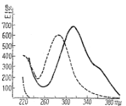
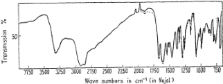
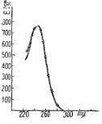
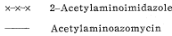
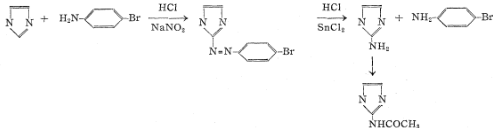

No. 5

79

## 75. Shoshiro Nakamura: Structure of Azomycin, a New Antibiotic.

(Institute of Applied Microbiology, University of Tokyo*

Maeda, Osato, Umezawa, and Okami 1,2) discovered a new antibiotic substance and they proposed the name, azomycin, for this antibiotic substance because of its extremely high content of nitrogen. Nature of azomycin has been briefly reported. 1) It was produced by a strain resembling Nocardia mesenterica. 2) The same substance was later obtained by Osato and others 3) from the culture liquid of another strain which had been identified as a new species, Streptomyces eurocidicus ,4) and which had been found to produce a polyene antibiotic substance, 5) eurocidin, indicating three maxima at 318, 333, and 351 m $\mu$ . Osato and others 3) found that S. eurocidicus also produced another antibacterial substance which was one of erythromycin – carbonylcin group substances and which was named tertiomycin. The first azomycin – producing strain was also found to produce an antibiotic substance of erythromycin – carbomycin group substances, but the former has no structural relation to the latter.

Recently, Pinnert – Sindico and Ninet 43 reported that S. ambofaciens produced spiramycin, an antibiotic of erythromycin – carbomycin group, together with another antibacterial substance, congocidin, 7) which was considered to be similar to netropsin. 8) Nakazawa and Shibata 9) reported that Streptomyces albireticuli n. sp., which produced eurocidin, also produced two antibacterial substances, carbomycin and enteromycin. Enteromycin and netropsin are antibiotic substances quite different from azomycin.

The author isolated azomycin from a culture liquid of the strain used by Maeda and others. 1) As it was reported by Osato and others, 2) the distribution coefficient of azomycin between ethyl acetate or butyl acetate and water is larger at pH 2.0 than at pH 7.0. Distribution coefficients between butyl acetate and water were found to be as follows: 2/1 at pH 3.0 $\sim$ 5.0; 1.4/1 at pH 6.0; 1/4 at pH 7.0; 1/6 at pH 8.0. This result suggested the acidic nature of azomycin.

Azomycin was recrystallized three times from ethanol and used for the present studies. Azomycin was obtained in the form of colorless prisms. It melted at 284° under decomposition. It was slightly soluble in methanol, ethanol, propylene glycol, acetone, ethyl acetate, and butyl acetate. It was almost insoluble in water, carbon disulfide, carbon tetrachloride, ether, and petroleum ether. It was soluble in aqueous solutions of sodium hydroxide and ammonium hydroxide, and the solutions colored yellow. The solubilities were as follow: 4.0 mg./cc. in cold methanol; 12.8 mg./cc. in hot methanol; 3.5 mg./cc. in acetone; 0.5 mg./cc. in chloroform; 0.8 mg./cc. in distilled water; 0.5 mg./cc. in 0.1 N HCl; 2.7 mg./cc. in 0.1 N NaOH; 8.3 mg./cc. in 2.0% leucine solution. It was stable both in acid and alkaline solutions. Its methanol solution exhibited no optical rotation. Azomycin in ethanol had a characteristic absorption in the ultraviolet with a maximum at 313 m $\mu$ (E $_{\mathrm{fcm}}^{16}$ 680) (Fig. 1 ).

* Yayol-cho, Bunkyo-ku, Tokyo (中村昭四郎).

2) Y. Okami, K. Maeda, H. Umezawa: Ibid., 7A, 53(1954).

3) T. Osato, M. Ueda, S. Fukuyama, K. Yagishita, Y. Okami, H. Umezawa: Ibid., 8A, 105(1955).

4) Y. Okami, R. Utahara, S. Nakamura, H. Umezawa: Ibid., 7A, 98(1954)

6) S. Pinnert-Sindico, L. Ninet: Antibiotics Annual, 724(1954—1955)

7) R. Despois, L. Ninet: VI. Congresso Internationale di Microbiologica, 1, 241(1953).

9) Nakazawa, Shibata: Report at the Meeting of

tember, 1951.

III-Electronic Library Service

---

380

Tol, 3 (1955)

Fig. 1. Ultraviolet Absorption (in EtOH)

<table><tr><td>----------</td><td>Imidazole</td></tr><tr><td>---------</td><td>4-Nitroimidazole</td></tr><tr><td>--------</td><td>Azomycin</td></tr></table>

Fig. 2. Azomycin

It was negative in the following tests : Ninhydrin, biuret, Millon, Pauly, and Sakaguchi. The reaction product obtained by catalytic reduction with Adams' catalyst gave positive Pauly reaction. The result of elementary analysis agreed with the formula (C 2 H 3 O 2 N 3 ) n . However, the determination of molecular weight failed by the Rast method and also by the Berger method owing to its low solubilities in organic solvents. The silver salt of azomycin was prepared and its elementary analysis supported the formula of C 2 H 5 O 2 N 8 Ag.

Nitro radical in azomycin was suggested by the peaks at 1493 and 1375 cm −1 in the infrared spectrum of azomycin (Fig. 2). The infrared spectrum of 4-nitroimidazole,

$$ \\ \text { In } \\ $$

which was prepared by the method described by Fargher and Pyman, 10 , 11) is indicated in Fig. 3 . The peaks at 1499 and 1384 cm −1 were considered to be due to its nitro radical. Nitro group was also suggested by semimicroqualitative test for nitro group. 12) By the catalytic hydrogenation with Adams' catalyst, one mole of azomycin C $_{3}$ N $_{3}$ O $_{2}$ N $_{3}$ absorbed three moles of hydrogen.

Fig. 3. 4-Nitroimidazole

The empirical formula, C 3 H 3 O 2 N 3 , which contained a nitro group, suggested the presence of an imidazole or pyrazole ring. However, the latter has not yet been found in natural substances. The imidazole ring in azomycin was suggested by the peaks at

10) R. C. Fargher, F. L. Pyman: J. Chem. Soc., 115, 234(1919); 115, 244(1919).

11) F. Rung, M. Behrend: Ann., 271, 30(1892)

12) W. M. Hearon, R. G. Cusfavson: Ind. Eng. Chem., Anal. Ed., 29, 352(1937).

III-Electronic Library Service

---

No. 5

35

1540 and $\SI{1520}{cm^{-1}}$ in the infrared absorption spectrum. These peaks correspond to those at 1590 and $\SI{1555}{cm^{-1}}$ in the infrared absorption spectrum of imidazole (Fig. 4 ) and to those at 1537 and $\SI{1505}{cm^{-1}}$ in the infrared absorption spectrum of 2 – acetylaminoimidazole (Fig. 5 ). Azomycin was negative in Pauly reaction, which is generally

$$ \\ \text { P. } \\ $$

positive in imidazole and its derivatives. However, 4-nitroimidazole was also found to be negative in Pauly reaction. Azomycin, after catalytic hydrogenation, gave positive Pauly reaction.

Fig. 4. Imidazole

Fig. 5.——Acetylaminoazomycin ......2-Acetylaminolmidazole

Acetylamino derivative of azomycin was obtained by the reductive acetylation 13) using stannous chloride in acetic anhydride. Acetylaminoazomycin recrystallized from 80 % aqueous ethanol to fine needles, m.p. 278 $\sim$ 279°(decomp.). It was an amphoteric substance. It was soluble in dilute hydrochloric acid and in aqueous sodium hydroxide solution, but not in water. It gave positive Pauly reaction and green color with cold aqueous alkaline permanganate solution. The empirical formula of C 6 H 7 ON 5 was determined by the elementary analysis. The infrared absorption spectrum of acetylaminoazomycin indicated that the nitro group in azomycin was converted to an acetylamino group. It had a characteristic absorption in the ultraviolet with a maximum at 244 $\sim$ 248 m $\mu$ (E $_{\rm tem}^{\rm as}$ 765, in ethanol) (Fig. 6).

Fig. 6. Ultraviolet Absorption (in EtOH)

Since 4 – nitroimidazole which was synthesized was different from azomycin, 2 – acetylaminoimidazole 11) was synthesized by the following process:

13) C. Hunter, J. A. Nelson: C. A., 36, 13213(1942)

III-Electronic Library Service

---

382

ol.3 (1955)

Acetylaminoazomycin was found to be identical with 2-acetylaminoimidazole in crystalline form, decomposition point, color reactions, and infrared and ultraviolet spectra. Thus, it was made clear that azomycin should be 2-nitroimidazole, and is a new compound not reported to date. As already described, azomycin has a weak acidic nature. It has been reported 10,11) that hydrogen in 1(or 3) – position of imidazole is acidic in 4-nitroimidazole.

Bacteriostatic effect of azomycin and 4 – nitroimidazole was studied by the agar dilution method and the results are indicated in Table I . It is interesting that 4 – nitroimidazole did not exhibit any bacteriostatic effect and acetylaminoazomycin has also lost bacteriostatic activities.

<table><tr><td rowspan="2">Microorganisms</td><td colspan="2">4-Nitroimidazole (Agar dilution method) Minimum concentration necessary for complete inhibition (γ/cc.)</td></tr><tr><td>Azomycin</td><td>4-Nitroimidazole</td></tr><tr><td>B. subtilis PCI 219</td><td>6</td><td>100</td></tr><tr><td>M. pyogenes var. aureus 209–P</td><td>12</td><td>100</td></tr><tr><td>E. coli</td><td>25</td><td>100</td></tr><tr><td>S. dysenteriae</td><td>3</td><td>100</td></tr><tr><td>S. paradysenteriae</td><td>12</td><td>100</td></tr><tr><td>S. typhi</td><td>5</td><td>100</td></tr><tr><td>S. paratyphosa</td><td>3</td><td>—</td></tr><tr><td>Ps. aeruginosa</td><td>100</td><td>—</td></tr><tr><td>B. anthracis</td><td>6</td><td>100</td></tr><tr><td>Pr. vulgaris OX 19</td><td>100</td><td>—</td></tr><tr><td>M. tuberculosis 607</td><td>50</td><td>100</td></tr><tr><td>M. phlei</td><td>2</td><td>100</td></tr><tr><td>C. albicans</td><td>100</td><td>100</td></tr><tr><td>S. sake</td><td>100</td><td>100</td></tr><tr><td>Asp. niger</td><td>100</td><td>100</td></tr><tr><td>Torula utilis</td><td>100</td><td>—</td></tr><tr><td>Cryptococcus neoformans</td><td>100</td><td>—</td></tr><tr><td>T. mentagrophytes</td><td>100</td><td>—</td></tr></table>

As nitro compounds of biological origin, chloramphenicol and hipptagenic acid are known. Recently, Washizu, Umezawa, and Sugiyama 14) reported that aureothin, a toxic substance produced by aureothricin – producing Streptomyces, is a $p$ –nitrobenzoic acid derivative. Umezawa and others observed that $\textit{t}$ -nitrobenzoic acid is produced by a chloramphenicol – producing strain, depending on the cultural conditions. Imidazole derivatives of biological origin are mostly those in which 4 – or 5 – position of imidazole is substituted. Roseonine, 15) a hydrolyzed product of roseomycin (a streptothricin – group substance), is reported to be a 2 – aminoimidazole derivative. The structure of azomycin is unique among the known biological substances.

The author expresses his sincere appreciation to Prof. H. Umezawa and Prof. Y. Sumiki for their kind direction of the study. Also the author expresses his thanks to Dr. Maeda, National Institute of Health, his the kind cooperation on the preparation of azomycin.

## Experimental

Isolation and Purification of Azomyein—The strain belonging to N. mesenterica was shakecultured in a medium containing glucose 1%, meat extract 0.5%, peptone 0.5%, and NaCl 0.5% (pH 7.0), at 27~29°. One L. of the 48-hr. shake-cultured broth was inoculated in 180 L. of the same medium which was placed in a stainless steel fermenter of 400-L. capacity and which had been sterilized for 20 mins. at 120°. The fermentation was performed at 28°, under aeration (200 L.

14) F. Washizu, H. Umezawa, N. Sugiyama: J. Antibiotics, 7A, 60(1954).

15) K. Nakanishi, T. Ito, Y. Hirata: J. Am. Chem. Soc., 76, 2845(1954)

III-Electronic Library Service

---

No.5

383

of air per min.) and agitation (200 r.p.m.). About 400 cc. of sterilized soybean oil was used as an antifoaming agent. After 40 hrs., the broth was drawn, and the mycelium was removed. The filtrate, about 170 L. of pH 5.8, was extracted with 80 L. of AcOBu and the extract was concentrated at 50° to about 600 cc. and kept for a week at 0°. The precipitate, crude azomycin crystals (4.5 g), was separated and it was recrystallized from MeOH. In the case of the second azomycin–producing strain (S. eurociticus ), the medium containing glycerol 2.0%, soybean meal 1.0%, NaCl 0.25%, and NaNO 3 0.2% (pH 7.2) was used.

Azomycin was further recrystallized three times from EtOH to m.p. 284°(decomp.). Anal Calcd. for CaH 3 O 2 N 3 : C, 31.86; H, 2.65; N, 37.17. Found : C, 31.89; H, 2.65; N, 36.75.

Catalytic Reduction —118 mg. of azomycin was dissolved in 80 cc. MeOH and hydrogenated with 20 mg. of Adams' catalyst. 75 cc. of H 2 was absorbed in 5 mins. (23.4cc. corresponds to 1 mole of H 2 per 1 mole of azomycin). Reduction product was found to be positive to Pauly test, but could not be obtained in crystalline form and gradually turned brown on keeping.

Silver Salt of Azomycin—10% AgNO 3 in dil. NH 4 OH was poured into a solution containing 0.1 g, of azomycin in 10 cc, of dil. NH 4 OH. The yellow powder thereby obtained was collected and washed with dil. NH 4 OH and water to m.p. over 300°. Anal. Calcd. for C 5 H 2 O 2 N 1 A g : C, 16.38; H, 0.916; N, 19.10; Ag, 49.05. Found : C, 17.06; H, 1.03; N, 19.17; Ag, 49.16.

Acetylaminoazomycin — To a mixture of 0.2 g. of azomycin in 12 cc. Ac $_{2}$ O and 5 cc. AcOH was added to 3 g. of SnCl $_{2}$ ·2H $_{2}$ O in 20 cc. Ac $_{2}$ O and 5 cc. HCl. The reaction mixture was heated on a water bath for 1.5 hrs. The solvent was evaporated to dryness in vacuo . The residue was dissolved in 50 cc. of water, H $_{2}$ S was bubbled through this solution, and the precipitate was centrifuged and washed twice with H $_{2}$ S water. The combined solution and washings was concentrated in vacuo to 2 cc., neutralized with 10 % Na $_{x}$ CO $_{8}$ , and 110 mg. of acetylaminoazomycin was obtained. Recrystallized from 80 % aq. EtOH to colorless fine prisms, m.p. 278 $\sim$ 279 $^{\circ}$ (decomp.). Anal. Calcd. for C $_{2}$ H $_{7}$ ON $_{3}$ : C, 47.99; H, 5.64; N, 33.58. Found : C, 48.30; H, 5.86; N, 33.81.

2-p-Bromobenzeneazoimidazole—The method of Fargher and Pyman$^{11}$ was followed. Pure 2-p-bromobenzeneazoimidazole was obtained by recrystallization from EtOH, m.p. 250°(decomp.).

2-Acetylaminoimidazole—The method of Fargher and Pyman 11) was followed. Colorless fin prisms, m.p. 278~279°(decomp.). Anal. Calcd. for C 3 H 7 ON s: C, 47.99; H, 5.64; N, 33.58. Found C, 48.18; H, 5.00; N, 33.63. 4-Nitroimidazole—The method of Fargher and Pyman 11) was followed. It was recrystallized

from $\mathrm{MeOH}$ to colorless rhombic prisms, m.p. 301 -302*(decomp.). Anal. Calcd. for $\mathrm{C}_{3} \mathrm{H}_{3} \mathrm{O}_{2} \mathrm{~N}_{8}$ : $\mathrm{C}, 31.86 ; \mathrm{H}, 2.65 ; \mathrm{N}, 37.17$. Found: C, 31.90; H, 2.62; N, 36.95.

## Summary

The structure of azomycin, a new antibiotic, was proved to be 2-nitroimidazole Reduction product of azomycin lost the bacteriostatic activities. It is interesting that 4-nitroimidazole does not exhibit bacteriostatic effects.

Received July 4,1955

III-Electronic Library Service

