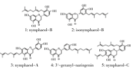

16

Asian Pacific Journal of Tropical Medicine (2014)16-20

EISEVIER

journal homepage:www.elsevier.com/locate/apjtm

Document headings

doi:

# Analysis of antioxidant prenylflavonoids in different parts of Macaranga tanarius , the plant origin of Okinawan propolis

Shigenori Kumazawa $^{1*}$ , Masavo Murase $^{1}$ , Noboru Momose $^{1}$ , Syuichi Fukumoto $^{2}$

Department of Food and Nutritional Sciences, University of Shizuoka, 52–1 Yada, Suruga–ku, Shizuoka 422–8526, Japan Pokka Sapporo Food and Beverage, 45–2 Juuniso, Kumanoshou, Kitanagoya–city, Aichi 481–8515, Japan

## article info

Article historys

Received 10 September 2013 Received in revised form 15 November 2013 Accepted 15 December 2013 Available online 20 January 2014

## ABSTRACT

Objective: To analyze the antioxidant prenylflavonoids in different parts of Macaranga tanarius ( M. tanarius ) (Euphorbiaceae) including the leaf, petiole, stem, leaflet, flower and fruit (only in female plant), and to evaluate their antioxidant properties. Methods: Methanol extracts of each part of M. tanarius were prepared and five prenylflavonoids in them were quantitatively analyzed using HPLC. The fruits from female plant were further separated into seed, pericarp, and glandular trichome. After the quantitative analyses of prenylflavonoids in each part of M. tanarius , antioxidant activity of the extracts was evaluated by 2,2 –diphenyl–1 –picryl–hydrazyl (DPPH) radical scavenging assay. Results: The leaf of M. tanarius contained two prenylflavonoids as main components in both male and female plants. Both flowers (male and female) contained five kinds of prenylflavonoids. In the petiole, stem and leaflet of both male and female plants, the prenylflavonoids were not detected or their amounts were very low. Five kinds of prenylflavonoids were detected in the seed, pericarp and glandular trichome of female M. tanarius . In particular, the glandular trichome had the highest level of total prenylflavonoids (235 mg/g of fresh plant). DPPH radical scavenging activity of all parts was more than 30 % . Conclusions: We found that different parts of M. tanarius contained antioxidant prenylflavonoids. In particular, not only the glandular trichome but also the leaf contained prenylflavonoids, which indicated that M. tanarius may be developed as a functional plant, because the leaves of this plant can be easily collected.

Keywords

Macaranga tanarius

Antioxidant

$^{\ast}$ Tervillavona

*ropolis

kimens

## 1. Introduction

Macaranga tanarius (M. tanarius, Euphorbiaceae) is a widely distributed tropical tree in Southern Asia. M. tanarius is a dioecious plant and is also a well – known pioneer tree and an ant – plant. Ants defend this tree against herbivores by producing food bodies that attractants[1–4].

In Thailand, the root of M. tanarius is used as an emetic agent, whereas the fresh leaves are used to cover wounds as an anti – inflammatory [5] . We have reported that M. tanarius is the plant origin of Okinawan propolis [6] . Propolis is a resinous hive product collected by honeybees. Honeybees in Okinawa, Japan use surface materials (glandular trichome) of M. tanarius fruits as propolis. We have found that Okinawan propolis and glandular trichome of M. tanarius contain several prenylflavonoids with potent antioxidant and antimicrobial activities [6,7] . Some of the prenylflavonoids identified from the glandular trichome of M. tanarius are present in the leaf of M. tanarius [8–12] . Thus, M. tanarius might be the plant with source of functional prenylflavonoids. However, quantitative analysis of the

${ }^{\circ}$ Corresponding author: Shigenori Kumazawa, Department of Food and Nutritional

E-mail: kunneava@u-shizuoka-kunue.jp

Foundation project: Supported by the Program for Creating Okinawa Innovation of Cabinet Office, Government of Japan and a Grant-in-Aid for Scientific Research of the apam Society for the Promotion of Science.

---

_

Thus, in this study, we collected male and female plants of M. tanarius and performed quantitative analysis of antioxidant prenylflavonoids present in different parts of M. tanarius , including the leaf, petiole, stem, leaflet, flower, and fruit (only in female plant). The fruits were further separated into seed, pericarp, and glandular trichome which is the surface material of M. tanarius fruits. After the quantitative analyses of prenylflavonoids in each part of M. tanarius , we examined its 2,2 – diphenyl – 1 – picryl – hydroxyl (DPPH) radical scavenging activity. The qualitative characteristics of M. tanarius described in our study will be useful when it is used as a natural medicinal plant.

## 2. Materials and methods

### 2.1. Plant material

M. tanarius was collected from Naha, Okinawa, Japan, in June 2008. Mature fruits of M. tanarius were obtained in this season. Although the age of the plant sample used in this study was unknown, the height of the tree was 2 – 3 m. The plant was identified by Mr. Tsuyoshi Miyagi, Okinawa Prefectural Forest Resources Research Center, Japan, where a voucher specimen was deposited.

### 2.2. Chemicals

Butylated hydroxytoluene was purchased from Kanto Chemicals (Tokyo, Japan). DPPH and α –tocopherol (vitamin E, VE) were purchased from Wako Pure Chemical Industries (Osaka, Japan). Eriodictyol and naringenin were purchased from Funakoshi (Tokyo, Japan).

### 2.3. Preparation of extracts

Male and female of M. tanarius plants were separated into leaf, petiole, stem, leaflet, flower, and fruit. The fruits were further separated into seed, pericarp, and glandular richome. Each part (1 g) was air – dried for 3 days and ground using a grinder. Then, each sample was extracted with 10 mL of methanol at room temperature for 3 days. The methanol extracts were filtered, and the filtrates were concentrated using a rotary evaporator.

### 2.4. Analysis of prenyllatontoids

Prenylflavonoids in the methanol extracts of each part of $M$.

tanarius were analyzed using a Jasco Gulliver HPLC system (Tokyo, Japan) with a photo – diode array detector. The dried methanol extracts of the samples were dissolved in methanol again, and the extracts were then filtered with a 0.45 – $^{\mu}$ m membrane filter. For the qualitative and quantitative analyses of the samples, we used a Capcell Pak UG120 C18 column (250.0 mm × 4.6 mm i.d.; Shiseido, Tokyo, Japan). The mobile phase consisted of 0.1 % (v/v) trifluoroacetic acid in water (A phase) and 0.1 % (v/v) trifluoroacetic acid in acetonitrile (B phase). The gradient was 20 %– 80 % B phase (0–60 min), 80 %– 100 % B phase (60–80 min), and 100 % B phase (80–90 min), and the flow rate was 1.0 mL/min. Qualitative analysis of the prenylflavonoids was performed by monitoring the UV spectra in the 195–650 nm range at a rate of 0.8 spectra/s and a resolution of 4.0 nm. On the other hand, the peak areas by the absorption of UV at 280 nm were used for quantitative analysis. Prenylflavonoids isolated from Okinawan propolis were used as authentic compounds to identify each peak [13,14] .

Another set of the extracts dissolved in methanol was analyzed by LC/MS to obtain more information for identifying each peak. A portion of the filtrate (5 μ L) was subjected to SI=1 HPLC system (Shiseido, Tokyo, Japan) on a Capcell Pak UG120 C18 column (250.0 mm × 2.0 mm i.d., 5 μ m). The mobile phase consisted of 0.1 % (v/v) formic acid in water (C phase) and 0.1 % (v/v) formic acid in acetonitrile (D phase). The gradient was 20 %— 80 % D phase (0=60 min), 80 % $-$ 100 % D phase (60=80 min), and 100 % D phase (80=90 min), and the flow rate was 0.2 mL/min. The elution of extracts was monitored at 270 nm and then introduced into the API– 2000 mass spectrometer (AB Sciex, Framingham, MA, USA) equipped with an electrospray ion source. The operating parameters are as follows: source voltages, 5 kV; electrospray capillary voltage, −10 V; and capillary temperature, 250  ̊ C. All MS data were acquired in negative ionization mode. The antioxidant prenylflavonoids 1=5 from each part of M . tanarius were quantitatively analyzed. The calibration curve for each compound was obtained from replicate injections ( n =3) of known amounts of the corresponding standards with the same flavonoid skeleton (eriodictyol for prenylflavonoids 1, 2, 3 and 5, and naringenin for prenylflavonoid 4). The limit of detection and quantification were determined at a signal=to=noise (S/N) ratio of 3 and 10, respectively. The limit of detection and quantification were determined using a serially diluted reference solution of each compound.

The reproducibility of the determinations was confirmed by analyzing five technical replicates of the standard solution. The precision was expressed using relative standard deviation. The reproducibility was evaluated on the basis of the result obtained at different times by different analysts

$\title{ \\ Shipnovi Kanazawa et al./Asian Pacific Journal of Tropical Medicine (2014)16-20 \\ }$

---

18

23kgesovi Kerezsosse et al/Asian Pacific Journal of Tropical Medicine (2014)16-20

n the same laboratory. A recovery test was performed using he method of standard addition.

### 2.5. Free radical scavenging activity on DPPH

This assay was performed according to the method of Chen and Ho with some modifications [15] . The reaction mixture contained 2 mL of ethanol, 125 μ mol/L DPPH , and 0.5 mg/mL of test samples. After incubation for 1 h at room temperature, the absorbance was recorded at 517 nm. The control solution contained only ethanol and DPPH . Results are expressed as percentage decrease with respect to control values. Butylated hydroxytoluene and VE at the same concentration were used as the positive controls.

## 3. Results

The contents of water and extract of each part of $M$ , tanarius are shown in Table 1 . Water content in each part was determined by subtracting dry weight from fresh weight. The weights shown in Table 1 were each weight (mg) per gram of the plant. Extraction efficiency (%) was determined from the yields of the methanol extracts.

Water contents in the parts other than the glandular trichome were 600 – 800 mg/g (Table 1). In the present study, each part of the plant was dried at room temperature for 3 days. The glandular trichome did not show a significant change in weight. Water content of the glandular trichome was very low (10 mg/g). Among all parts of the plant, the glandular trichome showed the highest extraction efficiency using methanol (48.5 % ). This indicates that the glandular trichome of M. tanarius consists mostly of hydrophobic constituents. On the other hand, the extraction efficiency of the leaf was more than 20.0 % , which indicates that the leaf of M. tanarius also contains hydrophobic compounds.

We identified prenylflavonoids 1-5 in the methanol

extracts of different parts of M. tanarius by HPLC with photo–diode array and MS detection . The chemical structures of the compounds identified are shown in Figure 1 . We used the prenylflavonoids isolated from the Okinawan propolis as authentic compounds to identify each peak. First, the peaks were assigned by comparing the retention times and UV spectra of authentic standards by photo–diode array detection. Further, LC/MS analysis was performed to confirm the assignments of each peak to obtain the profiles of compounds present in the samples. Negative electrospray ion – MS of each HPLC peak corresponded to the molecular ions.

Figure 1. Structures of prenylflavonoids identified from M. taenarius

The results of the quantitative analysis of the extracts from each part of M. tanarius are shown in Table 2 . Values are expressed as means of triplicate analyses for each sample. A calibration curve for each prenylflavonoid was constructed and tested for linearity. Good linearity was observed for the compounds between peak areas and concentrations over the range test ( r >0.998). The limit of detection and quantification values for each compound were 2.5 and 8.0 μg/mL, μ g/mL, respectively. The results for precision and reproducibility were good. The percentage recovery value was found to be approximately 95 % by the recovery test.

The leaf of M. tanarius contained the prenylflavonoids 1 and 5 as main components in both male and female plants

<table><tr><td rowspan="2">Plant part</td><td colspan="2">Dry weight (mg/g)</td><td colspan="2">Water content (mg/g)</td><td colspan="2">Extract (mg/g)</td><td colspan="2">Extraction efficiency (%)</td></tr><tr><td>Male</td><td>Female</td><td>Male</td><td>Female</td><td>Male</td><td>Female</td><td>Male</td><td>Female</td></tr><tr><td>Leaf</td><td>400</td><td>366</td><td>601</td><td>634</td><td>94.3</td><td>90.8</td><td>23.6</td><td>24.8</td></tr><tr><td>Petiole</td><td>205</td><td>264</td><td>795</td><td>736</td><td>16.3</td><td>12.5</td><td>8.0</td><td>4.7</td></tr><tr><td>Stem</td><td>138</td><td>455</td><td>862</td><td>545</td><td>11.4</td><td>9.3</td><td>8.3</td><td>2.0</td></tr><tr><td>Leaflet</td><td>295</td><td>275</td><td>705</td><td>726</td><td>35.8</td><td>27.1</td><td>12.1</td><td>9.9</td></tr><tr><td>Flower</td><td>276</td><td>238</td><td>724</td><td>762</td><td>71.1</td><td>47.0</td><td>25.8</td><td>19.7</td></tr><tr><td>Seed</td><td></td><td>338</td><td></td><td>662</td><td></td><td>41.6</td><td></td><td>12.3</td></tr><tr><td>Pericarp</td><td></td><td>236</td><td></td><td>764</td><td></td><td>22.4</td><td></td><td>9.5</td></tr><tr><td>Glandular trichome</td><td></td><td>990</td><td></td><td>10</td><td></td><td>480.0</td><td></td><td>48.5</td></tr></table>

Table 1

All data are per gram of plant

---

<table><tr><td rowspan="2">Plant part</td><td colspan="2">Prenylflavonoid 1</td><td colspan="2">Prenylflavonoid 2</td><td colspan="2">Prenylflavonoid 3</td><td colspan="2">Prenylflavonoid 4</td><td colspan="2">Prenylflavonoid 5</td><td colspan="2">Total</td></tr><tr><td>Male</td><td>Female</td><td>Male</td><td>Female</td><td>Male</td><td>Female</td><td>Male</td><td>Female</td><td>Male</td><td>Female</td><td>Male</td><td>Female</td></tr><tr><td>Leaf</td><td>1.10±0.03</td><td>1.07±0.02</td><td>0.12±0.01</td><td>ND</td><td>0.24±0.02</td><td>0.15±0.00</td><td>ND</td><td>ND</td><td>3.08±0.05</td><td>2.98±0.05</td><td>4.54</td><td>4.20</td></tr><tr><td>Petiole</td><td>ND</td><td>0.02±0.00</td><td>ND</td><td>0.01±0.00</td><td>ND</td><td>ND</td><td>ND</td><td>0.01±0.00</td><td>ND</td><td>0.03±0.00</td><td>ND</td><td>0.07</td></tr><tr><td>Stem</td><td>ND</td><td>ND</td><td>ND</td><td>ND</td><td>ND</td><td>ND</td><td>ND</td><td>ND</td><td>ND</td><td>0.01±0.00</td><td>ND</td><td>0.01</td></tr><tr><td>Leaflet</td><td>ND</td><td>0.30±0.00</td><td>ND</td><td>ND</td><td>ND</td><td>ND</td><td>ND</td><td>ND</td><td>0.02±0.00</td><td>0.03±0.00</td><td>0.02</td><td>0.33</td></tr><tr><td>Flower</td><td>2.78±0.01</td><td>0.81±0.00</td><td>0.14±0.00</td><td>0.31±0.01</td><td>0.10±0.01</td><td>1.22±0.01</td><td>0.23±0.00</td><td>0.90±0.01</td><td>0.63±0.01</td><td>0.79±0.01</td><td>3.88</td><td>4.03</td></tr><tr><td>Seed</td><td></td><td>0.19±0.01</td><td></td><td>0.11±0.00</td><td></td><td>0.18±0.01</td><td></td><td>0.19±0.01</td><td></td><td>0.14±0.01</td><td></td><td>0.81</td></tr><tr><td>Pericarp</td><td></td><td>0.52±0.01</td><td></td><td>0.30±0.00</td><td></td><td>0.52±0.01</td><td></td><td>0.49±0.01</td><td></td><td>0.31±0.00</td><td></td><td>2.14</td></tr><tr><td>G l a n d u l a r trichome</td><td></td><td>60.14±0.25</td><td></td><td>35.22±0.29</td><td></td><td>55.40±0.53</td><td></td><td>48.50±0.25</td><td></td><td>35.92±0.37</td><td></td><td>235.18</td></tr></table>

Table 2

Contents of prenylflavonoids in fresh samples of $M$. ta narius (mg/g).

Each value represents the mean±SD (n=3). ND: not detected. The prenylflavonoids 1–5 are nymphaeol-B, isonymphaeol-B, nymphaeol-A 3′-geranyl-naringenin, and nymphaeol-C, respectively.

(Table 2). Further, both flowers (male and female) contained all five kinds (1 – 5) of prenylflavonoids. However, in the petiole, stem, and leaflet of both male and female plants, these prenylflavonoids were not detected or their amounts were very low. All five kinds of prenylflavonoids were detected in the seed, pericarp, and glandular trichome of female M. tanarius . In particular, the glandular trichome had the highest level of prenylflavonoids (235 mg/g of fresh plant). Next, we evaluated the DPPH radical scavenging activity

of each part of $M$ , tanarius (Table 3 ). We reported that prenylflavonoids in the glandular trichome of M. tanarius have strong DPPH radical scavenging activity [6] . In the present study, DPPH radical scavenging activity of all parts was more than 30.0 % . Particularly, the leaf, in which the prenylflavonoid contents were lower than those in glandular richome, also had DPPH radical scavenging activity. This result suggests that compounds other than prenylflavonoids in each part also contribute to the DPPH radical scavenging activity.

<table><tr><td>Plant part</td><td>Male</td><td>Female</td></tr><tr><td>Leaf</td><td>85.22±2.44</td><td>74.65±0.30</td></tr><tr><td>Petiole</td><td>32.87±1.90</td><td>39.40±0.86</td></tr><tr><td>Stem</td><td>37.85±1.58</td><td>39.05±0.65</td></tr><tr><td>Leaflet</td><td>42.58±3.24</td><td>48.92±1.76</td></tr><tr><td>Flower</td><td>65.28±2.82</td><td>63.57±3.30</td></tr><tr><td>Seed</td><td></td><td>48.20±5.32</td></tr><tr><td>Pericarp</td><td></td><td>80.45±1.70</td></tr><tr><td>Glandular trichome</td><td></td><td>79.65±0.90</td></tr><tr><td>BHT</td><td></td><td>14.82±1.42</td></tr><tr><td>VE</td><td></td><td>75.66±1.53</td></tr></table>

Table 3

Each value represents the mean±SD ( n =3). Butylated hydroxytoluene and α − tocopherol (vitamin E, VE) at the concentration of 0.5 mg/mL / mL were used as positive control.

## 4. Discussion

Recently, few studies have reported the biological activities of the leaf extracts of M. tanarius . The aqueous methanol extracts of M. tanarius leaves inhibit $\alpha-$ glucosidase, and ellagitannins are the active compounds present in them [16] . On the other hand, the methanolic leaf extracts of M. tanarius also have antibacterial activity [17] . Therefore, M. tanarius is receiving increasing attention as a natural medicinal plant. We have also reported that the ethanol extracts of Okinawan propolis from glandular trichome of M. tanarius have antioxidant and antimicrobial activities and that the prenylflavonoids in them contribute the activities [6,7] . Further, it has been developed and patented an antimicrobial agent, containing M. tanarius extracts with prenylflavonoids, and as an active ingredient that is useful in oral products for preventing and treating dental caries, gingivitis and gum inflammation [18] . However, quantitative analysis of functional prenylflavonoids in the leaf and other parts of M. tanarius has not been performed as far as we know.

In the present study, we quantitatively analyzed five kinds of prenylflavonoids in different parts of M. tanarius . All these prenylflavonoids have antioxidant and antimicrobial activities [6,7] . Although the prenylflavonoids analyzed in this study are known, the report of the quantitative analysis of the prenylflavonoids in various parts of M. tanarius is for the first time. In particular, not only the glandular trichome but also the leaf contained prenylflavonoids, which indicates that M. tanarius may be developed as a functional plant, because the leaves of this plant can be easily collected. These qualitative characteristics of M. tanarius reported in our study will be important when M. tanarius is used as a natural medicinal plant.

---

20

23kgesovi Kerezsosse et al/Asian Pacific Journal of Tropical Medicine (2014)16-20

Conflict of interest statement

We declare that we have no conflict of interest.

## Acknowledgment

This work was supported by the Program for Creating Okinawa Innovation of Cabinet Office, Government of Japan and a Grant – in – Aid for Scientific Research of the Japan Society for the Promotion of Science. We thank Prof. Yazaki (Kyoto University, Japan) for his useful comments, and we thank Y. Ohara (University of Shizuoka, Japan) for her technical assistances on this work.

## Reference

1] Heil M, Koch T, Hilpert A, Fiala B, Boland W, Linsenmair E. Extrafloral nectar production of the ant–associated plant, Macaranga tanarius , is an induced, indirect, defensive response elicited by jasmonic acid. Proc Natl Acad Sci USA 2001; 98 : 1083–1088.

[2] Eck G, Fiala B, Linsenmair KE, Bin Hashim R, Proksch P. Trade– off between chemical and biotic antiherbivore defense in the south east Asian plant genus Macaranga . J Chem Ecol 2001; 27 : 1979– 1996.

[3] Matsumami K, Takamori I, Shinzato T, Aramoto M, Kondo K, Otsuka H, et al. Radical–scavenging activities of new megastigmane glucosides from Macaranga tanarius (L.) Müller–ARG. Chem Pharm Bull 2006: 54 : 1403–1407.

4] Ishida C, Kono M, Sakai S. A new pollination system: brood–site pollination by flower bugs in Macaranga (Euphorbiaceae). Ann Bot 2009; 103 : 39–44.

5] Phommart S, Sutthivaiyakit P, Chimnoi N, Ruchirawat S, Sutthivaiyakit S. Constituents of the leaves of Macaranga tanarius . J Nat Prod 2005; 68: 927–930.

6] Kumazawa S, Nakamura J, Murase M, Miyagawa M, Ahn MR, Fukumoto S. Plant origin of Okinawan propolis: honeybee behavior

observation and phytochemical analysis . Naturwissenschaften 2008: 95 ; 781–786.

[7] Kumazawa S, Fukumoto S. Macaranga tanarius , the plant origin of Okinawan propolis. Honeybee Sci 2010; 28: 1–6. (in Japanese)

[8] Tseng MH, Chou CH, Chen YM, Kuo YH. Allelopathic prenylflavanones from the fallen leaves of Macaranga taenarias. J Nat Prod 2001: 64 : 827–828.

[9] Tseng MH, Kuo YH, Chen YM, Chou CH. Allelopathic potential of Macaranga tanarius (L.) MUELL-ARG. J Chem Ecol 2005; 29: 1269–1286.

[10]Guhling O, Kinzler C, Dreyer M, Bringmann G, Jetter R. Surface composition of myrmesophile plants: cuticular wax and glandular trichomes on leaves of Macaranga tanarius . J Chem Ecol 2005; 31 : 2323–2341.

[11]Kawakami S, Harinantenaria L, Matsunami K, Otsuka H, Shimzate T, Takeda Y, Macaflavanones A–G, prenylated flavanones from the leaves of Macaranga tanarius. J Nat Prod 2008; 71 : 1872–1876.

[12]Trusheva B, Popova M, Koendhori EB, Tsvetkova I, Naydenski C Bankova V. Indonesian propolis: chemical composition, biological activity and botanical origin. Nat Prod Res 2011; 25 : 606–613.

[13]Kumazawa S, Goto H, Hamasaka T, Fukumoto S, Fujimoto T Nakayama T. A new prenylated flavonoid from propolis collected in Okinawa, Japan. Biosci Biotechnol Biochem 2004; 68 : 260–262.

[14]Kumazawa S, Ueda R, Hamasaka T, Fukumoto S, Fujimoto T, Nakayama T. Antioxidant prenylated flavonoids from propolis collected in Okinawa, Japan. J Agric Food Chem 2007; 55 : 7722– 7725.

[15]Chen CW, Ho CT. Antioxidant properties of polyphenols extracted from green tea and black tea. J Food Lipids 1995; 2: 35–46.

[16]Gunawan–Puteri MDPT, Kawabata J. Novel α −glucosidase inhibitors from Macaranga tanarius leaves. Food Chem 2010; 123 384–389.

[17]Lim TY, Lim YY, Yule CM. Evaluation of antioxidant, antibacterial and anti–tyrosinase activities of four Macaranga species. Food Chem 2009: 114 : 594–599.

[18] Fukumoto S, Goto T. Antimicrobial agent useful in oral products for preventing and treating dental caries, gingivitis and gun inflammation, contains Macaranga tanarius extracts as active ingredient. Patent No. JP2007045754–A.

