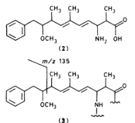

CHEM SOC PERKIN TRANS.1 1985

274

# Structural Studies on Cyanoginosins-LR, -YR, -YA, and -YM, Peptide Toxins from Microcystis aeruginosa

Dawie P. Botes, * Philippus L. Wessels, and Helène Kruger National Chemical Research Laboratory, CSIR, P.O. Box 395, Prei

Maria T. C. Runnegar 2018

Department of Biochemistry and Nutrition, University of New England, N.S.W. 2351, Australia Sitthivet Santikarn, Richard J. Smith, Jennifer C. J. Barna, and Dudley H. Williams

University Chemical Laboratory, Lensfield Road, Cambridge CB2 1EW

The structures of the hepatotoxins of general name cyanoginosins-XY are proposed to be cyclo-D-Ala L-X-erythro-β-methyl-D-isoAsp-L-Y-Adda-D-isoGlu-N-methyldehydroAla (1) where X and Y repre sent variable amino acids and Adda is 3-amino-9-methoxy-2,6,8-trimethyl-10-phenyldeca-4,6 dienoic acid (2). The structural studies on four variant toxins utilised n.m.r. and mass spectral method analogous to those recently used to determine the structure of cyanoginosin-LA.

0-Ala-l-X-erythro-β-Me-d-isoAsp-l-Y-Adda-d-isoGlu-N-Medha—

(1)

Cyanoginosin is a term we have recently suggested 1 to describe a type of cyclic heptapeptide toxin of cyanobacterial origin. The cyanoginosins are produced by toxic strains of the freshwater cyanobacterium Microcystis aeruginosa . This is one of the species responsible for the poisoning of animals, including humans, that drink water from reservoirs on which the algae grow. We have recently described in detail 1 the structure of a toxin from South Africa. We now report full or partial structures of four analogues of this toxin; three obtained from the same source and one from a bloom of the same alga found in the Malpas Dam in New South Wales, Australia. 2

Amino Acid Content .— Amino acid analyses 3 and stereospecific enzymic transformations 4 had already shown that cyanoginosin-LR, -YR, and -YA all contained the same damino acid residues, i.e. erythro - β -methylaspartic acid ( β MeAsp), glutamic acid (Glu), and alanine (Ala). In addition, the presence of N -methyldehydroalanine ( N -Medha) had been demonstrated 4 and the presence of a non-polar side-chain was suspected from electrophoretic and u.v. studies and by analogy with results obtained for cyanoginosin-LA (formerly named toxin BE-4). 1 The two-letter suffixes indicate the L-amino acids found in each toxin; namely, for -LR, leucine (Leu) and arginine (Arg); for -YR, tyrosine (Tyr) and Arg; for -YA, Tyr and Ala; and for -YM, Tyr and methionine (Met). In the case of -YM, the chirality of the β -MeAsp was not previously known and the presence of N -Medha was only suspected because methylamine had been found by amino acid analysis. 2 It was also known that the toxins contained no free amino groups and that -YM contained two free carboxy groups, one in each of the dicarboxylic acid residues. 2

## Results and Discussion

Molecular Weights. — Fast-atom bombardment mass spectrometry (f.a.b.m.s.) showed the molecular weights of three of the toxins to be as follows: -YR, 1 044; -LR, 944; and -YM, 1 035 daltons. Summing of the known amino acid residue weights indicated that the toxins probably all contained the unusual amino acid (2) found in cyanoginosin-LA. $^1$ (In the case of -YM this would only apply if it contained N -Medha.) Absence of sequence ions in the spectra indicated that the toxins were cyclic.

Residues in Cyanoginosin-YM .— The chirality of the I MeAsp was determined by gas chromatography – mass spectra metry (g.c.m.s.), in the manner previously described, 1 to be D.

The presence of $N$ -Medha was demonstrated by means of reduction with NaBH 4 or NaBD 4 (giving molecular weight increases of two and three daltons, respectively) followed by hydrolysis and g.c.m.s. which revealed $N$ -MeAla in the hydrolysate.

The presence of Met in its oxidised (sulphoxide) form was shown by the molecular weight loss of sixteen daltons following treatment with 2-mercaptoethanol.

N.m.r. Data .— The presence of the unusual amino acid (2) (Adda) was strikingly demonstrated in all four toxins by the n.m.r. data. Chemical shifts and coupling constants agreed, within 0.05 p.p.m. and 0.3 Hz respectively, with those assigned (under the same conditions) to this residue in cyanoginosinLA. 1 { Further evidence for the position of the methoxy substituent was obtained for -YM by the observation of an abundant fragment ion at m/z 135 [see structure (3)] in electronimpact mass spectra (e.i.m.s.) } . Data for the other constant residues ( i.e. the d-amino acids) were also in close agreement and the expected signals were seen for the variant, L-amino acid, residues. $^1$ H N.m.r. spectroscopy was of most use in determining the presence of Adda because the presence of the other residues was adequately defined by previously obtained evidence. Information about the linkage and sequence of the residues was obtained by other means.

Published on 01 January 1985, Downloaded by Mount Allison University on 13/07/2015 03:14:27

View Article Online / Journal Homepage / Table of Contents for this issue

---

View Article Online

2748

J. CHEM. SOC. PERKIN TRANS. 1985

<table><tr><td rowspan="2">Derivative Glu</td><td colspan="2">LR −</td><td colspan="2">+</td><td colspan="2">YR −</td><td colspan="2">−</td><td colspan="2">YM −</td><td colspan="2">YA −</td></tr><tr><td>32 021 (1.00)</td><td>45 699 (1.00)</td><td>+ 11 250 (1.00)</td><td>− 17 162 (100)</td><td>+ 17 162 (100)</td><td>21 306 (1.00)</td><td>− 25 925 (1.00)</td><td>+ 4 714</td><td>(1.00)</td><td>+ 10 218 (1.00)</td></tr><tr><td>β-MeAsp</td><td>7 695 (0.62)</td><td>7 147 (0.41)</td><td>3 461 (0.80)</td><td>6 205 (0.94)</td><td>5 743 c  (0.70)</td><td>5 803 (0.58)</td><td>1 531</td><td>(0.84)</td><td>3 184 (0.81)</td></tr><tr><td>N -MeAla</td><td>820 (0.02)</td><td>42 379 (0.77)</td><td>317 (0.02)</td><td>18 962 (0.92)</td><td>19 282</td><td>(0.75)</td><td>27 447 (0.88)</td><td>617</td><td>(0.11)</td><td>10 944 (1.04)</td></tr><tr><td>Ala</td><td>658 (0.02)</td><td>293 (0.01)</td><td>130 (0.01)</td><td>183 (0.01)</td><td>154</td><td>(0.01)</td><td>146 (0.00)</td><td>155 d  (0.01)</td><td>237 (0.01)</td></tr><tr><td>Leu</td><td>1 578 (0.02)</td><td>317 (0.00)</td><td></td><td></td><td></td><td></td><td></td><td></td><td></td><td></td></tr><tr><td>Met(O)</td><td></td><td></td><td></td><td></td><td>160</td><td>(0.00)</td><td>155 (0.00)</td><td></td><td></td><td></td></tr><tr><td>Tyr</td><td></td><td></td><td>177 (0.01)</td><td>220 (0.01)</td><td>336</td><td>(0.01)</td><td>281 (0.00)</td><td>331</td><td>(0.03)</td><td>279 (0.01)</td></tr><tr><td>Arg</td><td>268 (0.00)</td><td>461 (0.00)</td><td>107 (0.00)</td><td>424 (0.01)</td><td></td><td></td><td></td><td></td><td></td><td></td></tr></table>

table. Radioactivity counts a,b on isolated amino acids after tritium labelling 5 of reduced cyanoginosins

- , + Without and with TFA hydrolysis, respectively. * Counts min 1. b Values in parentheses are relative tritium incorporations after correction for the amino acid sensitivity to the reaction,3 normalised with respect to Glu and using Asp, Ala, and Met as models for β-MeAsp, N-MeAla, and Met(O) respectively. c High incorporation in this sample of -YM suggests a very labile bond which had partly cleaved during isolation of the toxin. Similar results were occasionally seen with the other toxins. 4 2 mol Ala per mol of toxin.

Linkage of Glu and β-MeAsp. —Glu and β-MeAsp were shown to be iso-linked from the results of base-catalysed tritium incorporation 5 (Table) into the intact toxins as previously described for cyanoginosin-LA. 1 High incorporations into these residues showed that there was a free carboxy group directly adjacent to the x-carbon in each case. (This was already known for -YM. 2 ) Hence, it was also shown that neither carboxy group was involved in forming the cyclic linkage in either toxin. Instead, high incorporation in the N -MeAla residues was found in the toxins after reduction and ring-opening with trifluoroacetic acid (TFA). 1 This showed that in all cases the N -MeAla was now C -terminal which confirmed the sequence which was primarily determined mass spectrometrically.

Sequencing by Mass Spectrometry .— Hydrolysis of toxin-YM using TFA, followed by high-performance liquid chromatography (h.p.l.c.), gave two major components consisting of peptides having free N -termini (acetylated with acetic anhydride). The whole sequence could be obtained from one of the eluted peptides using f.a.b.m.s., excepting the fact that Glu and β -MeAsp are isobaric. The positions of the latter two residues were deduced using two cycles of Edman degradation followed by dansylation,* hydrolysis, and h.p.l.c. which showed that they were in the same positions as in cyanoginosin-LA. $^1$ For cyanoginosin-LR, -YR, and -YA complete sequence information was not determined from f.a.b.m.s. because the Arg residues in cyanoginosin-LR and -YR prevented the production of a full set of sequence ions, and cyanoginosin-YA was not subjected to f.a.b.m.s. because of insufficient material. However, the Edman degradations showed the two N -terminal residues, after ring-opening with TFA, to be Ala then Leu for cyanoginosin-LR, and Ala then Tyr for cyanoginosin-YR and -YA. Following this, dansylation, hydrolysis, and t.l.c. identified β -MeAsp in the third position as with cyanoginosin-YM. These results determine the ordering within the two-letter suffixes, supposing the rest of the sequences to be analogous to the sequences of cyanoginosin-LA and -YM. Tritium incorporation in the linearised derivatives placed the N -MeAla residue, thus positioning four of the seven residues in these variants. We expect that if full sequence determinations were to be made, we would find that all toxins of this class have identical structures as given by the formula ( 1 ).

## Experiments

Isolation of Toxins .— Cyanoginosin-LR, -YR, and -YA were isolated as previously described 3,4 and cyanoginosin-YM was isolated as previously described 2 except that reversed-phase h.p.l.c. replaced paper electrophoresis in the final purification step.

$^{1}H~N.m.r$ . Spectra. — Spectra were recorded on Bruker WM500 and AM500 machines. Chemical shifts were measured relative to sodium 3-(trimethylsilyl)propionate in solutions in D $_2$ O at 303 K. Assignments were made using COSY-45 and difference methods (n.O.e. and decoupling).

Mass Spectra.—Spectra were recorded on a Kratos MS-50 pectrometer as previously described. 1

Derivatisations, Hydrolyses, Tritium Labelling .— Most chemical transformations and subsequent measurements were carried out as previously described. $^1$ Treatment of cyanoginosin-YM with 2-mercaptoethanol was in alkaline aqueous solution (2 h at 80 °C).

## Acknowledgements

performed in Cambridge and Dr. E. Houghton and Mr. P. Teale of Race Course Security Services, Newmarket, for g.c.m.s. data

## References

D. P. Botes, A. A. Tuinman, P. L. Wessels, C. C. Viljoen, H. Kruger, D. H. Williams, S. Santikarn, R. J. Smith, and S. J. Hammond, J. Chem. Soc., Perkin Trans. 1, 1984, 2311.

${ }^{2}$ T. C. Elleman, I. R. Falconer, A. R. B. Jackson, and M. T. C. Runnegar, Aust. J. Biol. Sci., 1978, 31, 209. ${ }^{4}$ D. P. Botes, H. Kruger, and C. C. Viljoen, Toxicon, 1982, 20, 945.

4 D. P. Botes, C. C. Viljoen, H. Kruger, and P. L. Wessels, Toxicon 1982, 20 , 1037.

5 H. Matsuo and K. Marita, in ‘Protein Sequence Determination,’ ed S. B. Needleman, Springer-Verlag, New York, 1975, p. 104.

Dansyl = 5-dimethylaminonaphthalene-1-sulphonyl

Received 13th May 1985; Paper 5/79

Published on 01 January 1985. Downloaded by Mount Allison University on 13/07/2015 03:14:27.

