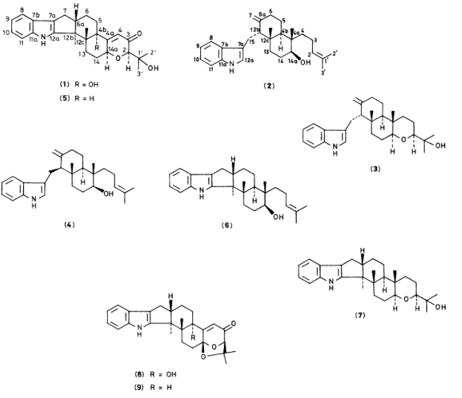

View Article Online / Journal Homepage / Table of Contents for this issue

2607

# Isolation and Structures of Indoloditerpenes, Possible Biosynthetic Intermediates to the Tremorgenic Mycotoxin, Paxilline, from Emericella striata 1

Koohei Nozawa, Shoichi Nakajima, and Ken-ichi Kawai * Faculty of Pharmaceutical Sciences, Hoshi University, Ebara 2-4

Shun-ichi Udagawa (2019年7月3日)

National Institute of Hygienic Sciences, Kamiyoga 1-18-1, Setagaya-ku, Tokyo 158, Japan

Together with paspaline (7) , two indololoterpenes designated dehydroxypaxilline (5) , C 27 H 33 NO 3 , and emindole SB (6) , C 28 H 39 NO , were isolated from the mycelium of Emericella striata . The structures of dehydroxypaxilline (5) and emindole SB (6) were determined on the basis of spectroscopic investigation of these compounds. It is very interesting that emindole SB (6) , paspaline (7) , and dehyroxypaxilline (5) were isolated from the same fungus, E. striata , on consideration of the biogenesis of paxilline (1) which had also been isolated from the same fungus as one of the main components.

Recently we reported the isolation of a tremorgenic mycotoxin, paxilline (1) , from the mycelial extract of Emericella striata (Rai, Tewari, and Mujkerji) Malloch and Cain, strain 80-NE-22, $^2$ as one of the major metabolites, and from E. desertorum Samson and Mouchacca, strain CBS 653.73, $^3$ as a minor component. During our search for compounds related to (1) , novel indoloditerpenes, i.e. , emindoles DA (2) 4–5 and DB (3) , 5 and emindole SA (4) , 4,6 from E. desertorum and E. striata , respectively, were isolated. Recently, two compounds related to the biosynthetic intermediates to (1) designated dehydroxypaxilline (5) and emindole SB (6) were isolated along with paspaline (7) , which was originally isolated from the mycelium of Clariceps paspali Stevens and Hall, 7 from the non-polar fraction of the mycelial acetone extract, and the structures of compounds (5) and (6) are reported in this paper.

## Results and Discussion

The molecular formulae of dehydroxypaxilline (5) and emindole SB (6) were confirmed as C 27 H 33 NO 3 and C 28 H 39 NO , respectively, by electron impact ionization (e.i.) mass spectrometry and by elemental analysis or high-resolution mass spectrometry. A positive colouration for van Urk's reagent (yellowish green) $^{\rm S}$ and the fragmentation ion at m/z 130 [(C 9 H 8 N) + ] in the e.i. mass spectra of compounds (5) and (6) suggested the presence of an indole moiety in both compounds. The $^{\rm 1H}$ n.m.r. signals of four aromatic protons of the indole moiety appeared at δ H 7.091 (2 H), 7.305 (1 H), and 7.441 (1 H) in (5), and at δ H 7.059 (2 H), 7.268 (1 H), and 7.408 (1 H) in (6). These data were almost superimposable on those of paxilline (1) and paspaline (7), which were also isolated from the same fungus, including the coupling patterns. The proton at C-2 of

<table><tr><td>Carbon a</td><td>(1) b</td><td>(2)</td><td>(3)</td><td>(5)</td><td>(6)</td><td>(7)</td></tr><tr><td>C-2</td><td>83.16</td><td>124.94</td><td>85.85</td><td>82.69</td><td>124.68</td><td>85.86</td></tr><tr><td>C-3</td><td>199.50</td><td>21.89</td><td>37.81</td><td>198.24</td><td>21.42 c</td><td>37.81</td></tr><tr><td>C-4</td><td>119.16</td><td>37.54</td><td>24.85</td><td>121.86</td><td>37.54</td><td>25.39 c</td></tr><tr><td>C-4a</td><td>169.45</td><td>41.12</td><td>36.25</td><td>168.27</td><td>39.30</td><td>36.65</td></tr><tr><td>C-4</td><td>76.78</td><td>39.07</td><td>45.43</td><td>42.69</td><td>39.94</td><td>46.56</td></tr><tr><td>C-5</td><td>28.58 c</td><td>23.03</td><td>22.19 c</td><td>25.61 c</td><td>22.77 c</td><td>22.04 c</td></tr><tr><td>C-6</td><td>27.34 c</td><td>30.83</td><td>30.74</td><td>30.05 c</td><td>27.47 c</td><td>27.61 c</td></tr><tr><td>C-6a</td><td>49.57</td><td>136.25</td><td>136.26</td><td>49.01</td><td>49.80</td><td>48.87</td></tr><tr><td>C-7</td><td>33.62</td><td>110.20</td><td>110.22</td><td>32.86</td><td>33.67</td><td>33.98</td></tr><tr><td>C-7a</td><td>116.68</td><td>115.57</td><td>115.60</td><td>118.56</td><td>118.31</td><td>118.32</td></tr><tr><td>C-7</td><td>124.94</td><td>127.64</td><td>127.66</td><td>125.07</td><td>125.17</td><td>125.26</td></tr><tr><td>C-8</td><td>118.18</td><td>118.88</td><td>118.90 d</td><td>118.64</td><td>118.41</td><td>118.46</td></tr><tr><td>C-9</td><td>119.16</td><td>118.94</td><td>118.93 d</td><td>119.82</td><td>119.55</td><td>119.60</td></tr><tr><td>C-10</td><td>120.02</td><td>121.63</td><td>121.61</td><td>120.87</td><td>120.43</td><td>120.48</td></tr><tr><td>C-11</td><td>111.61</td><td>111.00</td><td>111.02</td><td>111.64</td><td>111.38</td><td>111.52</td></tr><tr><td>C-11a</td><td>139.92</td><td>148.10</td><td>148.03</td><td>140.19</td><td>140.04</td><td>140.16</td></tr><tr><td>C-12a</td><td>152.15</td><td>121.90</td><td>121.87</td><td>149.25</td><td>150.82</td><td>150.90</td></tr><tr><td>C-12</td><td>50.80</td><td>58.61</td><td>58.85</td><td>50.57</td><td>53.11</td><td>53.09</td></tr><tr><td>C-12c</td><td>43.04</td><td>37.92</td><td>38.48</td><td>42.48</td><td>41.24</td><td>40.15</td></tr><tr><td>C-13</td><td>20.98 c</td><td>34.58</td><td>34.84</td><td>24.15 c</td><td>25.17 c</td><td>24.74 c</td></tr><tr><td>C-14</td><td>27.16 c</td><td>27.75</td><td>21.95 c</td><td>27.35 c</td><td>27.47 c</td><td>22.08 c</td></tr><tr><td>C-14a</td><td>72.79</td><td>73.95</td><td>84.75</td><td>74.84</td><td>77.33</td><td>84.81</td></tr><tr><td>C-1′</td><td>72.38</td><td>131.21</td><td>71.95</td><td>72.53</td><td>132.22</td><td>72.05</td></tr><tr><td>C-2′</td><td>24.19</td><td>17.70</td><td>23.80 e</td><td>24.27</td><td>17.44</td><td>23.85</td></tr><tr><td>C-3′</td><td>26.61</td><td>25.74</td><td>26.14</td><td>26.80</td><td>25.71</td><td>26.18</td></tr><tr><td>4a-Me</td><td></td><td>16.91</td><td>13.45</td><td></td><td>16.41</td><td>12.77</td></tr><tr><td>12b-Me (C-15)</td><td>16.20</td><td>23.27</td><td>23.29</td><td>14.65</td><td>14.60</td><td>14.63</td></tr><tr><td>12c-Me</td><td>19.37</td><td>23.18</td><td>23.85 e</td><td>16.30</td><td>19.16</td><td>20.04</td></tr></table>

Table. $^{13}$ C N.m.r. chemical shifts of paxilline (1), emindole SB (6), and related compounds in CDCT

${ }^{a}$ Numberings of the related compounds correspond to those of (1). ${ }^{b}$ Measured in $\mathrm{CDCl}_{3}$ containing a little $\left(\mathrm{CD}_{3}\right)_{2} \mathrm{SO},{ }^{c-e}$ Assignments may be reversed.

Published on 01 January 1988. Downloaded by State University of New York at Stony Brook on 29/10/2014 15:47-21.

---

2608

J. CHEM. SOC. PERKIN TRANS. 1988

the indole moiety, which appeared as a doublet at $\delta_{\mathsf{H}}$ 6.887 in emindole DA (2) and at $\delta_{\mathsf{H}}$ 6.893 in emindole SA (4) , was not observed in compounds (5) and (6) . The indole NH was observed at $\delta_{\mathsf{H}}$ 7.881 in (5) and at $\delta_{\mathsf{H}}$ 7.752 in (6) . The above results and $^{13}$ C n.m.r. spectra (Table) were explicable by assuming the presence of a 2,3-disubstituted indole moiety in dehydroxypaxilline (5) and emindole SB (6) .

The $^{1}$ H n.m.r. spectrum of dehydroxypaxilline (5) was closely similar to that of paxilline (1), except for the upfield shift, δ H 4.826 (br t) in (1) to δ H 4.268 (br dd) in (5), of the proton attached to the carbon bearing the ether oxygen. Compound (5) had only one less oxygen atom than paxilline (1), and so it was assumed that one hydroxy group in (1) was replaced by a proton $M-Me_{2}CO$ in (5). The strong fragmentation ion at m/z 361 [( C ) − Me 2 CO ) + J , the same as in (1), suggested the presence of a 1hydroxy-1-methylethyl group in the molecule. The assignments of the $^{13}$ C n.m.r. chemical shifts of compound (5) were carried out on the basis of the signal multiplicity and on a comparison with those of compound (1), and are listed in the Table. The carbon signal at δ C 76.78 assigned to C-4b bearing the hydroxy group in (1) was changed to a signal at δ C 42.69, which appeared as a doublet in the off-resonance spectrum of compound (5). The other $^{13}$ C n.m.r. signals differing from compounds (1) and (5)

were those of carbons at C-4, C-5, C-6, C-12a, C-13, C-14a, and the 12c-methyl group, which were near C-4b. The above results confirmed that dehydroxypaxilline was the dehydroxy derivative at C-4b of paxilline ( 1 ), as shown in structure ( 5 ). The c.d. spectra of compounds ( 1 ) and ( 5 ) showed maxima at 237 ( − ), 297 ( + ), and 338 ( + ) nm, and at 238 ( − ), 294 ( + ), and 336 ( + ) nm, respectively, and the absolute configuration of dehydroxypaxilline ( 5 ) should therefore be the same as that of paxilline ( 1 ). The $^{\rm I}$ H n.m.r. signals at $\delta_{\rm H}$ 1.632 (3 H, br s), 1.693 (3 H, br s),

and 5.115 (1 H, br t) in emindole SB (6) corresponded to the $^{13}$ C n.m.r. signals at $\delta_{\rm C}$ 17.44 (q), 25.71 (q), 132.22 (s), and 124.68 (d). These data suggested the presence of a 4-methylpent-3-enyl group in compound (6). The signals of three aliphatic tertiary methyl groups were observed at $\delta_{\rm H}$ 0.808, 1.008, and 1.086 in the $^{1}$ H n.m.r. spectrum and at $\delta_{\rm C}$ 14.60, 16.41, and 19.16 in the $^{13}$ C n.m.r. spectrum. The signal observed at $\delta_{\rm H}$ 3.568 (1 H, dd), which corresponded to the carbon signal at $\delta_{\rm C}$ 77.32, was assigned to the proton attached to the carbon bearing an equatorial secondary alcohol. The other $^{1}$ H n.m.r. signals were due to aliphatic methylene and methine protons. The assignments of the $^{13}$ C n.m.r. signals of compound (6) (Table) were confirmed on the basis of the chemical shifts and multiplicity of the signals,

Published on 01 January 1988. Downloaded by State University of New York at Stony Brook on 29/10/2014 15:47-21.

View Article Online

---

View Article Online

CHEM, SOC. PERKIN TRANS 1988

2609

and by comparison with the signals of emindoles DA ( 2 ) and SA ( 4 ), and paspaline ( 7 ). The carbon signals of the decalin ring near the indole moiety in compound ( 6 ) were closely similar to those in ( 7 ), whereas the side-chain signals and those of the pyran ring in ( 6 ) were superimposable on those in ( 2 ) or ( 4 ). The above results, considering the molecular formula of compound ( 6 ), suggested that cyclization of emindole SB ( 6 ) at the double bond by epoxidation and attack of the hydroxy group afforded paspaline ( 7 ).

The $^{13}$ C n.m.r. signals which were greatly shifted from emindole SB (6) to paspaline (7) were those for carbons C-2, C-3, C-4, C-4a, C-4b, C-14, C-14a, C-1’, C-2’, and the 4a-methyl group, the shift values of which were calculated as $+38.02$ , $-16.39$ , $+12.15$ , $+2.65$ , $-6.62$ , $+5.39$ , $-7.48$ , $+59.26$ , $-6.41$ , and $+3.64$ , respectively, consistent with those from emindole DA (2) to emindole DB (3) (Table). The above facts confirmed the relative structure of emindole SB as (6) . The absolute configuration of compound (6) has not yet been determined, but it was assumed to be as shown in structure (6) because of the cooccurrence of paxilline (1), emindole SA (4), dehydroxypaxilline (5) , and paspaline (7) with the same basic configuration. Acklin et al. , reported 9 that indoloditerpenes like paspalinine

(8) and paspalicine (9), which were originally isolated from Cluriceps paspali Stevens and Hall as tremorgenic mycotoxins, 7 would have been derived from tryptophan and geranylgeraniol by cyclization and migration of the carbon skeleton, and that they isolated a compound which they considered to be emindole SB (6) as the intermediate to paspaline (7) and (8) but without any supporting data. It is very interesting that dehydroxypaxilline (5), emindole SB (6), and paspaline (7) were isolated from E. striata along with paxilline (1). The biogenesis of paxilline (1) in E. striata would be as follows: linear indologeranylgeraniol cyclizes, followed by migration of the carbon skeleton to give emindole SB (6), which is further cyclized, after epoxidation, to give compound (7). Paspaline (7) was changed into dehydroxypaxilline (5) by oxidation at C-3 and the overall loss of methane from C-4–C-4a, and then hydroxylation of compound (5) at C-4b gave paxilline (1). Hydroxylation at C-4b would have occurred after further cyclization of paspaline (7) in C. paspali , because paspalicine (9) was isolated from this fungus. $^7$

## Experimental

M.p.s were determined on a Yanagimoto micro-melting point apparatus and are uncorrected. Optical rotations were measured with a JASCO DIP-181 spectrometer. E.i. mass spectra were taken with a JEOL JMS-D 300 spectrometer. U.v. spectra and i.r. spectra were recorded on a Hitachi 124 spectrometer and a JASCO IR-810 spectrometer, respectively. $^{\rm 1}$ H (399.78 MHz) and $^{\rm 13}$ C (100.43 MHz) N.m.r. spectra were recorded on a JEOL JNM-GX 400 spectrometer, using tetramethylsilane as internal standard. C.d. curves were determined on a JASCO J-40 spectrometer. Column chromatography was performed using Kieselgel 60 (Art. 7734; Merck). Low pressure liquid chromatography (l.p.l.c.) was performed on a Chemco Low-Prep pump 81-M-2 and a glass column (200 $\times$ 10 mm) packed with silica gel CQ-3 (30—50 μm; Wako). T.l.c. was conducted on pre-coated Kieselgel 60F $_{254}$ (Art. 5715; Merck). Spots on t.l.c. were detected by their absorption under u.v. light, and/or by spraying van Urk's reagent. $^8$

Isolation of Metabolites Related to Paxilline (1).—E. striata, strain 80-NE-22, was cultivated at 30 °C for 21 days in CzapekDox medium (50 l). The dried mycelia (660 g) were extracted with acetone at room temperature. The extract (26 g) was

chromatographed on silica gel with benzene-acetone (50:1). After removal of ergosterol, the residue was Chromatographed on silica gel with benzene-ethyl acetate (5:1) to give two fractions. The less polar fraction was purified by repeated l.p.l.c. with the solvent system of hexane-ethyl acetate (10:1 and 5:1) to give paspaline (7) (118 mg). The more polar fraction was purified by repeated l.p.l.c. with the solvent system of chloroform – acetone (93:7 and 100:1) to obtain dehydroxypaxilline (5) (71 mg) and emindole SB (6) (52 mg).

Paspaline (7) was obtained as a crystalline powder (from methanol), m.p. 253—254 °C (lit., $^{7}$ 254 °C); [ $x$ ] $_{\rm D}$ $^{20}-24^{\circ}$ ( $c$ 0.38 in CHCl $_{3}$ ) [lit., $^{7}$ $-$ 23 $^{\circ}$ ( $c$ 0.36 in CHCl $_{3}$ )]; $m/z$ 421 ( $M^{+}$ , 76 % ), 406 [ $(M-\mathrm{Me})^{+}$ , 79], 362 [ $(M-59)^{+}$ , 10], 182 (100), and 130 [ $(\mathrm{C_{9}H_{8}N})^{+}$ , 41]; $\delta_{\mathrm{H}}$ (CDCl $_{3}$ ) 0.878 (3 H, s, Me), 1.015 (3 H, s, Me), 1.119 (3 H, s, Me), 1.176 (3 H, s, Me), 1.187 (3 H, s, Me), 1.35—1.84 (12 H, m), 1.938 (1 H, ddd, J 12.7, 12.7, and 3.7 Hz), 2.319 (1 H, dd, J 13.1 and 10.6 Hz), 2.663 (1 H, dd, J 13.1 and 6.6 Hz), 2.709 (1 H, br s, OH), 2.774 (1 H, m), 3.019 (1 H, dd, J 11.5 and 3.7 Hz, CH $_{2}$ C $H$ O), 3.209 (1 H, dd, J 12.0 and 2.9 Hz, CH $_{2}$ C $H$ O), 7.061 (2 H, m), 7.285 (1 H, m), 7.415 (1 H, m), and 7.850 (1 H, br s, NH). $^{13}$ C N.m.r. signals are summarized in the Table. Dehydroxypaxilline (5) was obtained as leaflets (from

methanol), m.p. 232—234 °C (Found: C, 77.05; H, 8.0; N, 3.3. C $_{27}$ H $_{33}$ NO $_3$ requires C, 77.29; H, 7.93; N, 3.34 % ); $m/z$ = 419 ( M $^+$ , 22 % ), 404 [( $M-\rm Me)^+$ , 24], 361 [( $M-\rm Me_2CO)^+$ , 59], 346 [( $M-\rm Me_2CO-Me)^+$ , 100], 182 (55), and 130 [(C $_9$ H $_{\rm n}$ N) $^+$ , 24]; $\lambda_{\rm max.}$ (EtOH) 231 (log ε 4.70), 280 (4.10), and 290sh nm (4.03); $v_{\rm max.}$ (KBr) 3 410 (OH, NH) and 1 660 cm $^{-1}$ (C=O); $\delta_{\rm H}$ (CDCl $_3$ ) 0.987 (3 H, s, Me), 1.240 (3 H, s, Me), 1.288 (3 H, s, Me), 1.300 (3 H, s, Me), 1.545 (1 H, m), 1.709 (4 H, m), 1.837 (1 H, m), 1.887 (1 H, m), 2.119 (1 H, ddd, $J$ 13.4, 13.4, and 4.1 Hz), 2.299 (1 H, m), 2.409 (1 H, dd, $J$ 13.2 and 10.3 Hz), 2.743 (1 H, dd, $J$ 13.2 and 6.4 Hz), 2.810 (1 H, m), 3.734 (1 H, d, $J$ 2.2 Hz, CHO), 4.226 (1 H, s, OH), 4.268 (1 H, br dd, $J$ 10.0 and 7.8 Hz, CH $_2$ CHO), 5.871 (1 H, br s, =CH), 7.091 (2 H, m), 7.305 (1 H, m), 7.441 (1 H, m), and 7.881 (1 H, br s, NH); c.d. (c 3.2 × 10 $^{-3}$ in MeOH); [0] $_{238}-$ 7.2 × 10 4 , [0] $_{277}+$ 7.19 × 10 3 , [0] $_{294}$ + 7.82 × 10 3 , and [0] $_{336}+$ 7.82 × 10 3 . 13 C N.m.r. signals are summarized in the Table. Eminode SB (6) was obtained as an amorphous powder, $m/z$

$405.3019\quad(M^{+}, C_{28}H_{39}NO$ requires $M$ , $405.3029, \:87\%)$ , $390.2804\,[(M-\mathrm{Me})^{+},C_{27}H_{36}NO$ requires $m/z$ $390.2797, \:51]$ , $182.0975\,(C_{13}H_{12}N$ requires $m/z$ $182.0970, \:100)$ , and $130.0655$ $[(C_{9}H_{8}N)^{+},C_{9}H_{8}N$ requires $m/z$ $130.0655, \:45]$ ; $v_{max}$ , $(\mathrm{KBr})$ $3\:410$ $(\mathrm{OH}, NH)$ ; $\delta_{\rm H}$ $0.808$ ( $3\:\mathrm{H},\mathrm{s},\:\mathrm{Me}$ ), $1.008$ ( $3\:\mathrm{H},\mathrm{s},\:\mathrm{Me}$ ), $1.086$ ( $3\:\mathrm{H},\mathrm{s}$ , $\mathrm{Me}$ ), $1.24$ — $1.50$ ( $14\:\mathrm{H},\mathrm{m}$ ), $1.632$ ( $3\:\mathrm{H},\mathrm{br}$ s, =CMe $_{2}$ ), $1.693$ ( $3\:\mathrm{H},\mathrm{br}$ s, =CMe $_{2}$ ), $2.320$ ( $1\:\mathrm{H},\mathrm{dd},J$ $12.9$ and $10.3\:\mathrm{Hz}$ ), $2.665$ ( $1\:\mathrm{H},\mathrm{dd},J$ $12.9$ and $6.4\:\mathrm{Hz}$ ), $2.732$ ( $1\:\mathrm{H},\mathrm{m}$ ), $3.568$ ( $1\:\mathrm{H},\mathrm{dd},J$ $8.3$ and $6.7\:\mathrm{Hz}$ , CH $_{2}CH(\mathrm{OH})$ ], $5.115$ ( $1\:\mathrm{H},\mathrm{br}$ t, $J$ $7.0\:\mathrm{Hz}$ , CH $_{2}CH$ =), $7.059$ ( $2\:\mathrm{H},\mathrm{m}$ ), $7.268$ ( $1\:\mathrm{H},\mathrm{m}$ ), $7.408$ ( $1\:\mathrm{H},\mathrm{m}$ ), and $7.752$ ( $1\:\mathrm{H},\mathrm{br}$ s, NH). $^{13}\mathrm{C}$ N.m.r. signals are summarized in the Table.

## Acknowledgements

We are grateful to Professor M. Yamazaki of the Faculty of Pharmaceutical Sciences, Chiba University, for helpful discussions. We also thank Mrs. T. Ogata of this University for elemental analyses, and Mrs. M. Yuyama and Miss T. Takahashi of this University for n.m.r. and mass measurements.

## References

Kawahara, K. Nozawa, S. Nakajima, and K. Kawai, Phytochemistry 1988, in the press.

2 H. Seya, K. Nozawa, S. Udagawa, S. Nakajima, and K. Kawai, Chem Pharm. Bull. , 1986, 34 , 2411.

Published on 01 January 1988. Downloaded by State University of New York at Stony Brook on 29/10/2014 15:47-21.

---

View Article Online

2610

J. CHEM SOC PERKIN TRANS 1988

3 K. Nozawa, H. Seya, S. Nakajima, S. Udagawa, and K. Kawai, J Chem. Soc., Perkin Trans. I , 1987, 1735.

4 K. Nozawa, S. Udagawa, S. Nakajima, and K. Kawai, J. Chem. Soc Chem. Commun. , 1987, 1157.

${ }_{5}^{1}$ K. Nozawa, S. Nakajima, K. Kawai, and S. Udagawa, J. Chem. Soc. Perkin Trans. 1, 1988, 1689. ${ }_{6}^{2}$ K. Nozawa, M. Yuyama, S. Nakajima, K. Kawai, and S. Udagawa,

Chen, Soc., Perkin Trans. 1, 1988, 2155.

7 Th, Fehr and W. Acklin, Helt, Chim. Acta, 1966, 49, 1907.

8 E. Stahl and H. Kaldeway, Hoppe-Seyler's Z. Physiol. Chem. , 1961, 323 , 182.

9 W. Acklin, F. Weibel, and D. Arigoni, Chimia, 1977, 31, 63

Received 27th January 1988; Paper 8/00291

Published on 01 January 1988. Downloaded by State University of New York at Stony Brook on 29/10/2014 15:47-21.

