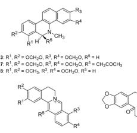
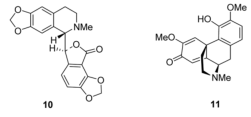
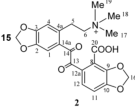
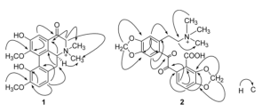

Ying-Rui Wu1, 2 Yun-Bao Ma1 You-Xing Zhao1 Shu-Ying Yao1, 2 Jun Zhou1 Ying Zhou3 Ji-Jun Chen1

# Two New Quaternary Alkaloids and Anti-Hepatitis B Virus Active Constituents from Corydalis saxicola

## Abstract

Two new quaternary isoquinoline alkaloids, saxicolalines A (1) and N-methylnarceimicine (2), together with sixteen known alkaloids (3–18) were isolated from Corydalis saxicola Bunting. The structures of saxicolalines A (1) and N-methylnarceimicine (2) were established based on spectral methods including 1D, 2D NMR (COSY, HMQC, HMBC) and HR-ESI-MS. The anti-HBV activities of ten main alkaloids were evaluated. Among the tested compounds, dihydrochelerythrine (8) exhibited the most potent

activity against HBsAg and HBeAg secretions with IC50 < 0.05 μM, SI > 3.5, respectively.

## Key words

Corydalis saxicola Bunting - Fumariaceae - quaternary isoquinoline alkaloids - anti-HBV activity

## Supporting information available online at

http://www.thieme-connect.de/ejournals/toc/plantamedica

## Introduction

Corydalis saxicola Bunting (Fumarioideae) is a perennial herb distributed mainly in calcareous mountain regions of southwest China, and has been used clinically as a folk medicine to treat hepatitis for a long time [1], [2]. The alkaloid extracts of the herb demonstrated pharmacological activities, including anti-virus [3], and eleven alkaloids haveeen isolated from this plant so far [4], [5]. In our preliminary study, the total extract of the roots of C. saxicola exhibited significant anti-HBV (hepatitis B virus) activity against HBsAg (hepatitis B virus surface antigen) secretion of Hep G 2.2.15 cells with an IC50 = 0.16 mg/mL, and against HBeAg (hepatitis B virus e antigen) secretion with an IC50 < 0.04 mg/mL, respectively, which prompted us to further investigate the anti-HBV constituents of this plant. The chemical investigation resulted in the isolation of two new quaternary isoqui-

noline alkaloids, saxicolaline A (1) and N-methylnarcimicine (2) , together with sixteen known alkaloids 3 – 18 (Fig. 1 ). Herein, we present the isolation, structure elucidation of saxicolaline A and N-methylnarceimicine, and the anti-HBV activities of compounds 1 , 2 , 7 , 8 , 10 – 13 , 15 and 18 in vitro .

## Materials and Methods

## General

Column chromatography: silica gel (200-300 mesh; H, Qingdao Marine Chemical Inc.; Qingdao, P. R. China); Sephadex LH-20 (Amersham Biosciences; Uppsala, Sweden); reverse-phase C-8 silica gel (40–63 μm; Merck; Darmstadt, Germany). Melting points: XRC-1 apparatus (Sichuan University, Sichuan, China); optical rotations were carried out on a Jasco P-1020 Polarimeter

Affiliation

1 State Key Laboratory of Phytochemistry and Plant Resources in West China, Kunming Institute of Botan Chinese Academy of Sciences, Kunming, P. R. Chin 2 Graduate School of Chinese Academy of Sciences, Beijing, P. R. Chin 3 Guangxi Institute of Chinese Medicine & Pharmaceutical Science, Nanning, P. R. Chin

Prof. Dr. Ji-Jun Chen · State Key Laboratory of Phytochemistry and Plant Resources in West China Kunming Institute of Botany · Chinese Academy of Sciences - Heilongtan - Kunming 650204 People's Republic of China · Phone/Fax: +86-871-522-3265 · E-mail: chenjj@mail.kib.ac.cn

Received February 26, 2007 · Revised May 17, 2007 · Accepted May 21, 2007

Bibliography

Planta Med 2007; 73: 787–791 © Georg Thieme Verlag KG Stuttgart - New York DOI 10.1055/s-2007-981549 · Published online July 5, 2007

ISSN 0032-0943

Original Paper

Downloaded by: Universit é Laval. Copyrighted material

---

$$ \\ \text { R1, } \mathrm{R}^{2}=\mathrm{OCH}_{3}, \mathrm{R}^{3}, \mathrm{R}^{4}=\mathrm{OCH}_{3}, \mathrm{R}^{5}=\mathrm{CH}_{3} \\ $$

Fig. 1 Structures of compounds 1- 18.

12: R1 , R2 = OCH3, R3 , R4 = OCH3, R5 = H 14: R1 , R2 = OCH2O, R3 , R4 = OCH3, R5 = H 15: R1 , R2 = OCH2O, R3 , R4 = OCH2O, R6 = H 16: R1 = OCH3, R2 = OH, R3 , R4 = OCH2O, R5 17: R1 = OH, R2 = OCH3, R3 , R4 = OCH2O, R5

$$ \\ \text { Method } \\ $$

(JASCO Inc.; Easton MD, USA); UV spectra were obtained in a Shimadzu UV 2401 PC spectrometer (Shimadzu; Kyoto, Japan); IR spectra were measured on a Bruker Tensor 27 spectrometer (Bruker Optics Inc.; Ettlingen, Germany) with KBr pellets, v in cm−1; MS were recorded on a VG Autospec-3000 or API QSTAR PULSAR LC-Q-TOF spectrometer (VG; Manchester, England); NMR spectra were recorded on a Bruker AM-400 (400 MHz/100 MHz) or DRX500 (500 MHz/125 MHz) spectrometer (Bruker BioSpin AG; Fällanden, Switzerland) and chemical shifts are given in δwith TMS as internal reference; Fractions were monitored by TLC and spots were visualized by spraying the silica gel plates with Dragendorff's reagent.

## Plant material

Corydalis saxicola Bunting was collected in Donglan region, Guangxi Zhuang Municipality, People's Republic of China, in May 2005, and was authenticated by Prof. Zhou Jun. A voucher specimen (ZJ 2005-05-1) has been deposited at the State Key Laboratory of Phytochemistry and Plant Resources in West China, Kunming Institute of Botany, Chinese Academy of Sciences.

## Extraction and isolation

Dried roots of C. saxicola (5.5 kg) were powdered and extracted with 95% EtOH (3×10 L) under reflux. The EtOH extract was soaked with 2% HCl solution (8.0 L), then filtered. The aqueous phase was basified to pH 10 with 25% NH3/H2O and extracted with CHCl3 (0.5 L×4) to give extract A (93.6 g). The aqueous layer was further basified with 10% NaOH solution to pH 12 and ex-

tracted with n-BuOH (0.5 L×4) to afford extract B (63.6 g). Extract B (63.6 g) was submitted to dry column chromatography on silica gel (10×120 cm, 200–300 mesh, 2500 g) eluting with CHCl3/CH3OH/H2O (7:3:0.5, 4.5 L) to give fractions E−I. Fraction H (2.9 g) was subjected to vacuum liquid chromatography (VLC) (2×15 cm, silica gel H, 50 g) in a step gradient manner with CHCl3/CH3OH/H2O from 8:2:0.2 to 6:4:0.4 (650 mL) to give compounds 18 (540 mg) and 1 (89 mg). Compound 2 (16 mg) was obtained from fraction I (8.2 g) by repeated VLC (sintered glass funnel, 250 mL, silica gel H, 100 g) eluted with EtOH/H2O (5:1, 1.5 L), column chromatography (3×45 cm, reverse-phase C-8 silica gel, 70 g) with EtOH/H2O (from H2O to EtOH/H2O, 2:8, each 500 mL) and purified by Sephadex LH-20 column chromatography (1.5×45 cm) eluted with H2O (300 mL).

## Isolates

Saxicolaline A (1): yellow crystalline solid (MeOH); m.p. 223– 225 °C; [α]β7: 718.8 (c 0.16, C5H5N); UV (MeOH): λmax (log ε) = 205 (4.39), 231 (4.23), 289 (4.09), 358 (4.05) nm; IR (KBr ): νmax = 3425, 2935, 1654, 1607, 1576, 1466, 1442, 1408, 1039 cm−1; 1H- and 13C-NMR data see Table 1: FAB-MS (neg. ion mode): m/z = 355 ([M − H] − ), 339 ([M − CH3 ] − , 100), 325 ([M − OCH3 ] − , 77), 311 ([M − NMe 2 ] − , 37), 293, 265, 154, 97, 80; HR ESI-MS (pos. ion mode): m/z (%) = 356.1484 [M]+ (calcd. for C20H22NO5: 356.1497).

N-Methylnarceimicine (2): yellow crystalline solid (MeOH); m.p. 194 – 196 °C; UV (MeOH): λmax (log ε) = 207 (4.48), 331 (4.02)

Wu Y-R et al. Two New Quaternary… Planta Med 2007; 73: 787 – 791

Original Paper

Downloaded by: Universite Laval. Copyrighted material

---

<table><tr><td>Position</td><td>13C</td><td>1 Hp</td><td>13C</td><td>2 1Hp</td></tr><tr><td>1</td><td>152.3 (s)</td><td>–</td><td>113.0 (d)</td><td>7.71 (1H, s)</td></tr><tr><td>2</td><td>165.3 (s)</td><td>–</td><td>145.3 (s)</td><td>–</td></tr><tr><td>3</td><td>103.8 (d)</td><td>7.16 (1H, s)</td><td>149.8 (s)</td><td>–</td></tr><tr><td>3a</td><td>111.5 (s)</td><td>–</td><td>–</td><td>–</td></tr><tr><td>4</td><td>182.6 (s)</td><td>–</td><td>111.5 (d)</td><td>7.01(1H, s)</td></tr><tr><td>4a</td><td>–</td><td>–</td><td>133.8 (s)</td><td>–</td></tr><tr><td>5</td><td>67.5 (t)</td><td>4.45 (1H, d, 15.4), 4.16 (1H, d, 15.4)</td><td>27.3 (t)</td><td>3.02 (2H, dd, 10.2, 3.1)</td></tr><tr><td>6</td><td>–</td><td>–</td><td>65.5 (t)</td><td>3.50 (2H, m)</td></tr><tr><td>6a</td><td>68.9 (d)</td><td>4.77 (1H, dd, 14.0, 3.1)</td><td>–</td><td>–</td></tr><tr><td>7</td><td>29.5 (t)</td><td>3.23 (1H, dd, 14.4, 3.1), 2.81 (14.4, 14.0)</td><td>–</td><td>–</td></tr><tr><td>7a</td><td>124.1 (s)</td><td>–</td><td>–</td><td>–</td></tr><tr><td>8</td><td>116.2 (d)</td><td>6.62 (1H, d, 7.8)</td><td>124.8 (s)</td><td>–</td></tr><tr><td>9</td><td>110.2 (d)</td><td>6.73 (1H, d, 7.8)</td><td>145.4 (s)</td><td>–</td></tr><tr><td>10</td><td>149.9 (s)</td><td>–</td><td>150.5 (s)</td><td>–</td></tr><tr><td>11</td><td>148.1 (s)</td><td>–</td><td>107.8 (d)</td><td>6.90 (1H, d, 7.9)</td></tr><tr><td>11a</td><td>122.0 (s)</td><td>–</td><td>–</td><td>–</td></tr><tr><td>11b</td><td>111.5 (s)</td><td>–</td><td>–</td><td>–</td></tr><tr><td>11c</td><td>131.4 (s)</td><td>–</td><td>–</td><td>–</td></tr><tr><td>12</td><td>55.8 (q)</td><td>3.72 (3H, s)</td><td>122.7 (d)</td><td>6.96 (1H, d, 7.9)</td></tr><tr><td>12a</td><td>–</td><td>–</td><td>132.9 (s)</td><td>–</td></tr><tr><td>13</td><td>55.1 (q)</td><td>3.69 (3H, s)</td><td>191.9 (s)</td><td>–</td></tr><tr><td>14</td><td>52.8 (q)</td><td>3.42 (3H, s)</td><td>188.0 (s)</td><td>–</td></tr><tr><td>14a</td><td>–</td><td>–</td><td>127.5 (s)</td><td>–</td></tr><tr><td>15</td><td>44.9 (q)</td><td>3.06 (3H, s)</td><td>102.0 (t)</td><td>6.11 (2H, s)</td></tr><tr><td>16</td><td>–</td><td>–</td><td>101.6 (t)</td><td>6.06 (2H, s)</td></tr><tr><td>17</td><td>–</td><td>–</td><td>52.2 (q)</td><td>3.09 (3H, s)</td></tr><tr><td>18</td><td>–</td><td>–</td><td>52.2 (q)</td><td>3.09 (3H, s)</td></tr><tr><td>19</td><td>–</td><td>–</td><td>52.2 (q)</td><td>3.09 (3H, s)</td></tr><tr><td>20</td><td>–</td><td>–</td><td>166.0 (s)</td><td>–</td></tr></table>

8in ppm and/in Hz

nm; IR (KBr): $v_{\text{max}}$ = 3500–2500, 2906, 1661, 1607, 1586, 1505, 1487, 1446, 1373, 1360, 1251, 1030, 921 cm −1 ; 1 H- and 13 C-NMR data see Table 1 ; ESI-MS (pos. ion mode): m/z / z (%) = 450 ([100, M + Na – H] + , 100), 428 ([M] + , 14); HR-ESI-MS (pos. ion mode): m/z / z = 428.1345 [M] + (calcd. for C $_{22}$ H $_{22}$ NO $_{8}$ : 428.1333).

The anti-HBV assays were performed according to the method in our previous report [18]. An antivirus agent, lamivudine (3TC; Glaxosmithkline; Suzhou, China), was used as positive control.

## Supporting information

A detailed description of the extraction and isolation of 3-18 and the structures, physicochemical data and spectral data for compounds 3-12 and 15-18 are available as Supporting Information.

## Results and Discussion

Saxicolaline A (1) was obtained as a yellow crystalline solid and was positive to Dragendorff's reagent. Its molecular formula was determined as C20H22NO5 based on HR-ESI-MS at m/z = 356.1484 ([M]+, calcd.: 356.1497), indicating that compound 1

possessed eleven degrees of unsaturation. The $^1$ H-NMR spectrum displayed three aromatic protons including two o -coupled signals at $\delta$ = 6.73 and 6.62 (d, J = 7.8 Hz), two methoxy proton groups at $\delta$ = 3.72 and 3.69, and two N-methyl proton groups at $\delta$ = 3.42, 3.06 respectively. The $^{13}$ C-NMR spectrum revealed the presence of twenty carbon atoms including two benzene rings, four methyl groups, two methylene groups, one methine group and one carbonyl corresponding to the IR absorption at 1654 cm $^{-1}$ . The $^1$ H- and $^{13}$ C-NMR features were closely similar to those of magnoflorine ( 18 ) [15] except for the absence of two aliphatic protons and one methylene carbon in an aporphine skeleton. The

Fig. 2 Key HMBC correlations of compounds 1 and 2.

Wu Y-R et al. Two New Quaternary… Planta Med 2007; 73: 787 – 791

1940年,中国历史上第一次全国人民代表大会代表[2]。

Downloaded by: Universite Laval. Copyrighted material.

---

<table><tr><td rowspan="2">Compound</td><td rowspan="2">CC50(μM)</td><td></td><td colspan="3">HBsAgb IC50(μM)</td><td colspan="3">HBeAgc IC50(μM)</td></tr><tr><td></td><td></td><td></td><td>SId</td><td></td><td>IC50(μM)</td><td>SI</td></tr><tr><td>1</td><td>&gt;2.81</td><td>&gt;2.81</td><td>2.19</td><td>2.19</td><td>&gt;1.3</td><td>&gt;2.81</td><td>&gt;2.81</td><td>1.0</td></tr><tr><td>2</td><td>2.05</td><td>2.02</td><td>1.24</td><td>1.22</td><td>1.6</td><td>1.86</td><td>1.84</td><td>1.0</td></tr><tr><td>7</td><td>&gt;2.54</td><td>&gt;2.54</td><td>6.64</td><td>6.55</td><td>&gt;1.5</td><td>&gt;2.54</td><td>&gt;2.54</td><td>1.0</td></tr><tr><td>8</td><td>0.16</td><td>0.16</td><td>&lt;0.05</td><td>&lt;0.05</td><td>&gt;3.5</td><td>&lt;0.05</td><td>&lt;0.05</td><td>&gt;3.5</td></tr><tr><td>10</td><td>&gt;2.73</td><td>&gt;2.73</td><td>1.35</td><td>1.36</td><td>&gt;2.0</td><td>&gt;2.73</td><td>&gt;2.73</td><td>1.0</td></tr><tr><td>11</td><td>0.51</td><td>0.56</td><td>0.27</td><td>0.26</td><td>2.1</td><td>0.45</td><td>0.43</td><td>1.3</td></tr><tr><td>12</td><td>1.97</td><td>1.94</td><td>&gt;4.26</td><td>&gt;4.26</td><td>&lt;0.5</td><td>&gt;4.26</td><td>&gt;4.26</td><td>&lt;0.5</td></tr><tr><td>13</td><td>0.24</td><td>0.23</td><td>2.63</td><td>2.61</td><td>0.1</td><td>&gt;4.25</td><td>&gt;4.25</td><td>&lt;0.1</td></tr><tr><td>15</td><td>&gt;1.02</td><td>&gt;1.02</td><td>2.74</td><td>2.74</td><td>&gt;1.2</td><td>3.20</td><td>3.19</td><td>1.0</td></tr><tr><td>18</td><td>3.60</td><td>3.20</td><td>&gt;4.39</td><td>&gt;4.39</td><td>&lt;0.7</td><td>&gt;4.39</td><td>&gt;4.39</td><td>&lt;0.7</td></tr><tr><td>3TCa</td><td>42.83</td><td>43.00</td><td>15.37</td><td>14.72</td><td>2.9</td><td>44.85</td><td>42.93</td><td>1.0</td></tr><tr><td>Total extract of the roots of C. saxicola</td><td>0.23 mg/mL</td><td>0.21 mg/mL</td><td>0.17 mg/mL</td><td>0.16 mg/mL</td><td>1.3</td><td>&lt;0.04 mg/mL</td><td>&lt;0.04 mg/mL</td><td>&gt;5.3</td></tr></table>

$^{a}$ 3TC (lamivudine): positive control. $^{b}$ HBsAg: hepatitis B virus surface antigen. $^{c}$ HBeAg: hepatitis B virus e antigen. $^{d}$ Si (selective index) is the ratio of CC $_{50}$ and IC $_{50}$

carbonyl was assigned to be at C-4 in the B ring by the key HMBC correlation of H-3 ( δ = 7.16) and C-4 ( δ = 182.5). The optical rotation was dextrorotatory ([α]β̃?: 718.8), indicating that the stereochemistry of compound 1 at C-6a can be proposed as the Sform [16]. The structural deduction of compound 1 was further confirmed by 1H–1H COSY, HMQC and HMBC experiments. Therefore, the structure of saxicolaline A was elucidated in Fig. 2 .

$N$ -Methylnarceimicine (2) was obtained as a yellow crystalline solid and was positive to Dragendorff's reagent. The molecular formula $m/z=428.1333$ was established as C $_{22}$ H $_{22}$ NO $_8$ by HR-EI-MS of $m/z$ = 428.1333 ([M] + , calcd.: 428.1345), indicating thirteen degrees of unsaturation in the structure. The IR spectrum showed absorption bands due to a carboxyl group (3500 – 2500 cm − 1 ), carbonyl groups (1661 and 1607 cm − 1 ) and aromatic rings (1586, 1505 and 1446 cm − 1 ). The $^1$ H-NMR spectrum exhibited three N-methyl groups at $\delta$ = 3.09 (9H, s), two methylenedioxy groups at $\delta$ = 6.11 (2H, s) and 6.01 (2H, s), and four aromatic protons at $\delta$ = 7.71 (1H, s), 7.01 (1H, s), 6.96 and 6.90 (1H, d, J = 7.9 Hz). The $^{13}$ C NMR spectrum showed twenty-two carbon atoms which were attributed to two aromatic rings, two methylenedioxy groups, two aliphatic methylene groups, three N-methyl groups and three carbonyl groups, whose chemical shifts were closely similar to those of narceimicine [17] , except for one additional methyl linked to nitrogen atom which was confirmed by the correlations between H-17, -18 and -19 ( $\delta$ = 3.09) with C-6 ( $\delta$ = 65.5). The deduction was further supported by the analysisses of the $^{1}$ H– $^{1}$ H COSY, HMQC and HMBC spectra. Accordingly, compound 2 was elucidated as $N$ -methylnarceimicine.

The other sixteen known alkaloids were also isolated from this plant, and were identified as dihydrosanguinarine (3) [6] , corydaline (4) [7] , cavidine (5) [8] , stylopine (6) [9] , 6-acetonyl-5,6dihydrosanguinarine (7) [10] , dihydrochelerythrine (8) [6] , tetrahydropalmatine (9) [7] , adlumidine(10) [11] ), (–)-salutaridine (11) [12] , palmatine (12) [13] , protopine (13) , berberine (14) , cop-

tisine (15) [7] , thalifaurine (16) [14] , dehydroapocavidine (17) [7] and (+)-magnoflorine (18) [15] by comparing spectral data with those reported in the literature and of authentic samples. The isolation procedure and spectral data of known compounds are described in the Supporting Information.

The total extract of the roots of C. saxicola showed significant inhibition activity in vitro on both HBsAg and HBeAg secretions of the Hep G 2.2.15 cell line. Thus, ten pure compounds isolated in large amounts were assayed against HBV. The anti-HBV activities are summarized in Table 2. New compounds 1, 2 as well as compounds 7, 10 and 11 were moderately active while compounds 13 and 18 showed weak inhibitory effects. Interestingly, compound 8 exhibited the most potent activity against HBeAg secretion with IC50 < 0.05 μM and SI > 3.5, which prompted us to further investigate its mechanism of action against HBV.

## Acknowledgement

The authors are grateful to the staffs of the analytical group at the State Key Laboratory of Phytochemistry and Plant Resources in the West China, Kunming Institute of Botany, Chinese Academy of Sciences for measuring spectral data. This work was partly supported by grants from guided projects of Chinese Academy of Sciences (# KSCX1-YW-R-24).

## References

Delectis Florae Reipublicae Popularis Sinicae Academiae Sinicae Edita. Flora Reipublicae Popularis Sinicae, Tomus 32. Beijing: Science Press; 1999: 418 – 20.

2 Standards of Chinses Medicinal Material. Nanning: Guangxi Press of science and technology; 1990: 64–5.

3 Wei JQ, Jiang SY, Jiang YS, Qi XX, Tang H. A review of Corydalis saxicola Bunting of medicinal plants. J Gangxi Acad Sci 2006; 22: 108 – 11.

Wu Y-R et al. Two New Quaternary… Planta Med 2007; 73: 787 – 791

Original Paper

790

---

$^{4}$ Ke MM, Zhang XD, Wu LZ, Zhao Y, Zhu DY, Song CQ et al. Studies on the active principles of Corydalis saxicola Bunting. Yaoxue Xuebao 1982; 24: 289–91.

5 Li HL, Zhang WD, Zhang W, Zhang C, Liu RH. A new nitro alkaloid from Corydalis saxicola Bunting, Chin Chem Lett 2005; 16: 367–8.

$^{6}$ Oechslin SM, König GM, Oechslin-Merkel K, Wright AD, Kinghorn AD, Sticher O. An NMR study of four benzophenanthridine alkaloids. J Nat Prod 1991: 54: 519 – 24.

7 Halbsguth C, Meißner O, Häberlein H. Positive cooperation of protoberberine type 2 alkaloids from Corydalis cava on the GABA A binding site. Planta Med 2003; 69: 305–9.

${ }^{3}$ Iwasa K, Gupta YP, Cushman M. Absolute configurations of the cis- and trans-13-methyltetrahydroprotoberberines. Total synthesis of (+)-tha

9 Chrzanowska M. Synthesis of (±) stylopine. J Nat Prod 1995; 58: 4017.

10 Koul S, Razdan TK, Andotra CS, Kalla AK, Koul S, Taneja SC. Benzophenanthridine alkaloids from Corydalis flabellata. Planta Med 2002; 68: 262–5.

11 Blaskö G, Gula DJ, Shamma M. The phthalideisoquinoline alkaloids. J Nat Prod 1982: 45: 105–22.

12 Sariyar G, Gülgeze HB, Gözler B. Salutaridine N-oxide from the capsules of Papaver bracteatun. Planta Med 1992; 58: 368–9. 13 Wafo P, Nyasse B, Fontaine C. A 7,8-dihydro-8-hydroxypalmatine from

这是一篇與鱸形目相關的小作品。 你可以编辑或修订扩充其内容。

14 Chen CH, Chen TM, Lee C. Thalifaurine and dehydrodiscretine, new quaternary protoberberine from Talictrum fauriei. J Pharm Sci 1980; 69: 1061–5. 15 Barbosa-Filho JM, Da-Cunha EVL, Cornélio ML, Dias CDS, Gray AL Cis-

saglaberrimine, an aporphine alkaloid from Cissampelos glaberrima. Phytochemistry 1997; 44: 959–61.

$^{16}$ Ringdahl B, Chan RPK, Craig JC. Circular dichroism of aporphines. J Nat Prod 1981; 44: 80–5. $^{17}$ Tripathi YC, Pandey VB, Pathak NKR, Biswas M. A seco-phthalideiso-

quinoline alkaloids from Fumaria indica seeds. Phytochemistry 1988; 27: 1918–9.

13 Jiang ZY, Zhang XM, Zhang FX, Liu N, Zhao F, Zhou J et al. A new triterpene and anti-Hepatitis B virus active compounds from Alisma orientalis. Planta Med 2006; 72: 951–4.

Wu Y-R et al. Two New Quaternary… Planta Med 2007; 73: 787 – 791

1940年,中国历史上第一次全国人民代表大会代表[2]。

Downloaded by: Universite Laval. Copyrighted material.

